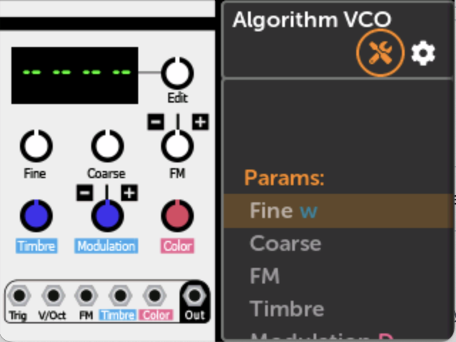
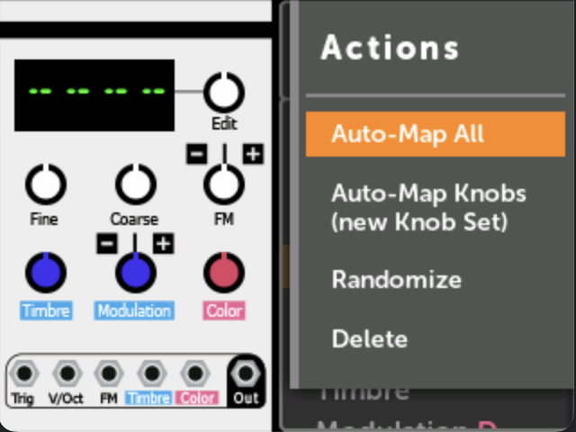

# Module Action Menu

The Module Action Menu is found by clicking on a module in a patch and then clicking on the Tool icon at the top.

-   [{ .half }](./img/module-action-icon.png)

-   [{ .half }](./img/module-action-menu.png)

## Actions

### Auto-Map All
This action attempts to map all knobs and jacks in the order that they appear in the
module. Existing maps will be preserved, and new Knob Sets will be created if
needed.

Jacks will be mapped to In 1-6 and Out 1-8, skipping any jacks that are already mapped.

`Auto-Map All` is a great way to try out a module or quickly create a single-module patch. 

Since this action will often fill all your jack mappings, it's recommended to
use `Auto-Map Knobs (new Knob Set)` for multi-module patches.

### Auto-Map Knobs (new Knob Set)

Similar to `Auto-Map All`, but this will create a new Knob Set and only map the
knobs (not jacks). The new Knob Set will be given the name of the module (e.g.
"EnOsc" or "Plateau").

If there are more than 12 controls, then only the first 12 will be mapped.

### Randomize

This randomizes the value of all parameters. Note that in VCV Rack, modules can
exclude particular parameters from being randomized. This is not present in
MetaModule, but will be added in a future update.

### Initialize

This initializes or resets the module. Different modules may interpret this
differently, but typically this sets all knobs, switches, etc to their basic
states.

This action does not remove any mappings or cables, but otherwise resets the
module to the same state it was in when you first added it to the patch.

### Presets

Clicking this will let you browse all factory presets for the module. If no presets
are found, then this option will be disabled.

Note that in the current MetaModule firmware, loading user-created presets is
not supported. Users who are familiar with the command line could add a preset
to a plugin file like this:

    tar -xf PluginName.mmplugin
    cp 01_my_preset.vcvm PluginName/presets/ModuleName/
    tar -cf PluginName.mmplugin PluginName/

### MIDI Assign

This enables MIDI Assign mode, which allows you to quickly map parameters to MIDI CC or MIDI Note gate on/off
events. See [Quick Assign Jacks](using_metamodule_jacks.md#quick-assign-jacks)

### Bypass

`Bypass` toggles a module on or off without removing it from the patch. When bypassed,
the module stops processing audio and CV, but all settings, mappings, and cables are 
preserved. Bypassed modules appear dimmed. The bypass state is saved with the patch 
and restored on load.

Use `Bypass` to temporarily disable a module while experimenting, or to compare your patch
with and without a particular effect.

### Rename…

Assign a custom alias to a module. Tapping `Rename...` opens a keyboard where you can
type a new name. Click the check mark to save your changes, or press the Back button to cancel. The alias appears wherever the module's name would be displayed. The alias is saved with the patch.

### Reset name 

Clear an alias and reset the module to its default name. (Only appears when a custom name 
is set for the selected module.)

### Delete

Delete the module from the patch, removing all cables and mappings. This cannot
be undone. (However, you can Revert the patch file to restore the module.)
