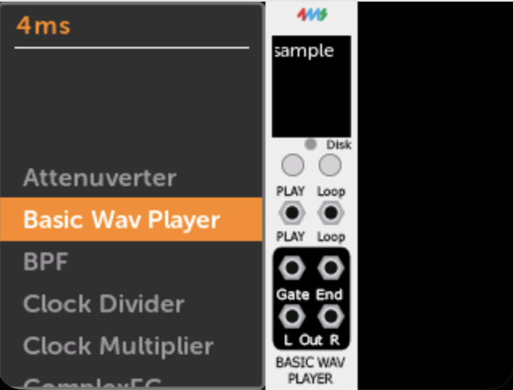
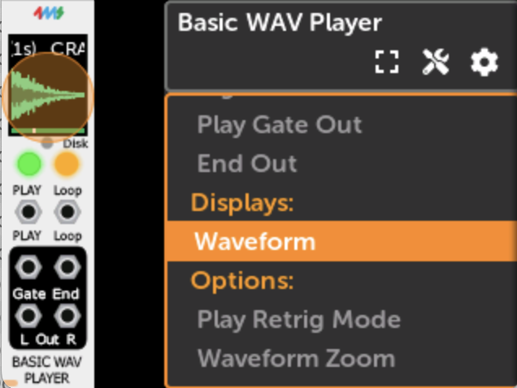
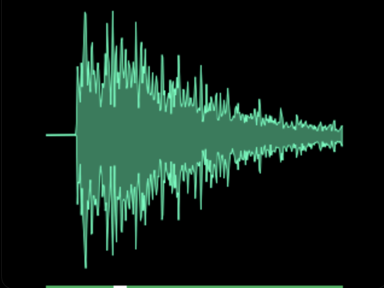
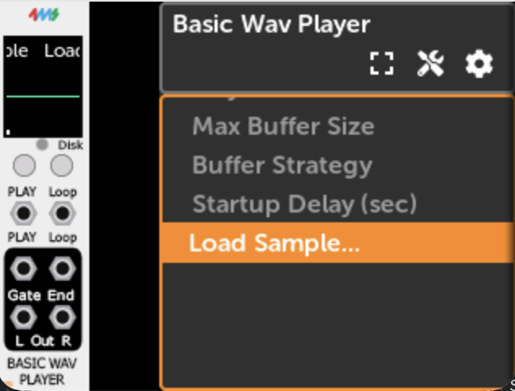
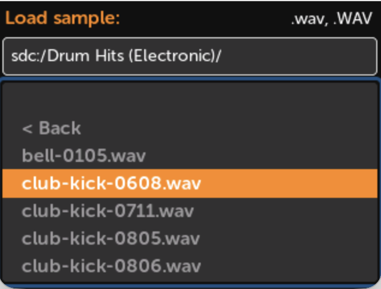
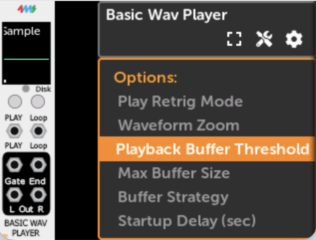

# Basic Wav Player

The **Basic Wav Player** (BWAVP) is a streaming `.wav` file player built into the MetaModule.
Because it streams audio from disk, it can play files of any length without waiting to load the entire
file into memory first. It also has advanced settings for optimizing simultaneous playback of multiple 
large samples.

## Adding the Module

   The Basic Wav Player is found in the **4ms** brand in the module browser.

   [{ .half }](./img/bwavp-module-browser.png)

## Module Overview

### Controls

- **Play** — Momentary button. Starts playback. If the sample is already playing, behavior depends on the
  [Play Retrig Mode](#play-retrig-mode) setting.
- **Loop** — Latching button. Toggles looping mode on and off. When looping is enabled, the sample
  restarts from the beginning when it reaches the end.

### Jacks

| Jack | Type | Description |
|------|------|-------------|
| **Play** | Input trigger/gate | Rising edge triggers playback, same as pressing the Play button |
| **Loop** | Input trigger/gate | Rising edge toggles looping mode |
| **Play Gate** | Output gate | Goes high (5V) while the sample is playing; goes low when stopped or paused. Does not go low when sample loops. |
| **End** | Output trigger | Fires when the sample ends naturally, when it loops, when it is re-triggered, or when playback stops. Does **not** fire when the sample is paused. |
| **Out Left** | Audio output | Left channel (or mono channel if the file is mono) |
| **Out Right** | Audio output | Right channel (or same as left if the file is mono) |

### Waveform Display

The module shows the sample waveform while playing. On the MetaModule, clicking on the Waveform Display will make it full-screen.

   [{ .half }](./img/bwavp-waveform-element.png)

   [{ .half }](./img/bwavp-waveform-display.png)

The [Waveform Zoom](#waveform-zoom) feature adjusts how much of the sample to display on the screen.

The waveform itself is color-coded:

| Waveform color | Meaning |
|---|---|
| **Teal** | Normal playback |
| **Blue** | Startup delay is active |
| **Red** | File or disk error |

### Progress bar

The progress bar below the waveform represents how much of the sample has been buffered from disk into memory.

| Progress bar color | Meaning |
|---|---|
| **Grey** | Reading from disk; not yet ready to play (buffer hasn't reached threshold) |
| **Blue** | Ready to play (buffer filled past threshold) |
| **Green** | Sample fully loaded into memory |

The white box in the progress bar shows the current playhead position.

### Disk light

The small **Disk** indicator (red light) is lit while the drive is being accessed. Do not remove the drive
when this light is on.

### Play Button Color

| Color | Meaning |
|---|---|
| Off | Not playing |
| Green | Playing |
| Yellow | Buffer underrun — re-buffering from disk |
| Red | File or disk error |

---

## Loading a Sample

-  To load a `.wav` file, scroll to **Load Sample**.

   [{ .half }](./img/bwavp-load-sample-menu.png)

-  A file browser will open. Navigate to the `.wav` file you want to play and select it.

   [{ .half }](./img/bwavp-file-browser.png)

The module begins buffering as soon as the file is selected. Once the progress bar turns blue,
playback is ready.

### File Location

Place `.wav` files on a **USB drive** or **microSD card** inserted in the MetaModule. There is no
required folder structure — use any folder organization you prefer.

### Supported Formats

| Property | Supported values |
|---|---|
| Extension | `.wav` |
| Channels | Mono or stereo |
| Bit depth | 8-bit, 16-bit, 24-bit, or 32-bit integer; 32-bit or 64-bit float |
| Sample rate | Any (automatically resampled to the MetaModule's current sample rate) |

---

## Settings

   All settings are found under __Options:__

   [{ .half }](./img/bwavp-settings.png)

### Play Retrig Mode

Controls what happens when the Play button is pressed (or a play trigger is received) while the sample
is already playing:

| Mode | Behavior |
|---|---|
| **Retrigger** *(default)* | Sample restarts from the beginning. An End trigger fires and the Play Gate dips low briefly. |
| **Stop** | Sample stops and resets to the beginning. An End trigger fires and Play Gate goes low. |
| **Pause** | Sample pauses at the current position. Press Play again to resume. No End trigger fires; Play Gate goes low while paused. |

### Waveform Zoom

Controls how much of the sample's duration is shown on the waveform display.
0% shows the last ~2ms of signal; 100% shows the last ~750ms.

### Playback Buffer Threshold

How much of the buffer must be filled before playback is allowed to begin.

- Lower values reduce latency from trigger to first audio output.
- Higher values provide more protection against brief disk stalls causing audio glitches.

Once the progress bar turns green (sample is fully buffered), this setting has no effect.
The default value of 25% is a good starting point.

### Max Buffer Size

Sets the maximum RAM the module may use for buffering the sample. If the sample fits entirely within
this limit, it will be fully loaded into memory (green progress bar) and the drive will not be
accessed again during playback.

If the sample is larger than the buffer, it streams from disk continuously during playback.

| Buffer size | Approximate maximum fully-buffered duration (stereo 48kHz) |
|---|---|
| 1 MB | ~5 seconds |
| 2 MB | ~10 seconds |
| 4 MB | ~21 seconds |
| **8 MB** *(default)* | **~43 seconds** |
| 16 MB | ~1 min 27 sec |
| 32 MB | ~2 min 54 sec |
| 64 MB | ~5 min 49 sec |
| 128 MB | ~11 min 38 sec |

In patches with multiple sample players, reducing Max Buffer Size per module helps keep
total memory usage manageable.

### Buffer Strategy

Advanced option. Controls how the module fills the ring buffer during streaming:

- **Fill to Threshold** *(default)* — loads just enough data to maintain the threshold level. As the
  sample plays and the buffer depletes, more data is loaded from disk in small bursts.
- **Fill Completely** — loads until the buffer is completely full, then stops loading until the
  buffer depletes back to the threshold level. This reduces disk access frequency.

### Startup Delay

Delays disk access by the specified number of seconds after the patch first loads. Useful in patches
with multiple sample players: stagger their startup delays so they don't all hit the drive at the
same moment, which could cause slow loading or audio glitches.

---

## Using in VCV Rack

The Basic Wav Player is available in VCV Rack as part of the 4ms plugin. Use **right-click > AltParams > Load Sample** to select a file from your computer.

!!! note "File paths and MetaModule"
    The file path is stored inside the patch file. On VCV Rack this is an absolute path on your
    computer (e.g. `/Users/you/samples/kick.wav`). On MetaModule, paths use the storage device
    prefix (e.g. `sdc:/samples/kick.wav` for microSD, or `usb:/samples/kick.wav` for USB).

    If you build the patch in VCV Rack and transfer it to MetaModule, you will need to use
    **Load Sample** again on the MetaModule to select the file from the card or USB drive.
    Placing the files in the same relative folder structure on both your computer and the storage
    device makes this easier.
