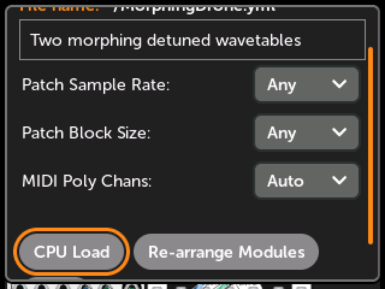
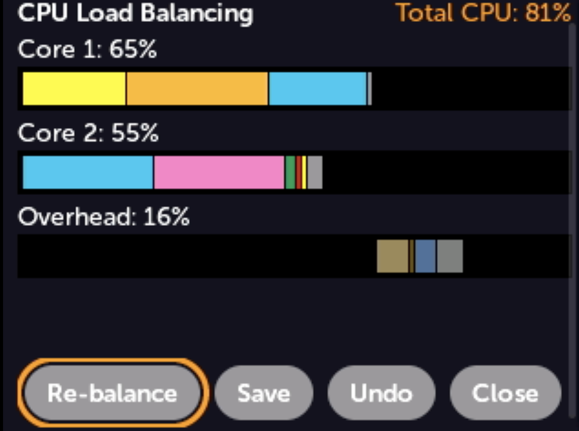
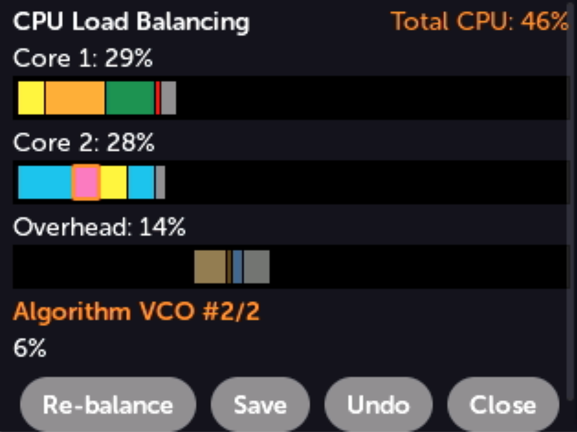
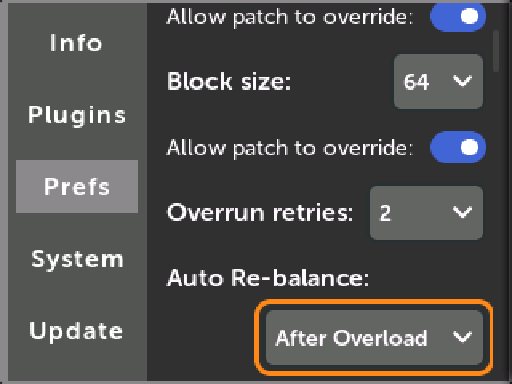

# CPU load balancing

The MetaModule's processor has two cores. When a patch plays, its modules are
divided between the two cores so that they share the work. The way the modules
are divided up is called the patch's *load balance*. A patch uses the least CPU
when both cores have about the same amount of work to do.

The MetaModule always balances patches when they are first opened, but it does so
using a quick method so the patch opens with minimal latency. A more extensive 
balancing procedure can be done that takes a little under a second, and often results
in a more efficient load balance. Also, as a patch is played and parameters and
signals change, re-balancing can sometimes make it use less total CPU load.

In the CPU Load window, you can see the current load balance, see how much CPU
each module is using while the patch plays, and have the MetaModule search for
a better balance.

## Opening the CPU Load window

-  __Open the Patch Info window and click `CPU Load`__

    Click the `(i)` icon in the Patch View and scroll down to find the button.

   [{ .half }](./img/patch-info-cpu-load.png)

## Reading the CPU Load window

[{ .half }](./img/cpu-load-panel.png)

- __Core 1__ and __Core 2__: Each core has a bar, and a percentage showing how
  much of the audio frame is spent running its modules and processing the modules'
  cables.

- __Overhead__: There's a third bar to show the time spent on mappings and 
  other necessary tasks. This happens after *both* cores are done.
    - *Mappings* is the time spent on knob and jack mappings. 
    - *MIDI* is the time spent handling MIDI mappings and streams. 
    - *Sync* is the time one core spends waiting for the other to finish
    - *Overhead* is everything else. Note that running the CPU load window itself adds 1-2% overhead.

- __Colored boxes__: Each box in a bar is one module or an overhead task. The
  wider the box, the more CPU that module or task is using. While the patch is
  playing, the boxes grow and shrink to follow the actual load.

- __White line__: If a core is asked to do more than it can, the bars are scaled
  down to fit on the screen and a white line marks the 100% point. Anything past
  the line is an overload. If there are no overloads, there will be no white line.

- __Total CPU__: The patch's overall load, in the top-right corner. 

If the window says `Play this patch to calculate its load balance`, the patch
has never been played, so there is nothing to show yet. Press the Back button
and play the patch first.

### Seeing the load of a module

-  __Turn the encoder to highlight a box__

    The name of the module and its load are shown below the bars. If the patch
    has more than one of the same module, the name also tells you which one it
    is, for example `Ensemble Oscillator #2/4`.

    Click on a module's box to jump to that module.

   [{ .half }](./img/cpu-load-module.png)

While the patch is playing, the module's load is measured live. If the patch is
not playing, the number is the estimate from the last time the balance was
calculated.

## Re-balancing

The automatic balance is a good first guess: it measures each module on its own
and then divides them up evenly between cores. But modules don't always use the
same amount of CPU when they run together as parameters and signals change, so
there is often a better balance to be found.

-  __Click `Re-balance`__

    The MetaModule tries several different ways of dividing the modules between
    the cores. It plays the patch with each one for a fraction of a second,
    measures the real load, and keeps the best one.

    The audio outputs are silent while this happens. It takes about a second,
    and the window shows its progress: `Trying arrangement 2 of 5...`

Large patches often see their CPU load drop by 2% or more, and sometimes by as
much as 10%. Small patches usually don't change much, if at all.

The other buttons are:

- __Save__: Save the patch, including its new balance. This is greyed out for a
  new patch that has never been saved: use the
  [Patch File Menu](module_patch_settings.md#patch-file-menu) instead.
- __Undo__: Revert all changes and use the balance the patch had when you
  opened the window.
- __Close__: Close the window, keeping all changes but not saving anything to
  disk. You can also press the Back button.

`Re-balance` is greyed out if the patch isn't loaded for playing, or if it has
fewer than two modules. If a patch was stopped for overloading the CPU, then
re-balancing starts the patch playing again.

## The balance is saved in the patch

A patch's load balance is stored in the patch file when you save the patch. The
next time you load the patch, the saved balance is used.

A patch that doesn't have a balance saved in it, such as a patch that just came
from VCV Rack, gets one calculated the first time it's played. The balance is
also re-calculated whenever you add, remove, or replace a module.

## Automatic re-balancing

The MetaModule can re-balance a patch for you, without opening the CPU Load
window. This is set by __Auto Re-balance__ in the Audio Settings section of the
[Preferences](preferences.md) page:

- __Off__: Never re-balance automatically.
- __After Overload__ (default): If a patch is stopped because it overloaded the
  CPU, it's re-balanced when you press Play to start it again.
- __Every Patch Load__: Every patch is re-balanced when it's loaded and played.
  This adds about a second of silence each time you load a patch.

You'll see the message `Optimizing CPU load balance...` when this happens.

[{ .half }](./img/prefs-auto-rebalance.png)
