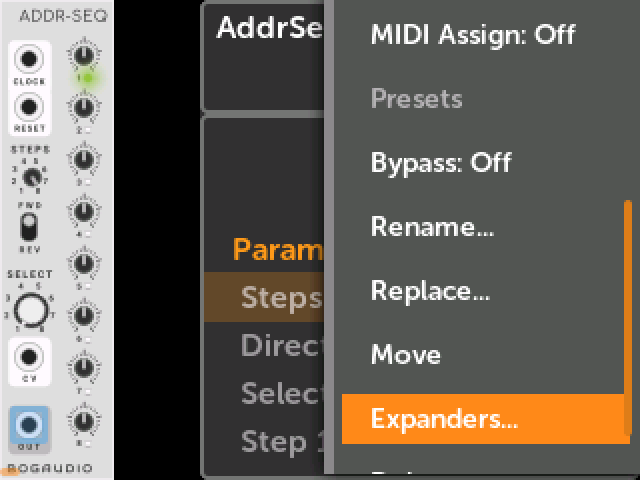
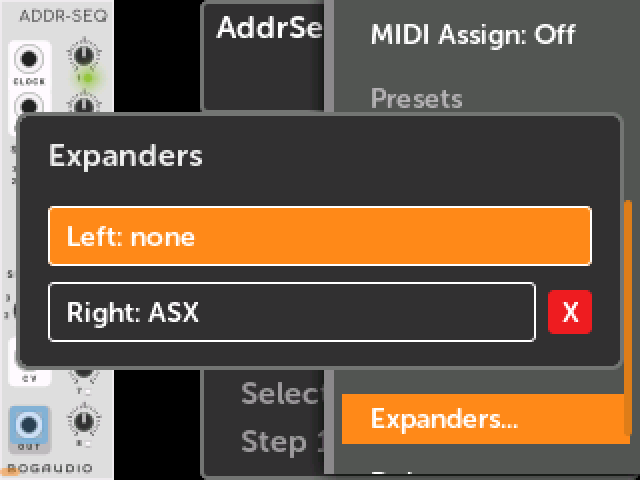
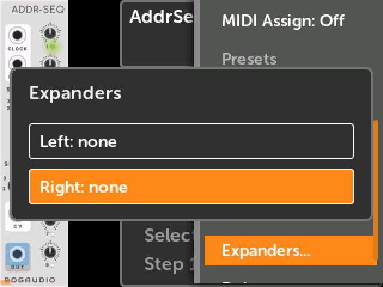
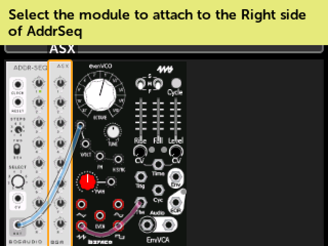
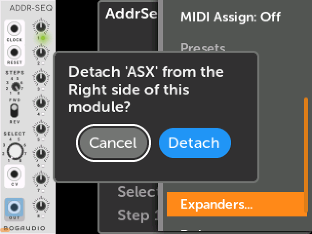

# VCV expander modules

Many VCV Rack plugins include expander modules: modules that add features to
another module when the two are placed side by side in the rack. Typical
examples might be extra channels or controls for a mixer, or CV inputs for
parameters that don't fit on the main module's panel.

Starting in firmware v2.4.0, expander modules are fully supported. A patch made
in VCV Rack opens and runs on the MetaModule with the same expander connections,
and you can view, create, and remove expander connections on the MetaModule
itself.

!!! note "Not the same as hardware expanders"
    This page is about *virtual* expander modules inside a patch. For the
    hardware expanders that attach to the back of the MetaModule, see
    [Wi-Fi Expander](wifi.md), [MetaAIO](meta-aio.md), and
    [MetaButtons](meta-buttons.md).

Make sure you are using MetaModule firmware v2.4.0 or later, and the 4ms VCV plugin 
v2.3.0 or later. Also, older versions of plugins may not have included the expander
modules, so make sure to update those as well.

## Expanders in a VCV Rack patch

Build the patch in VCV Rack as you normally would, with each expander touching
the module it expands. When you save or send the patch from the MetaModule Hub,
the expander connections are stored in the patch file if the following are all true:

- The two modules are touching, side by side.
- Both modules are from the same plugin brand.
- At least one of the two has the "Expander" tag (as seen in the VCV Rack module browser).

When you load the patch on the MetaModule, the two modules will be connected as
expanders. An expander connection is a link between two modules that is saved
in the patch. Unlike VCV Rack, the two modules do not have to be next to
each other on the screen: they stay connected wherever the modules are
[arranged](patch_layout.md).

## Viewing a module's expanders

-  __1. Open the module's Action menu and click `Expanders...`__

    Click on the module in the Patch View, click the Tool icon to open the
    [Module Action menu](action_menu.md), and scroll down to `Expanders...`

   [{ .half }](./img/module-action-expanders.png)

-  __2. The Expanders window shows what is attached to each side__

    Each module has a __Left__ side and a __Right__ side. A side shows the name
    of the module attached to it, or `none` if nothing is attached.

    Click on an attached module's name to jump to that module.

    Press the Back button to close the window.

   [{ .half }](./img/expander-popup.png)

While the patch is playing, a note after the module name tells you about the
connection:

- __active__: the two modules are exchanging data, which means the expander is
  working.
- __no link__: the connection is in the patch, but the two modules are not
  linked. This happens if one of the modules is not a module ported from VCV
  Rack. It can also appear for a moment right after you attach an expander.
- No note: the modules are linked, but they have not sent each other anything
  that the MetaModule was able to see. Some expanders communicate directly with
  each other, and the MetaModule firmware won't be able to verify the link in
  this case, even though everything is working normally.

## Attaching an expander

You can attach an expander to a module at any time, even while the patch is
playing. Both modules must already be in the patch.

-  __1. Click an empty side in the Expanders window__

    Pick the side that the expander goes on. This is the same side you would
    place it on in VCV Rack. Some expanders require being on one side or the
    other, so read the documentation for the modules you're using to find out.

   [{ .half }](./img/expander-popup-empty.png)

-  __2. Select the module to attach__

    Turn the encoder to highlight the expander module, and click on it.

    To cancel, press the Back button.

   [{ .half }](./img/expander-select-module.png)

-  __3. The expander is attached__

    The Expanders window of the first module will be displayed, showing
    the new connection.

   [{ .half }](./img/expander-popup.png)

Some things to know:

- The MetaModule does not check that the two modules were designed to work
  together. You can attach any two modules, but only a real expander pair will
  do anything.
- Expander connections are saved with the patch, so remember to save the patch
  after making changes.

## Detaching an expander

-  __Click the red `X` next to the attached module__

    Turn the encoder until the `X` is highlighted, click, and then confirm by
    clicking `Detach`.

    Only the connection is removed. Both modules stay in the patch, along with
    their cables and mappings.

   [{ .half }](./img/expander-detach.png)

Deleting a module from the patch also removes its expander connections. The same
is true when you [replace](action_menu.md#replace) a module.
