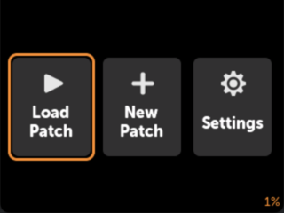
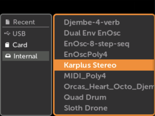
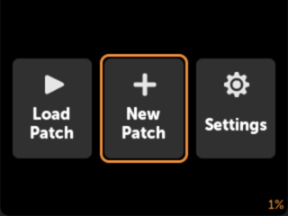
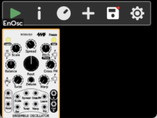
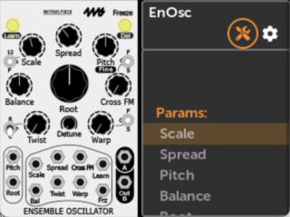
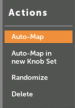
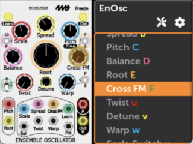
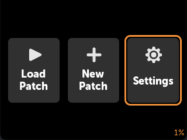

# Getting Started

## Get to Know the Panel

---

## How to Play a Patch

-  __1. Click `Load Patch` in the Main Menu__

   

-  __2. Click on a patch__

   

-  __3. Click Play icon__

   

---

## How to Create a New Patch

-  __1. Click `New Patch` in the Main Menu__

   

-  __2. Pick a module to add to the patch__

      For this example, we'll use the Ensemble Oscillator (EnOsc) from 4ms Company.

      Click once to view just the panel, then click again to add it.

   

-  __3. Click on the module__

   

-  __4. Click the Action Menu icon__

    

- __5. Select Auto-Map__ 

      This will map physical knobs and jacks to the EnOsc's virtual knobs, switches and jacks.

   

- __6. Play!__

       Patch Audio Outs 1 and 2 on the MetaModule to your speakers and twist the MetaModule knobs to control the sound. Patch modulation sources into the input jacks, if you wish.

       Scroll to see the mappings, or view all of them at once in Knob Set View.

       You can add more modules by clicking the `+` icon in the button bar, and repeat from step 2.

   

---

## How to Update Firmware 

-  __1. Click `Settings` in the Main Menu__

   

-  __2. Click Update__

   

-  __3. Download the firwmware to a USB drive or SD Card__

      Use the [Download](../downloads) link above.

   

