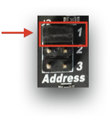
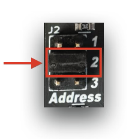
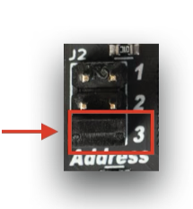
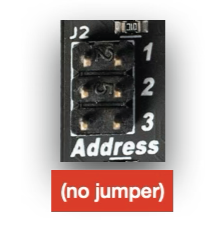

#MetaButtons Expander

## Getting Set Up

Read the PDF quick-start guide: [MetaButtons Quick Start](https://4mscompany.com/media/MetaModule/MetaButtons-quickstart.pdf)

## Daisy-chaining

You can daisy-chain up to four MetaButtons using the included cables.

### Connect the cables 

  - Connect the first MetaButtons module to the MetaModule as described in the Quick Start guide above.

  - To attach a second MetaButtons module, remove the adaptor board from the second MetaButtons' cable and
store the adaptor board in a safe place for future use.

  - Attach the cable directly from the "Toward MetaModule" header on the second
MetaButtons to the "Toward Expanders" header on the first MetaButtons module.

  - For a third and fourth MetaButtons module, repeat the process. Make sure each
cable goes from a "Toward MetaModule" header to a "Toward Expanders" header.

  - Finally, set the jumpers on each module (see below)

### Set the jumpers

There are four slots available, and the order of the slots you choose does not matter (as long as
no two modules share the same slot).

-  __MetaButtons 1__ 

     Install the jumper in the top position

  [{ .half }](./img/metabutton-jumper-1.png)

-  __MetaButtons 2__ 

     Install the jumper in the middle position

  [{ .half }](./img/metabutton-jumper-2.png)

-  __MetaButtons 3__ 

     Install the jumper in the bottom position

  [{ .half }](./img/metabutton-jumper-3.png)

-  __MetaButtons 4__ 

     Remove the jumper

  [{ .half }](./img/metabutton-jumper-4.png)

