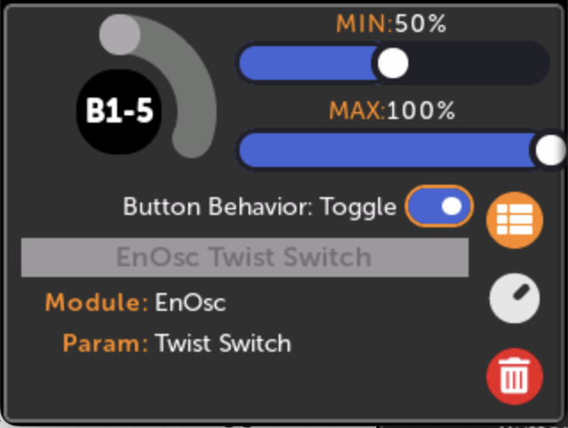
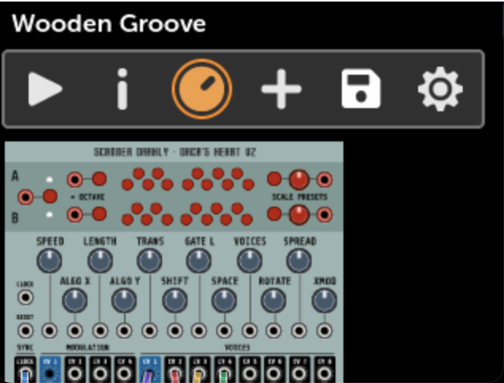
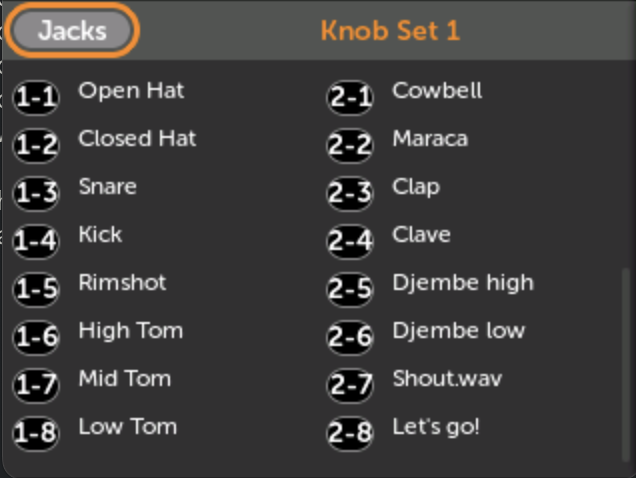
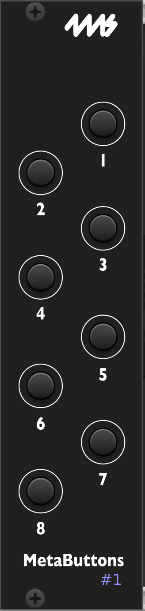
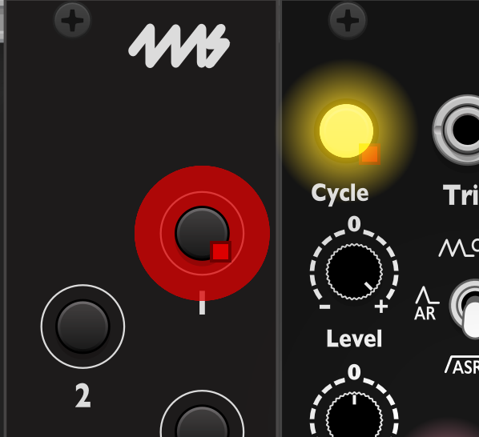
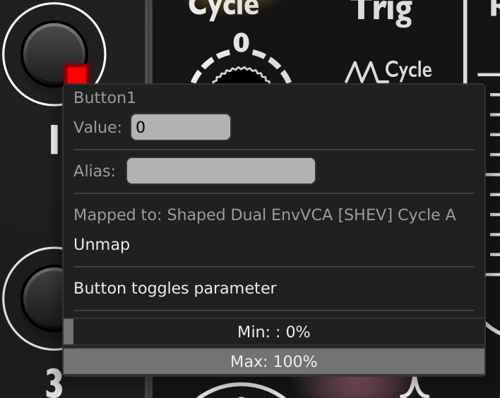
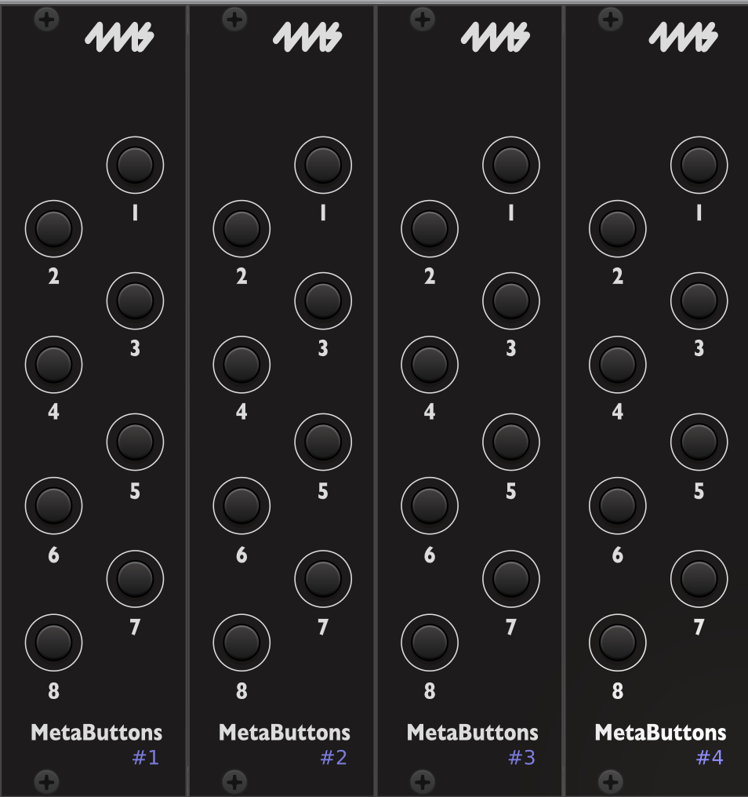

# MetaButtons Expander

## Getting Set Up

Read the PDF quick-start guide: [MetaButtons Quick Start](https://4mscompany.com/media/MetaModule/MetaButtons-quickstart.pdf)

## Basic Usage

### Creating mappings

You can map buttons to virtual parameters just like you map the knobs on the
MetaModule: either manually creating maps (see [Creating a New Knob
Mapping](using_metamodule.md#creating-a-new-knob-mapping-or-midi-mapping)), or
by using the Quick Map shortcut (holding down the rotary encoder and tapping a
button. See [Quick Map Shortcut](using_metamodule.md#quick-map-shortcut)).

### Button maps and Knob Sets

Like knob maps, button maps belong to a Knob Set. Changing the Knob Set will change the button mappings, just as it changes the knob mappings.

When the Hub changes Knob Sets (whether from the MetaModule's encoder shortcut, the MetaModule's
Knob Sets page, or via MIDI), all connected MetaButtons modules will automatically switch to
the same Knob Set.

!!! note "Multiple Hubs"
    If a patch contains more than one Hub, all MetaButtons modules will change Knob Sets whenever
    *any* Hub changes Knob Sets.

### Button maps and Catchup-modes

Button maps are not constrained by [Knob Catchup](preferences.md) modes. Pressing a button will always update the mapped parameter.

### Button names

Buttons are named by the MetaButtons module number (1-4), followed by the button number (1-8).
For example, if you just have one MetaButtons module then with the jumper in the default position,
the first button is Button 1-1 (or B1-1 for short). The second button is Button 1-2, the third is B1-3, etc.

If you daisy chain two MetaButtons modules, and set the jumper on the second
one to position 2, then the buttons on the second module will be B2-1, B2-2,
B2-3, etc. (See below for information about the jumper positions)

### Editing a button map

-  __Select Toggle mode to alternate between two states__ 

     You can also adjust the Min and Max values to change which two states are
     toggled. For example, you can toggle between the middle and top positions
     of a three-position switch by setting Min to 50% and Max to 100%.

  [{ .half }](./img/knobmap-toggle.png)

### Viewing button maps

Button maps are shown below knob maps.

-  __1. Open the Knob Sets page__

  [{ .half }](./img/knobsets-icon.png)

-  __2. Scroll down past the knobs to see the button maps__

  [{ .half }](./img/button-maps-list.png)

### Creating maps with VCV Rack

Creating patches with button mappings using VCV Rack follows the same process as creating maps to knobs.
The MetaButtons module in VCV Rack tracks the Hub's active Knob Set; the right-click menu on the
MetaButtons module shows which Knob Set is currently active.

-  __1. Add a MetaButtons module to your patch__

     Make sure the number in the bottom corner matches the jumper installed on the back of your module.
     If not, click it until it does.

  [{ .img-360 }](./img/vcv-metabuttons-1.png)

-  __2. Click the mapping ring around the button, then click a virtual parameter to map to__

  [{ .half }](./img/vcv-button-mapped.png)

-  __3. Right-click the button to change Toggle mode__

      The Min and Max settings control the two values that the button toggles between.

      You can also set an alias name for this mapping

  [{ .half }](./img/vcv-button-dropdown.png)

-  __4. To use more than one MetaButtons, give each one a unique number (1-4)__

     Click the number to change it.

     The numbers will be red if there is a conflict.

  [{ .img-360 }](./img/vcv-metabuttons-1-4.png)

## Daisy-chaining

You can daisy-chain up to four MetaButtons using the included cables.

### Connect the cables 

  - Connect the first MetaButtons module to the MetaModule as described in the Quick Start guide above.

  - To attach a second MetaButtons module, remove the adapter board from the second MetaButtons' cable and
store the adaptor board in a safe place for future use.

  - Attach the cable directly from the "Toward MetaModule" header on the second
MetaButtons to the "Toward Expanders" header on the first MetaButtons module.

  - For a third and fourth MetaButtons module, repeat the process. Make sure each
cable goes from a "Toward MetaModule" header to a "Toward Expanders" header.

  - Finally, set the jumpers on each module (see below)

### Set the jumpers

There are four slots available, and the order of the slots you choose does not matter (as long as
no two modules share the same slot).

-  __MetaButtons 1__ 

     Install the jumper in the top position

  [{ .half }](./img/metabutton-jumper-1.png)

-  __MetaButtons 2__ 

     Install the jumper in the middle position

  [{ .half }](./img/metabutton-jumper-2.png)

-  __MetaButtons 3__ 

     Install the jumper in the bottom position

  [{ .half }](./img/metabutton-jumper-3.png)

-  __MetaButtons 4__ 

     Remove the jumper

  [{ .half }](./img/metabutton-jumper-4.png)

