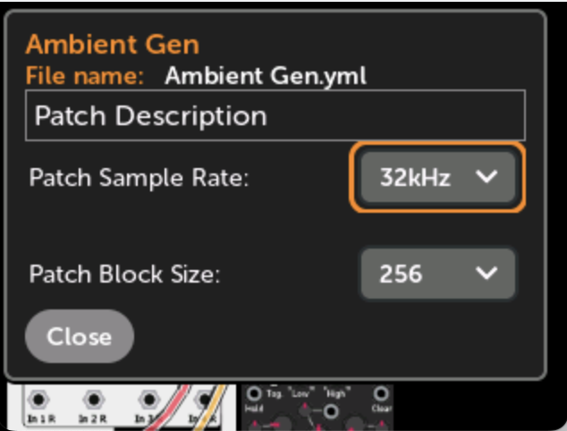
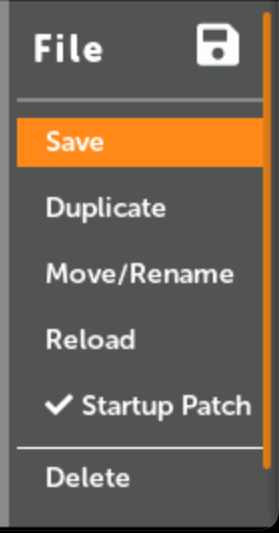

# Patch/Module Settings

## Module and Patch Display Settings

The Patch View page and Module View page each have their own display settings menu.
These menus control how mappings and cables are drawn when viewing modules and their connections.

-   __Patch View display settings__

    The Patch View display settings menu is found by clicking on the gear icon when viewing a patch.

    [{ .half }](./img/patch-view-gear-icon.png)

-   [{ .img-567 }](./img/patchview-settings.png)

-   __Module View display settings:__

    The Module View display settings menu is found by clicking on a module in a patch and then clicking on the gear icon at the top.

    [{ .half }](./img/mv-settings-icon.png)

-    [{ .img-511 }](./img/mv-settings-all.png)

### GRAPHICS

These options control how graphic screens on modules are displayed. The term
"graphic screen" is a loose term that refers to any element on the module that's
drawn dynamically (besides knobs, sliders, buttons, switches, lights, and text
displays). This may refer to anything from waveform or BPM displays, to static
portions of the faceplate that the module designer chose to draw with vector
commands, to text under knobs that may change in different modes.

- __Draw Screens__: toggles whether to draw graphic screens on modules.
If you have issues with the module responding slowly to the rotary encoder and
Back button, then try disabling screens or adjusting the Update Rate.

- __Update Rate__: When screens are enabled, you can throttle the frame rate
with this option. When set to the maximum value (fully to the right), each
graphic screen in the patch will be updated in turn, one graphic screen per 60Hz refresh.
Each click of the slider to the left updates screens half as often (i.e. one
screen per 30Hz refresh, then 15Hz refresh, etc..)

### STATUS BAR

The status bar is visible in the upper-right corner of the Patch View, and the
upper-left corner of the Module View. It displays the current CPU usage, and
optionally the audio sample rate and block size.

- __Show Audio Settings__: This option shows the current audio sample rate and block size
  in the status bar before the CPU load. For example, `48k/128 33%`

- __Show Status__ (*Module View*) / __Show Status on Top__ (*Patch View*): When
  enabled, the status bar will always be on shown in the corner, on
  top of everything else, even if the page scrolls.

---

*Patch View only*

- __Show Knob Set Name__: This displays the name of the current Knob Set next to the patch name.

### MAPS

These options set how control mappings (knob, switch, and button maps) are displayed:

- __Show Control Maps__: toggles whether to hide or show a colored ring around
  controls that are mapped. The color corresponds to the panel knob it's mapped
  to.

- __Opacity__: How opaque or transparent to draw the colored rings.

- __Flash When Moved__: Whether to flash the colored ring when its panel knob
  is moved. This can be turned on even if Show Control Maps is off.

- __Show Control Aliases__: *(Module View only)* When enabled, the alias name
  for control mappings will be displayed next to the control name in the
  element list.

These options set how jack mappings to the panel are displayed:

- __Show Panel Jack Maps__: toggles whether to hide or show a colored circle on 
  jacks that are mapped to the panel. The color corresponds to the panel jack
  it's mapped to.

- __Opacity__: How opaque or transparent to draw the circles. If Opacity is
  more than about 40%, the number of the jack will be drawn inside the circle.

- __Show Jack Aliases__: *(Module View only)* When enabled, the alias name
  for jack mappings will be displayed next to the jack name in the
  element list.

This option refers to both control mappings and jack mappings:

- __Always Show Maps__: Enabling this option will hide control and jack maps
  when you are viewing a patch while a different patch is playing (or paused).
  This option is disabled if both Show Control Maps and Show Panel Jack Maps
  are off.

- __Show on All Modules__: *(Patch View only)* When this option is enabled, maps
  will be drawn on all modules in the patch. When this is disabled, maps will
  be drawn on only the module that's currently focused. 
This option is disabled if both Show Control Maps and Show Panel Jack Maps are off.

### Cables

- __Show Cables__: *(Patch View only)*
  Toggles whether to draw cables connecting modules.

- __Highlight Patched Jacks__: *(Module View only)*
  Toggles whether to draw a colored square on
  jacks that have an internal cable patched to them. Output jacks have a square
  drawn around the outside of the jack, and input jacks have a square drawn on
  the inside of the jack. The color of the square matches the color of the
  cable as seen in the patch view.

- __Opacity__: How opaque or transparent to draw the cables or squares.

---

## Patch Info

-   __Patch Info__ 

    The Patch Info window is opened by clicking the `(i)` info icon when viewing a patch.

-   [{ .half }](./img/patchview-info-icon.png)

-   The Patch Info window contains information about the patch:

     - Patch name 
     - File name
     - MIDI polyphony channels (if relevant)
     - Patch description
     - Patch's sample rate and block size

    
-   [{ .half }](./img/patch-info-audio-settings.png)

-   __Patch Description__
     
    Click on the description to edit the text.
   
-   [{ .half }](./img/patch-description-edit.png)

-   __Patch Sample Rate and Block Size__
    
    You can set the suggested sample rate and block size for each patch. When
    the "Allow Patch to Override" preference is enabled (see [preferences](preferences.md)),
    the sample rate and block size will automatically be set to these values
    when the patch is loaded.

    Changing these values while the patch is playing will immediately change
    the current sample rate and block size.
   

---

## Patch File Menu

-   __Patch File Menu__

    The Patch File Menu is opened by clicking the file/disk icon when viewing a patch.

    While focused on the file icon the file path will be shown.

-   [{ .half }](./img/patch-view-file-icon.png)

-   Save, Duplicate, Move/Rename, Reload (or Revert), Startup Patch, Delete

    
-   [{ .half }](./img/file-menu-2.1.png)

-   __Save__: save the patch file
  
    This will save the current state of the patch including the position of
    all knobs, switches, and buttons. All mappings will be saved.

    If you ejected the disk, then the patch will not save (an error will be
    shown). In this case, either re-insert the disk and click `Save` again,
    or click `Duplicate` to save in a different location.

-   __Duplicate__: save a copy of the patch

    Clicking this will bring up a window where you can set the patch name and/or disk or sub-folder
    of the new patch file.

    The new patch file will be opened after the old one is duplicated, but if the old one was playing, 
    the old one will still be playing.

    
-   [{ .half }](./img/duplicate-file.png)

-   __Move/Rename__: change name or location of a patch

    Clicking this will bring up a window where you can change the patch name and/or disk or sub-folder.
    
-   [{ .half }](./img/duplicate-file.png)

-   __Revert__ (or __Reload__): Revert all changes to the patch file
  
    This will reload the patch file from disk, losing all changes.
    It cannot be undone.

    If you ejected the disk that the patch file lives on, then the patch
    cannot be reverted since the original file cannot be loaded.

    This option will appear as "Reload" when you have not made any modifications
    to the patch, and "Revert" when you have modified the patch. The resulting
    action is the same (reloading the file from disk).

-   __Startup Patch__
  
    Select this menu item to toggle whether the patch is the startup patch.

    When the MetaModule is powered up, the startup patch will be loaded
    and played after plugins are pre-loaded.

    If you don't want to have a startup patch, uncheck this.

    You can see what patch is the startup patch, and/or disable any patch
    from playing at startup in the [Preferences](preferences.md).

-   __Delete__: Delete the patch file
  
    This will delete the patch file from disk.
    It cannot be undone.

    If you ejected the disk that the patch file lives on, then the patch
    cannot be reverted since the original file cannot be loaded.

### File Names:
The legal characters for file names are:
0-9 A-Z ! # $ % & ' ( ) - @ ^ _ `` { } ~ + , ; = [ ] and extended characters \x80 to \xFF and U+000080 to U+10FFFF
White spaces and dots can be placed anywhere in the path name except end of the name. Trailing white spaces and dots are ignored.
