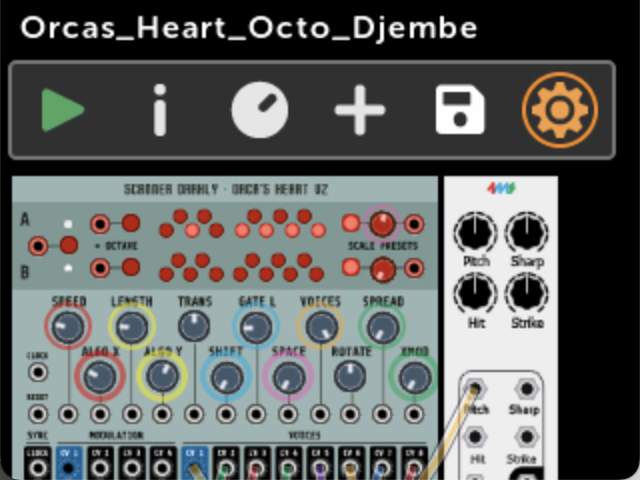
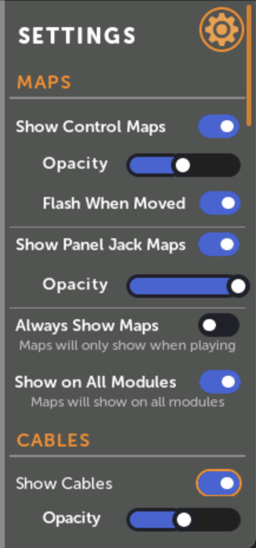
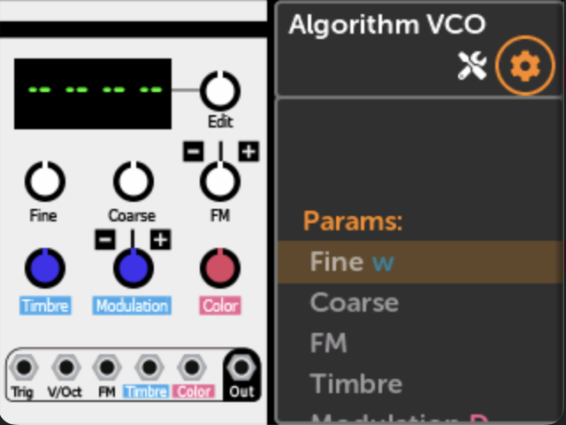
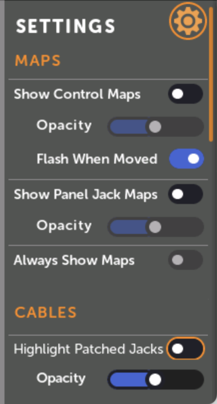
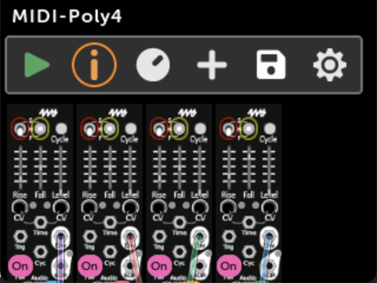
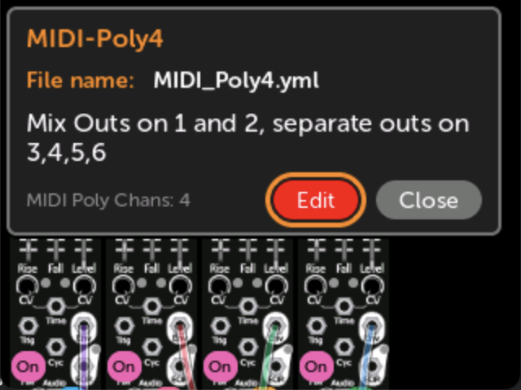
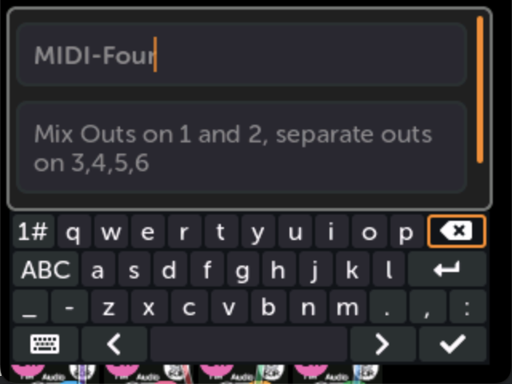
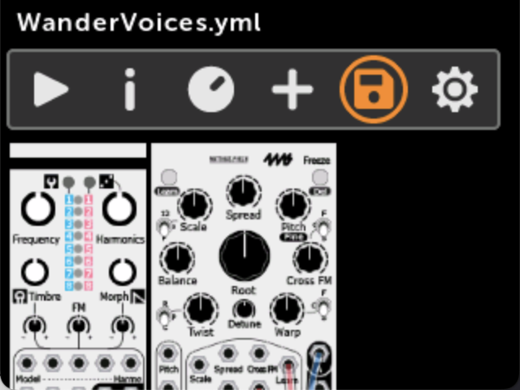
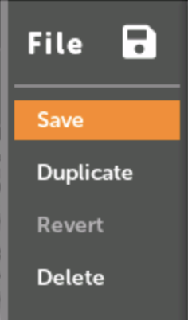
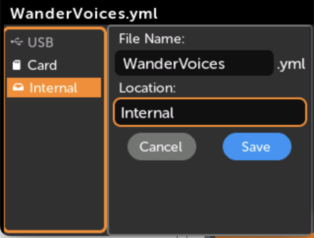

# Patch/Module Settings

## Module and Patch Display Settings

The Patch View page and Module View page each have their own display settings menu.
These menus control how mappings and cables are drawn when viewing modules and their connections.

-   __Patch View display settings__

    The Patch View display settings menu is found by clicking on the gear icon when viewing a patch.

    [{ .half }](./img/patch-view-gear-icon.png)

-   [{ .img-472 }](./img/patchview-settings.png)

-   __Module View display settings:__

    The Module View display settings menu is found by clicking on a module in a patch and then clicking on the gear icon at the top.

    [{ .half }](./img/mv-settings-icon.png)

-    [{ .img-412 }](./img/mv-settings-all.png)

### Control Maps

These options set how control mappings (knob, switch, and button maps) are displayed.

- __Show Control Maps__: toggles whether to hide or show a colored ring around
  controls that are mapped. The color corresponds to the panel knob it's mapped
  to.

- __Opacity__: How opaque or transparent to draw the colored rings.

- __Flash When Moved__: Whether to flash the colored ring when its panel knob
  is moved. This can be turned on even if Show Control Maps is off.

### Panel Jack Maps

These options set how jack mappings to the panel are displayed.

- __Show Panel Jack Maps__: toggles whether to hide or show a colored circle on 
  jacks that are mapped to the panel. The color corresponds to the panel jack
  it's mapped to.

- __Opacity__: How opaque or transparent to draw the circles. If Opacity is
  more than about 40%, the number of the jack will be drawn inside the circle.

### Always Show Maps

Enabling this option will hide control and jack maps when you are viewing a
patch while a different patch is playing (or paused).
This option is disabled if both Show Control Maps and Show Panel Jack Maps are off.

### Show On All Modules

(Patch View only)
When this option is enabled, maps will be drawn on all modules in the patch.
When this is disabled, maps will be drawn on only the module that's currently 
focussed. 
This option is disabled if both Show Control Maps and Show Panel Jack Maps are off.

### Cables

- __Show Cables__: (Patch View only)
  Toggles whether to draw cables connecting modules.

- __Highlight Patched Jacks__: (Module View only)
  Toggles whether to draw a colored square on
  jacks that have an internal cable patched to them. Output jacks have a square
  drawn around the outside of the jack, and input jacks have a square drawn on
  the inside of the jack. The color of the square matches the color of the
  cable as seen in the patch view.

- __Opacity__: How opaque or transparent to draw the cables or squares.

---

## Patch Name and Description

-   __Patch Description__ 

    The Patch Description page is opened by clicking the (I) info icon when viewing a patch.

-   [{ .half }](./img/patchview-info-icon.png)

-   The patch name, description, MIDI polyphony channels (if MIDI notes are mapped) are shown.

    
-   [{ .half }](./img/patch-description.png)

-   Click Edit to edit the patch name or description.
   
    Note that the patch name can be different than the file name.

-   [{ .half }](./img/patch-description-edit.png)

---

## Patch File Menu

-   __Patch File Menu__

    The Patch File Menu is opened by clicking the file/disk icon when viewing a patch.

    While focused on the file icon the file name will be shown (note, this may be
    different than the patch name).

-   [{ .half }](./img/patch-view-file-icon.png)

-   Save, Duplicate (Save As), Revert, or Delete

    
-   [{ .half }](./img/file-menu.png)

-   __Save__: save the patch file
  
    This will save the current state of the patch including the position of
    all knobs, switches, and buttons. All mappings will be saved.

    If you ejected the disk, then the patch will not save (an error will be
    shown). In this case, either re-insert the disk and click `Save` again,
    or click `Duplicate` to save in a different location.

-   __Duplicate__: save a copy of the patch

    Clicking this will bring up a window where you can change the patch name and/or disk or sub-folder.

    The new patch file will be opened after the old one is duplicated, but if the old one was playing, 
    it will still be playing.

    
-   [{ .half }](./img/duplicate-file.png)

-   __Revert__: Revert all changes to the patch file
  
    This will re-load the patch file from disk, losing all changes.
    It cannot be un-done.

    If you ejected the disk that the patch file lives on, then the patch
    cannot be reverted since the original file cannot be loaded.

-   __Delete__: Delete the patch file
  
    This will delete the patch file from disk.
    It cannot be un-done.

    If you ejected the disk that the patch file lives on, then the patch
    cannot be reverted since the original file cannot be loaded.

