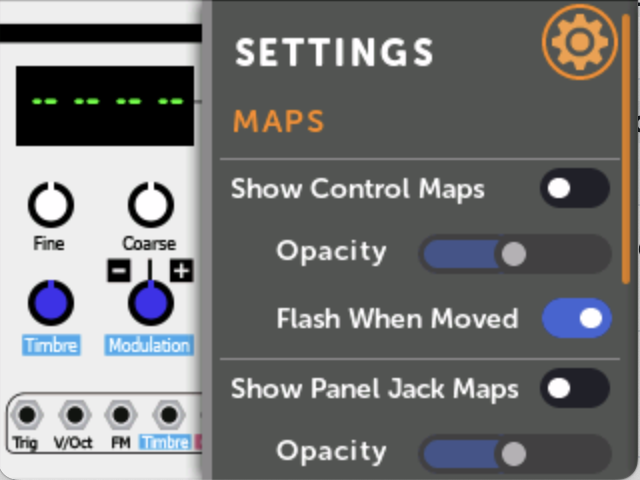
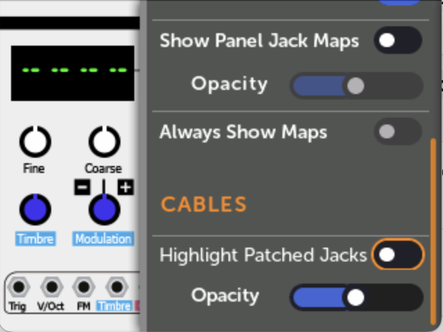

# Module and Patch settings

There are various menus for changing the way patches and modules are displayed, and for performing actions on a patch.

## Module Display Settings Menu

The Module Display Settings menu controls how mappings and cables are drawn when viewing a module in a patch.
(To change how mappings and cables are displayed when viewing an entire patch, see [Patch View Display Settings Menu](#patch-view-display-settings-menu)

-   The Module Display Settings menu is found by clicking on a module in a patch and then clicking on the gear icon at the top.

-   [{ .half }](./img/mv-settings-icon.png)

-   [{ .half }](./img/mv-settings-1.png)

-   [{ .half }](./img/mv-settings-2.png)

### Control Maps

These options set how control mappings (knob, switch, and button maps) are displayed.

- __Show Control Maps__: toggles whether to hide or show a colored ring around
  controls that are mapped. The color corresponds to the panel knob it's mapped
  to.

- __Opacity__: How opaque or transparent to draw the colored rings.

- __Flash When Moved__: Whether to flash the colored ring when its panel knob
  is moved. This can be turned on even if Show Control Maps is off.

### Panel Jack Maps

These options set how jack mappings to the panel are displayed.

- __Show Panel Jack Maps__: toggles whether to hide or show a colored circle on 
  jacks that are mapped to the panel. The color corresponds to the panel jack
  it's mapped to.

- __Opacity__: How opaque or transparent to draw the circles. If Opacity is
  more than about 40%, the number of the jack will be drawn inside the circle.

### Always Show Maps

Enabling this option will hide control and jack maps when you are viewing a
patch while a different patch is playing (or paused).
This option is disabled if both Show Control Maps and Show Panel Jack Maps are off.

### Cables

- __Highlight Patched Jacks__: Toggles whether to draw a colored square on
  jacks that have an internal cable patched to them. Output jacks have a square
  drawn around the outside of the jack, and input jacks have a square drawn on
  the inside of the jack. The color of the square matches the color of the
  cable as seen in the patch view.

- __Opacity__: How opaque or transparent to draw the squares.

---

## Patch View Display Settings Menu

---

## Patch Name and Description

---

## Patch File Menu

