# Arranging modules

Starting in firmware v2.4.0, you control how a patch is laid out on the screen:
how big the modules are drawn, where each module sits, and how the cables hang.

This page describes:

- [Module size](#module-size-zoom): zoom the Patch View from 50% to 100%.
- [Module positions](#module-positions): show modules packed together, or in the
  same positions as in your VCV Rack patch.
- [Re-arranging modules](#re-arranging-modules): move modules around on the
  MetaModule, even while the patch is playing.
- [Cable tension](#cable-tension): how much the cables droop.

Most of these options live in the Patch View display settings menu, which you
open by clicking the gear icon when viewing a patch. They are display settings,
so they apply to every patch you open.

   [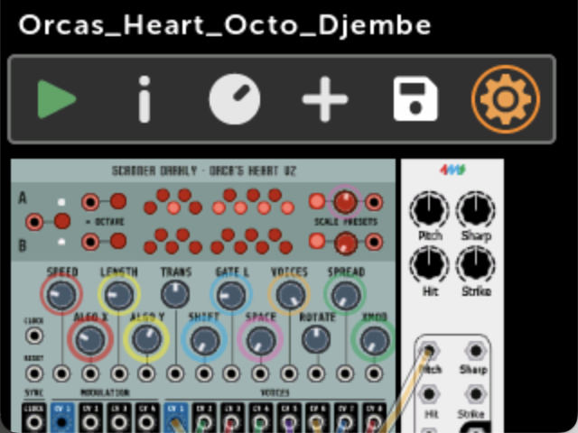{ .half }](./img/patch-view-gear-icon.png)

   [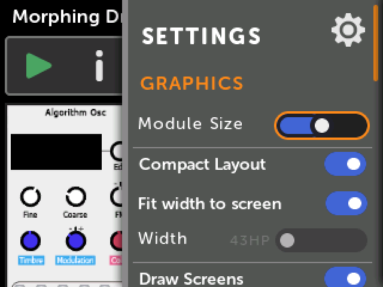{ .half }](./img/patchview-settings-layout.png)

## Module size (zoom)

The __Module Size__ slider sets how tall the modules are drawn in the Patch View.
There are five sizes, from 50% to 100% of the height of the screen. The default
is 75%.

At smaller sizes more of the patch fits on the screen at once, which makes it
easier to get around a big patch. At 100% a module fills the height of the
screen.

   [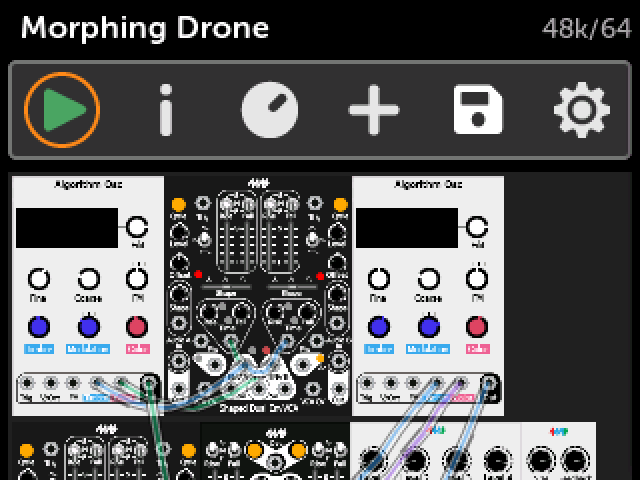{ .half }](./img/patchview-zoom-50.png)

   [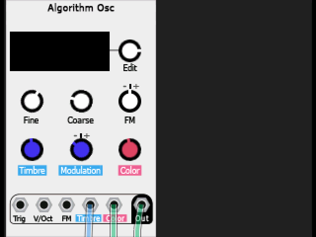{ .half }](./img/patchview-zoom-100.png)

The patch is re-drawn as you move the slider, so you can see the result behind
the menu.

Module Size only changes the Patch View. Clicking on a module still opens it in
the Module View at the normal size.

## Module positions

The __Compact Layout__ setting chooses between two ways of placing modules.

-  __Compact Layout on (default)__

    Modules are packed together from left to right with no gaps, and wrap to a
    new row when a row is full. The positions saved in the patch are ignored.

    This is how all previous firmware versions displayed a patch.

   [{ .half }](./img/patchview-zoom-50.png)

-  __Compact Layout off__

    Each module is drawn at the position saved in the patch. For a patch made
    in VCV Rack, this is the same position the module has in the rack,
    including any gaps between modules and any empty rows.

   [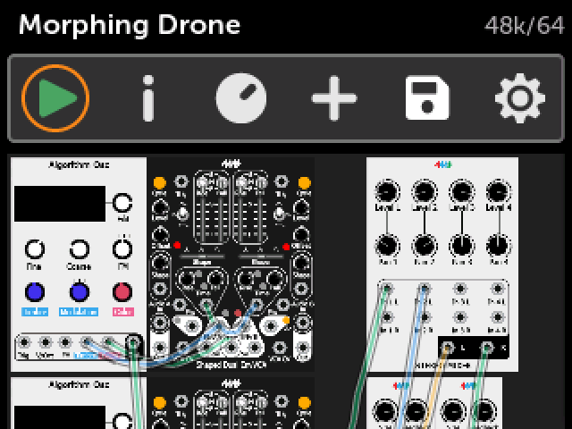{ .half }](./img/patchview-layout-vcv.png)

-  __Patches wider than the screen__

    If the patch is wider than the screen, the Patch View scrolls sideways as
    you move from module to module. An orange bar at the bottom of the screen
    shows where you are.

   [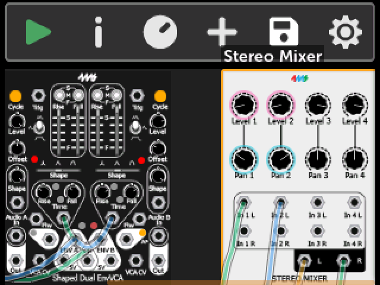{ .half }](./img/patchview-hscroll.png)

Positions are saved in the patch file by the 4ms VCV Rack plugin v2.3.0 or
later. A module that has no saved position, such as one in a patch saved by an
older plugin version, or a module you just added, is put into the first free
space.

With either setting, turning the encoder steps through the modules in reading
order: left to right, then down to the next row.

!!! note
    The module area has a maximum size. If a patch is laid out too large to
    fit, a message tells you how many modules are not being displayed. Choose a
    smaller Module Size or turn on Compact Layout to see them. Modules that
    aren't displayed are still part of the patch and still run.

### Rack width

When Compact Layout is on, two more settings choose where a row of modules
wraps:

- __Fit width to screen__: When on (the default), a row is as wide as the screen,
  so you only ever scroll up and down.

- __Width__: When __Fit width to screen__ is off, this slider sets the width of a
  row in HP, from 28HP to 128HP. If a row is wider than the screen, the Patch
  View scrolls sideways. The number next to the slider shows the current width.
  The new width is applied when you move off the slider or close the menu.

These two settings are greyed out when Compact Layout is off, because then the
patch's own positions decide how wide the patch is.

## Re-arranging modules

You can move modules around on the MetaModule. This works while the patch is
playing, and the cables follow the modules as they move.

Re-arranging changes the positions saved in the patch, so it needs
__Compact Layout__ to be off. If it's on, you'll be asked to turn it off first.

-  __1. Open the Patch Info window and click `Re-arrange Modules`__

    Click the `(i)` icon in the Patch View and scroll down to find the button.

    Alternatively, open a module's [Action menu](action_menu.md#move) and
    click `Move`. This starts re-arranging with that module already picked up,
    so you can skip step 3.

   [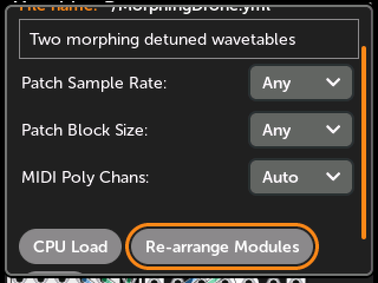{ .half }](./img/patch-info-rearrange.png)

-  __2. If asked, click `OK` to turn off Compact Layout__

    The patch is re-drawn using its saved positions.

   [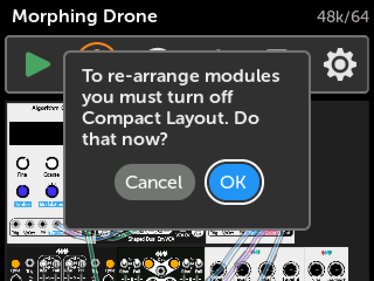{ .half }](./img/rearrange-confirm.png)

-  __3. Turn the encoder to highlight a module, and click to pick it up__

    While you are re-arranging, the highlighted module has a red outline. The
    outline turns yellow-green when the module is picked up.

   [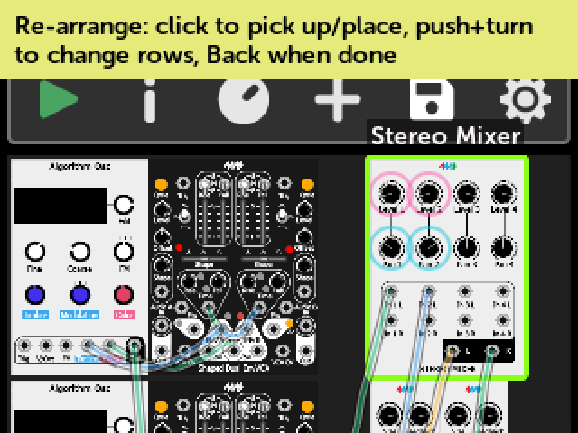{ .half }](./img/rearrange-pickup.png)

-  __4. Move the module__

    - __Turn the encoder__ to move the module left or right along its row.
    - __Push and turn the encoder__ to move the module up or down a row.

   [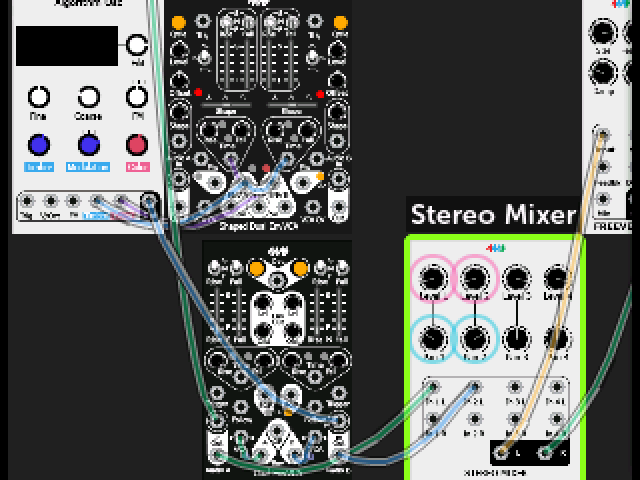{ .half }](./img/rearrange-moved.png)

-  __5. Click to put the module down__

    Pick up and move as many modules as you like. When you're done, press the
    Back button.

How modules move:

- If there is a gap next to the module, turning moves the module into the gap,
  2HP at a time.
- If the module is touching its neighbor, turning makes the two modules trade
  places.
- Turning past the end of a row moves the module to the start of the next row.
  Turning past the start of a row moves it to the end of the previous row. This
  wraps around: going past the end of the last row takes the module to the first
  row, and going back past the start of the first row takes it to the last row.
- When a module moves onto a row that already has modules where it lands, those
  modules are pushed to the right to make room.
- To make a new row at the bottom, push and turn clockwise while the module is
  on the last row. (This does nothing if the module is the only one on the last
  row.)

The new positions are part of the patch, so save the patch to keep them.
Moving modules does not change the sound of a patch, its cables, its mappings,
or its [expander connections](expander_modules.md).

## Cable tension

The __Tension__ slider, under __CABLES__ in the Patch View settings menu, sets how
tightly the cables are drawn. All the way to the right, the cables are straight
lines. Moving the slider to the left makes the cables droop more.

   [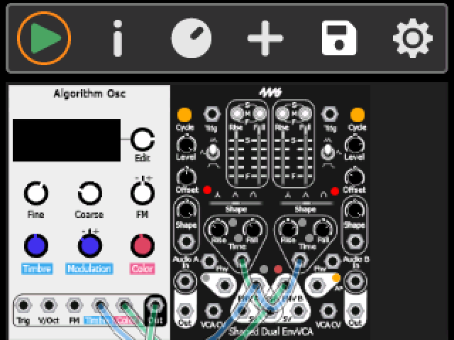{ .half }](./img/cable-tension-low.png)

   [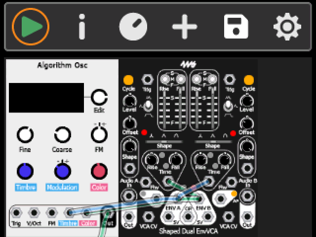{ .half }](./img/cable-tension-high.png)

Tighter cables cover less of the panels, which can make a busy patch easier to
read. You can also adjust the cable __Opacity__, or hide the cables, in the same
section of the menu: see [Patch/Module Settings](module_patch_settings.md#cables).
