# Plugins

## Installing Plugins

-  __1. Download plugins to a USB drive or microSD card__

      Use the [Plugins](../plugins) link above.

      Click "Download All" at the top. Unzip the "all_plugins.zip" file.

      Copy the `metamodule-plugins` folder to the USB drive or microSD card. 

      If you want to just install particular plugins, download them individually,
      and copy the `.mmplugin` file to the `metamodule-plugins` folder on 
      your USB drive or microSD card.

      You also can put the `.mmplugin` files in the root directory of the USB
      drive or microSD card.

      Insert the drive into the MetaModule.

   [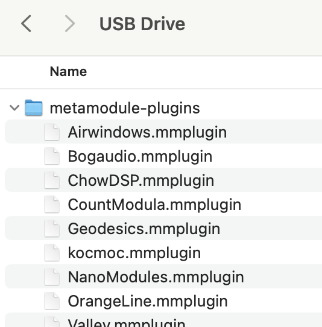{ .half }](./img/macos-plugins-disk.png)

-  __2. Click `Settings` in the Main Menu__

   [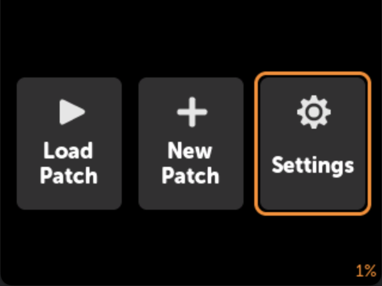{ .half }](./img/main-menu-settings.png)

-  __3. Click `Plugins`__

   [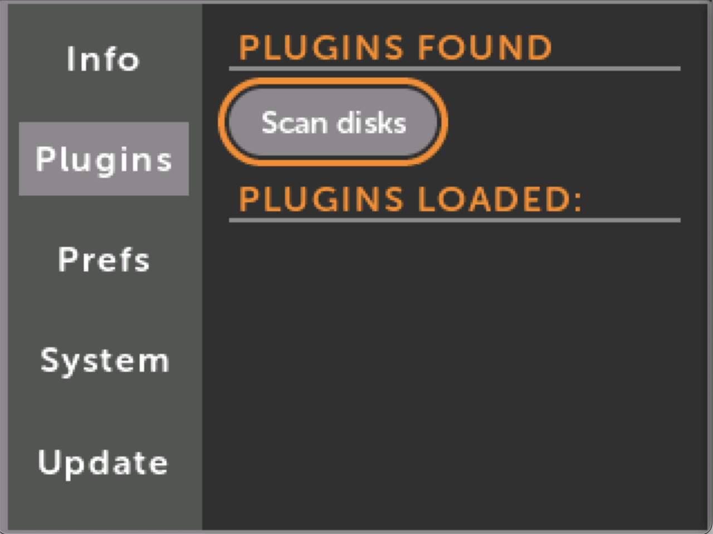{ .half }](./img/settings-plugins.png)

-  __4. Click `Scan disks`__

  [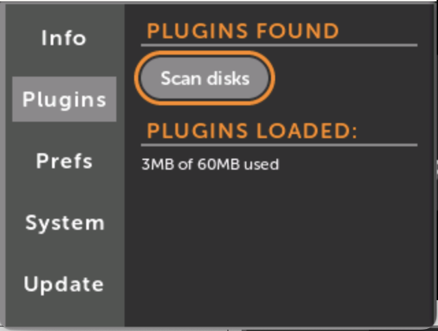{ .half }](./img/scan-plugins.png)

-  __5. Click a plugin to load it__

      The plugin will stay loaded until you unload it or reboot.

  [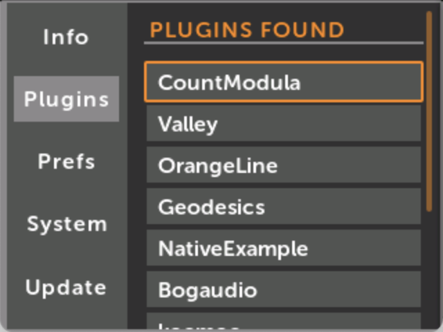{ .half }](./img/plugins-found.png)

-  __Or, load all plugins__

    Scroll to the bottom and click the `Load All` button to load all plugins found 

  [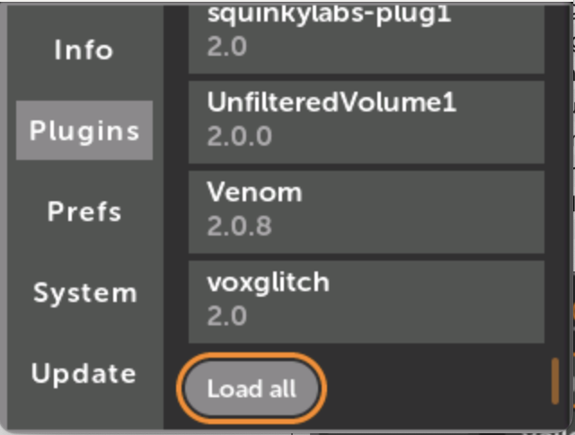{ .half }](./img/plugins-load-all.png)

## Pre-loading Plugins

If you want a plugin to load automatically when you power on, you can tell the
MetaModule to pre-load it.

A USB drive or microSD card containing the plugin file must be installed in the
MetaModule when you power on for this feature to work. If not, you can load the
plugin normally after startup.

-  __1. Click a plugin name under `PLUGINS LOADED`__

      If the plugin is not yet loaded, then follow the [instructions above](#installing-plugins). 

  [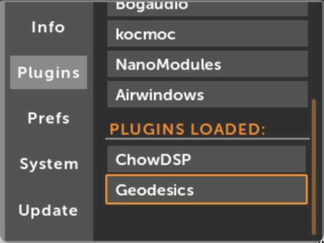{ .half }](./img/plugins-loaded.png)

-  __2. Enable Pre-load__

      The pre-load status of a plugin is saved when you exit the Plugins tab.
      The next time you power on, the MetaModule will search the USB drive and
      microSD card for a plugin with a matching name.

      Note: The wrong version may get loaded if you have different versions of the same plugin on a microSD card and a USB drive, or different versions in the `metamodule-plugins/` folder and in the root directory.

  [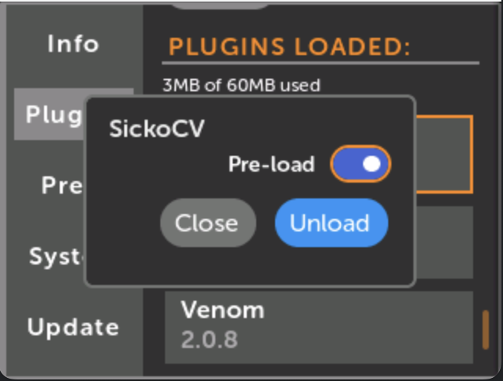{ .half }](./img/plugins-preload.png)

-  __Or, Pre-load all the currently loaded plugins__

      Click `Pre-load Current` at the bottom of the list of loaded plugins.

      The next time you power-on, the MetaModule will pre-load only the current
      set of loaded plugins.

  [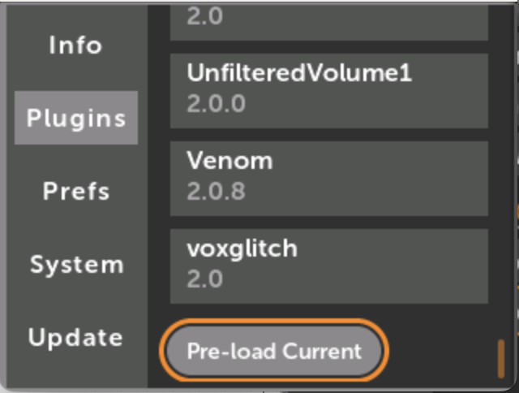{ .half }](./img/plugins-preload-current.png)

## Auto-loading Plugins

You can tell the MetaModule to load plugins only when needed. This is also known as "lazy loading".
In Settings > Prefs > Missing Plugins you can enable this by choosing "Ask" or "Always".
See [Preferences](preferences.md) for details.
[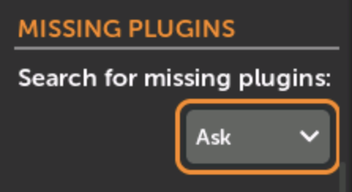{ .wide-240 }](./img/settings-missing-plugins.png)

For best results, keep a USB drive or microSD card installed on your
MetaModule. The drive should contain the latest plugins.

### Usage

Whenever you open or reload a patch file, the MetaModule will scan it to see if
it uses any modules that aren't currently loaded. If you selected "Ask" mode,
then it will pop-up a dialog box listing the brands that are missing. Clicking
Cancel will abort, otherwise it will proceed. Next it will scan the USB drive
and microSD card for the latest version of the missing plugins. Then the
MetaModule will load these plugins. 

 [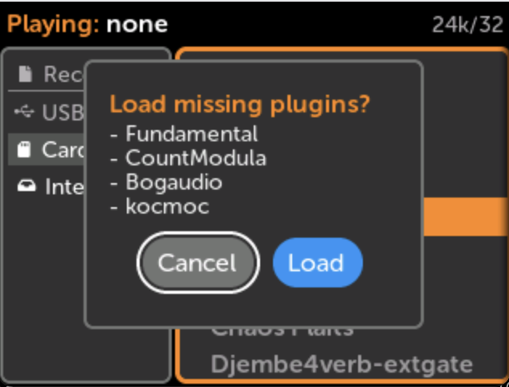{ .wide-240 }](./img/load-missing-plugin-conf.png)

 Specifically, the auto-loader will run in any of the following situations:
 - Clicking on a patch name from the Patch Selector page
 - Clicking on the "Now Playing" or "Last Viewed" patch name
 - Selecting "Reload" or "Revert" from the File Menu on the Patch View page
 - Updating a patch via Wi-Fi or on disk

 The only times the Patch View page is opened but the auto-loader does not run
 is when you access the Patch View page via the Back button (from the Main Menu
 or another page).

### Missing modules after auto-loading
After scanning for plugins and loading them, the MetaModule will check if the plugins it
loaded actually contained the missing modules. If there are still some missing
modules, it will display these names in a pop-up. This could happen if the
patch uses a module present in the VCV plugin but not present in the MetaModule
plugin. Check the Plugins page to see if there are
any updates to the MetaModule plugin.

## Viewing the modules in a plugin

-  __1. Click `New Patch` from the Main Menu__

     To add a module to an existing patch, click the `+` icon in the top button
     bar.

    
  [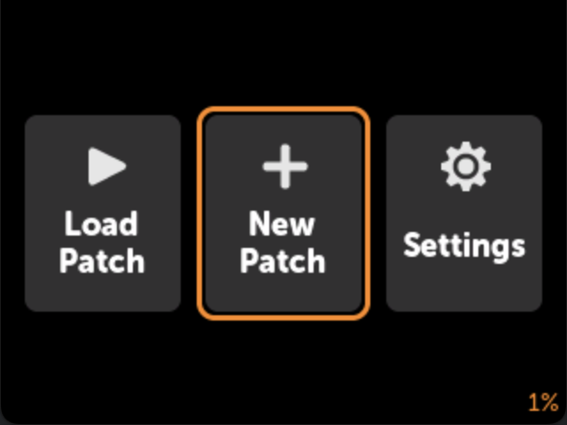{ .half }](./img/main-menu-new.png)

-  __2. Click the name of the plugin, then browse the modules__

    Click once on any module to view it full-screen.

    Click a second time to add it to the current patch.

  [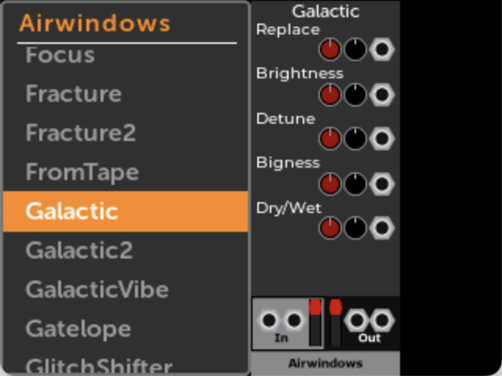{ .half }](./img/airwindows-module-list.png)

