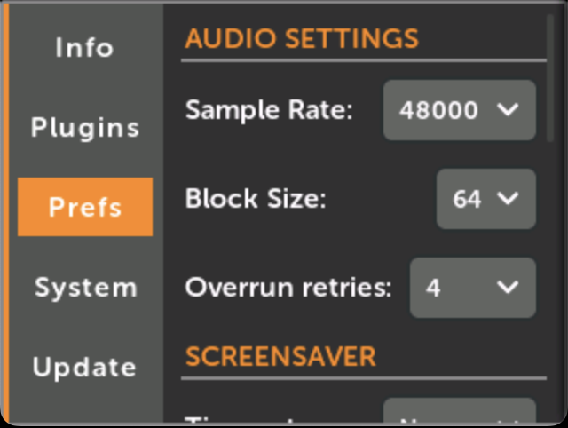
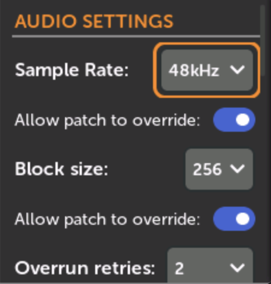
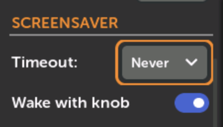
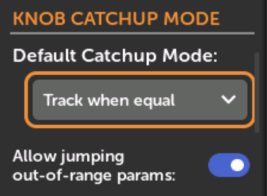
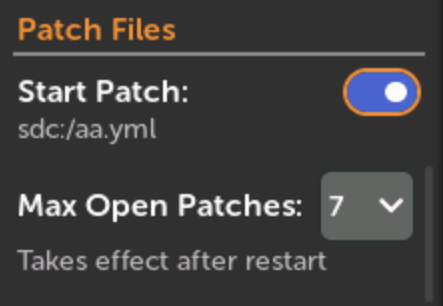
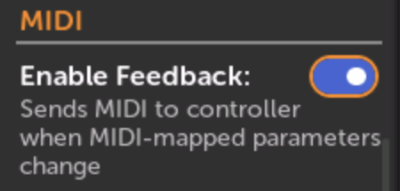

# Preferences

-  __1. Click `Settings` in the Main Menu__

   [{ .half }](./img/main-menu-settings.png)

-  __2. Click `Prefs`__

   [{ .half }](./img/settings-prefs-audio.png)

-  __Audio Settings__

     **Sample Rate:** 24000, 36000, 48000, or 96000. Higher values are generally better quality but use more CPU.
  
     **Block Size:** 16, 32, 64, 128, 256, 512. Lower values result in less
     latency. Some modules may only work with higher values. Sometimes higher
     values are more efficient, using less CPU (varies per module and patch).

     **Allow patch to override:** (Sample Rate and/or Block Size). Checking this allows patches to change
     the sample rate and/or block size when the patch is loaded. You can view a patch's suggested audio
     settings in the Info icon of the Patch View page. See [Patch Info](module_patch_settings.md#patch-info). If a patch is currently overriding the audio
     settings, then that will be displayed here in orange text. In that case, turning off the override
     preference will restore the default audio setting.
  
     **Overrun Retries:** If a patch takes too long to render a block of audio, there will be an
     audio glitch. This setting selects the number of audio glitches you're willing to tolerate
     in a one second period before the patch is stopped.
  
   [{ .wide-240 }](./img/settings-patch-audio.png)

-  __Screensaver__
     
     The screen will turn black if no controls are moved for a specified amount
     of time. The audio will not be changed. Signals on the jacks and MIDI will
     not wake the screen up. 

     Optionally, you can enable or disable if turning knobs will wake the
     screen up.

   [{ .wide-240 }](./img/prefs-screensaver.png)

-  __Knob Catchup Mode__

     When you load a patch or change Knob Sets, the physical knobs might not be in the same position
     as the virtual knobs they're mapped to. Each Knob Catchup Mode does something different to handle
     this situation:

       - **Track if knob moves:** This jumps the virtual knob's value as soon as you turn the physical knob.
       - **Track when equal:** The virtual knob will start tracking the physical knob when they are equal.
       - **Linear Fade:** The virtual knob will always change in the same direction as you turn the physical knob,
       but it might be larger or smaller amounts.

   [{ .wide-240 }](./img/prefs-knob-catchup.png)

   In **Track when equal** mode, there is an additional option to allow
   jumping out-of-range parameters. This is a rare situation that can occur
   if a knob or switch is mapped in two different knob sets with different
   min/max ranges, or is manually adjusted outside of the mapping's min/max
   range. If the virtual knob's value is set to a position that's outside
   of the min/max range of the current knob set, then checking this option
   will allow the virtual knob to start tracking when the physical knob is
   moved as close as possible. Otherwise if this is not checked, the
   virtual knob will not be accessible from the current Knob Set. If you are
   unsure, we recommend checking this option.

-  __Patch File__

     **Startup Patch:** the patch that's played when the module first starts up.
     If this checkbox is checked then the patch shown below will be played.
     You can change the Startup Patch by going to a patch and selecting "Startup Patch"
     in the File menu. See [Patch File Menu](module_patch_settings.md#patch-file-menu)

     **Max Open Patches:** The maximum number of patches that are allowed to be open
     at one time. Opening additional patches will automatically close the oldest
     patch that doesn't have unsaved changes. If all open patches have unsaved 
     changes then a warning will pop up, asking you to close some patches.

   [{ .wide-240 }](./img/prefs-patchfile.png)

-  __MIDI__

    MIDI Feedback is a feature that sends the value of MIDI-mapped knobs back to the MIDI controller.
    This allows the controller to stay in sync with the patch when you load patches, change knob sets,
    and when modules change their own parameter values (for example loading a scale preset on a module).

    Enabling this is usually safe, but if you notice strange behavior from your MIDI controller, try
    disabling this. 

    See [MIDI Feedback](using_metamodule_midi.md#midi-feedback)

   [{ .wide-240 }](./img/prefs-midi.png)

-  __Missing Plugins__

    **Search for missing plugins**: This determines what happens when you open or reload a patch that uses modules that aren't installed.
    The selected behavior will happen when a patch is opened, when it's refreshed via Wi-Fi or disk, or when you choose "Reload" or "Revert" from the file menu.

      - **Ask:** List the missing modules, and ask permission to search all disks for plugins that contain those modules and then load them.

      - **Always:** Immediately search all disks for plugins that may contain the missing modules, and then load those plugins.

      - **Never:** Ignore missing modules

    If a search and load happens and there are still missing modules afterwards, the list of missing modules will be displayed.

    See [Auto-loading plugins](plugins.md#auto-loading-plugins)

   [{ .wide-240 }](./img/settings-missing-plugins.png) [{ .wide-240 }](./img/load-missing-plugin-conf.png)

