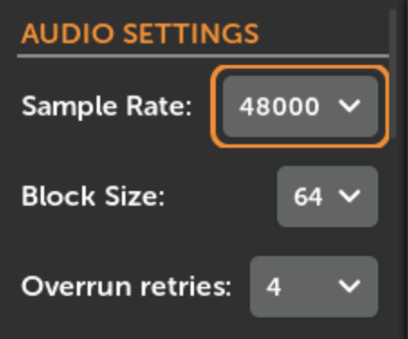

# Preferences

-  __1. Click `Settings` in the Main Menu__

   [{ .half }](./img/main-menu-settings.png)

-  __2. Click `Prefs`__

   [{ .half }](./img/settings-prefs-audio.png)

-  __Audio Settings__

     Sample Rate: 24000, 36000, 48000, or 96000. Higher values are generally better quality but use more CPU.
  
     Block Size: 16, 32, 64, 128, 256, 512. Lower values result in less latency. Some modules may only work with higher values. Sometimes higher values are more efficient, using less CPU (varies per module and patch).
  
     Overrun Retries: 
  
   [{ .wide-240 }](./img/prefs-audio-settings.png)

-  __Screensaver__

   [{ .wide-240 }](./img/prefs-screensaver.png)

-  __Knob Catchup Mode__

   [{ .wide-240 }](./img/prefs-knob-catchup.png)

-  __Patch File__

   [{ .wide-240 }](./img/prefs-patchfile.png)

-  __MIDI__

   [{ .wide-240 }](./img/prefs-midi.png)

