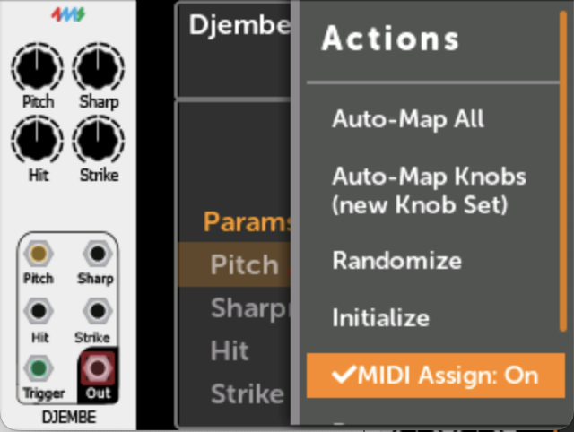
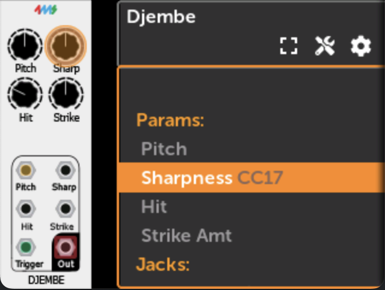

# Shortcuts

There are some time-saving shortcuts in the MetaModule UI.

### **Knob Set Shortcut**

A fast way to change Knobs Sets is to __hold down the Back button and turn the encoder__.

A pop-up will tell you the name of the Knob Set that was just made active.

The Back button's color will always indicate the Knob Set number:

1

2

3

4

5

6

7

8

### **Quick Map Shortcut**

You can quickly map params by pressing and holding the rotary encoder while wiggling a knob (or pressing a button
on the MetaButtons expander). This is a fast way to map a lot of parameters.

-  __1. Scroll to the parameter you want to map__

   [{ .half }](./img/djembe-pitch-knob.png)

-  __2. Press and hold the rotary while wiggling a knob__

     Release the rotary when you see the knob name appear.

     The knob will be instantly mapped.

     You can remove the mapping by holding down the rotary and tapping the Back button.

   [{ .half }](./img/djembe-pitch-knob-mapped.png)

### **Quick MIDI Map Shortcut**

You can quickly create MIDI CC or Note on/off mappings with MIDI Assign mode.

-  __1. Enable MIDI Assign mode in the module action menu__

   [{ .half }](./img/enable-midi-assign.png)

-  __2. Scroll to the parameter you want to map__

   [{ .half }](./img/djembe-sharp-knob.png)

-  __3. Press and hold the rotary while sending a MIDI CC or Note__

     Release the rotary when you see the MIDI event appear.

     The parameter will be instantly mapped.

     You can remove the mapping by holding down the rotary and tapping the Back button.

   [{ .half }](./img/djembe-sharp-knob-mapped-cc17.png)

### **Quick Assign Jacks**

You can quickly patch a virtual jack to a panel jack by pressing and turning the rotary encoder.
This is a fast way to assign a lot of jacks to the panel.

-  __1. Scroll to the jack you want to map__

   [{ .half }](./img/dld-jack.png)

-  __2. Press and turn the rotary__ 

     Each click of the rotary will select a different available panel jack.

     Release the rotary when you see the jack you want.

     You can remove the jack assignment by holding down the rotary and tapping the Back button.

   [{ .half }](./img/dld-jack-assigned.png)

### **Remove a mapping shortcut**

You can quickly remove all mappings in the current knobset or panel jack assignments.

-  __1. Scroll to the parameter with the mapping you want to remove__

     Press and hold the rotary, and then tap the Back button. Release the rotary.

   [{ .half }](./img/djembe-sharp-knob.png)

