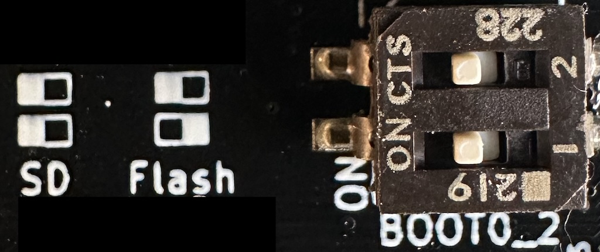
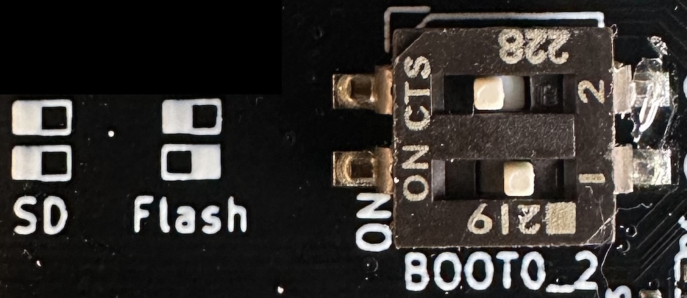

# Troubleshooting startup issues

Normally you should update firmware by following [these instructions](getting_started.md#how-to-update-firmware).

However, sometimes something goes wrong and the module will not start up properly. In that case, there is a way
to install updated firmware using a USB cable.

## USB DFU Bootloader

1. Download the latest firmware release and unzip it. Look inside the metamodule-firmware folder. You should see a file called main.uimg.

2. Connect a USB cable from a computer to the module. It must be a USB cable capable of transmitting data, not just a charging cable.
     - If at any point in the process a window opens on your computer asking if
       you wish to allow the USB device to connect, click "Allow" or "OK". If you
       accidentally ignore this message or click Cancel or No, then try 
       unplugging and replugging the cable to make the message pop up again. If
       that doesn't work, you may need to go into your computer's settings to
       allow it. As a last resort, restarting your computer might be the solution.
     

3. Power cycle the module while holding down the rotary encoder.

4. The button will be flashing green, this tells you that you are in USB-DFU bootloader mode

5. Open Chrome browser (other browsers will not work). Go to this web page: [Web DFU](https://devanlai.github.io/webdfu/dfu-util/)

6. Click Connect, and then select “STM Device in DFU Mode”.
     - Do NOT click the Vendor ID (hex) field. Leave that alone: it will
       automatically populate itself once you select the correct device.
     - If you click Connect and don't see "STM Device in DFU Mode" in the
       pop-up window, then try unplugging the USB cable and re-plugging it in.
     - If you still don't see "STM Device in DFU Mode" then see the note in
       step 2 about telling your OS to allow the USB connection.

7. Click “Choose File” and select the main.uimg file you just downloaded.

8. Click “Download”.

9. Wait a couple minutes… it takes a while. There will be this error message:
 `DFU GETSTATUS failed: ControlTransferIn failed: NetworkError: Failed to
 execute 'controlTransferIn' on 'USBDevice': A transfer error has
 occurred.` This is normal, and is not a problem. It’s safe to ignore this.

10. When the web page says it’s done, unplug the USB cable and power cycle
  the module

## SD Card restore

This method is more involved, but is the only way to restore damaged
bootloaders.

It requires an SD Card which will be formatted. The SD Card must be at least
2GB. We recommend using the SD Card included with your MetaModule.

1. Download the [metamodule restore image zip
   file](https://metamodule.info/dl/metamodule-restore-v1.6.4.img.zip)

2. Unzip the restore image. The resulting file should be should be exactly 2GB and called
   `metamodule-restore-v1.6.4.img`.

3. Download [Balena Etcher](https://etcher.balena.io#download-etcher) and
   install it according to the instructions for your OS.

4. Launch Etcher.

5. Insert the SD Card you want to format into your computer. All data on this
   card will be lost, so make sure to backup anything you need.

6. Click "Flash from File" and select the `metamodule-restore-v1.6.4.img` file you
   unzipped.

7. Click "Select target" and pick the SD Card device. Double-check you selected
   the right device. **ALL DATA WILL BE LOST ON THE DEVICE YOU PICK SO
   TRIPLE-CHECK YOU PICKED THE RIGHT ONE!**

8. Click "Flash" to begin the process. It may take 20 minutes or more if you
   have a slow card.

9. When it's complete, power off the MetaModule and insert the SD Card.

10. Unscrew the MetaModule from your case and locate the small DIP switch
    labeled "BOOT0_2". It's located roughly under the rotary encoder, in the
    upper-left corner of the MetaModule (as viewed from the PCB side).

11. Carefully flip the bottom switch to the left. Now both the top and bottom
    switches should be in the left position.

    { .half }

12. Power up the MetaModule. The module will boot from the SD Card into firmware 1.6.4.

13. Go to `Settings > Update` on the MetaModule, and follow the update procedure
    normally. Make sure you still have the rescue SD Card inserted into the
    MetaModule, and that you don't have a USB drive inserted. The rescue SD
    card contains a firmware update folder that has the bootloaders. Do not
    replace this with another version, or change it in any way. The goal of
    this step is to re-install the bootloaders from the rescue SD card into
    the MetaModule's internal memory. 

14. When the firmware update is complete, power off the MetaModule.

15. Remove the SD Card.

16. Flip the lower DIP switch back to the right. The top switch should be to
    the left and the bottom switch to the right.

    { .half }

17. Power on the MetaModule. It should boot into firmware v1.6.4, but this time
    it's booting from the internal memory, not from the SD Card.

18. Your MetaModule is now in fully working order. If there is a newer firmware
    available, you can download it from [MetaModule
    Downloads](https://metamodule.info/downloads) and update normally.

