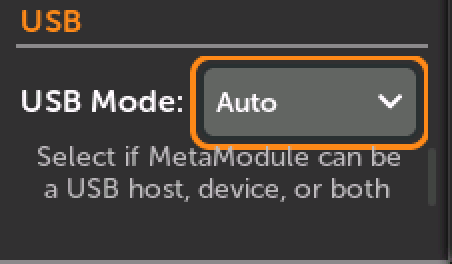
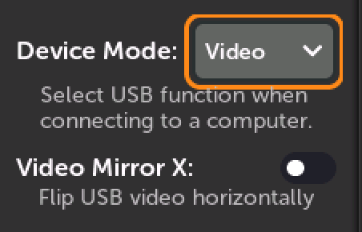
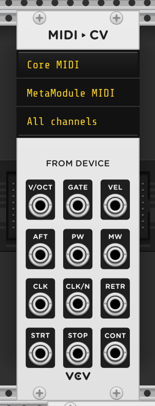
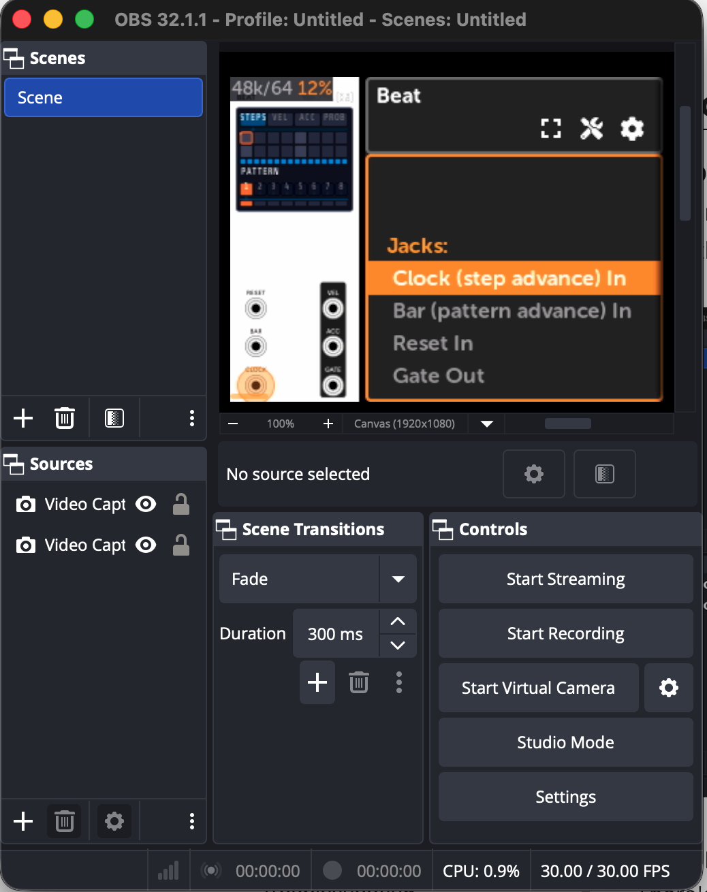

# USB Device Mode

The MetaModule has a single USB-C jack, which can work in two directions:

- As a USB **host**, so you can plug things into the MetaModule: MIDI controllers
  and USB drives.

- As a USB **device**, so you can plug the MetaModule into a computer. The
  MetaModule can appear on the computer as a MIDI device, or as a webcam that
  mirrors the screen.

Starting in firmware v2.3.0, you choose how the USB jack behaves in
`Settings` > `Prefs` > `USB`.

## USB Mode

-  __USB Mode__ selects whether the MetaModule acts as a USB host, a USB device, or
   decides for itself.

     - **Auto** *(default)*: the MetaModule detects what's on the other end of the
       cable and picks host or device automatically. Plug in a MIDI controller and it
       becomes a host; plug into a computer and it becomes a device.

     - **Host Only**: always act as a USB host. Use this if a device you plug in
       isn't detected reliably in Auto mode.

     - **Device Only**: always act as a USB device. Use this if your computer doesn't
       reliably connect to the MetaModule in Auto mode.

   [{ .wide-240 }](./img/prefs-usb-mode.png)

Auto mode relies on the computer or device negotiating the USB connection. Most
computers and devices do this correctly, but if a connection isn't being made,
forcing the role with **Host Only** or **Device Only** usually fixes it.

After changing the setting, you need to disconnect and re-connect the USB cable
for it to take effect.

## Device Mode

-  __Device Mode__ selects what the MetaModule looks like to a computer when it's
   acting as a USB device.

     - **MIDI** *(default)*: the MetaModule appears as a MIDI device named
       **MetaModule MIDI**. See [MIDI Device mode](#midi-device-mode) below.

     - **Video**: the MetaModule appears as a webcam named **MetaModule Screen**,
       which mirrors the display. See [Mirroring the screen](#mirroring-the-screen-to-a-computer) below.

   [{ .wide-240 }](./img/prefs-usb-device-mode.png)

Only one Device Mode is active at a time: the MetaModule can be a MIDI device or a
webcam, but not both at once.

When in "Host Only" mode, the **Device Mode** section will be disabled.

Changes take effect as soon as you click `Apply` — there's no need to restart the
MetaModule, but you may need to disconnect and re-connect the USB cable after 
changing the mode.

!!! note
    When in **Device Only** mode, you cannot use a USB thumb drive or a MIDI
    controller, since that requires the MetaModule being a host. However, to
    avoid confusion, if the MetaModule detects a USB device attached while
    **Device Only** mode is active, it will show a notification informing you
    to switch to **Auto** or **Host Only** mode to use the attached device.

## MIDI Device mode

-  
   With **Device Mode** set to **MIDI**, connect a USB-C cable from the MetaModule to
   your computer. The MetaModule will appear in your DAW or MIDI software as a device
   called **MetaModule MIDI**, with both an input and an output port.

   [{ .img-360 }](./img/vcv-metamodule-midi-device.png)

From there it works exactly like a MIDI controller plugged into the MetaModule:

- MIDI sent **from the computer to the MetaModule** can control mapped knobs, play
  notes, switch Knob Sets, and load patches, just like MIDI from a hardware
  controller. See [Using MIDI](using_metamodule_midi.md).

- MIDI sent **from the MetaModule to the computer** comes from the MIDI output
  modules in your patch, such as
  [CV to MIDI (Notes)](using_metamodule_midi.md#cv-to-midi-notes),
  [CV to MIDI CC](using_metamodule_midi.md#cv-to-midi-cc), and
  [Gate to MIDI](using_metamodule_midi.md#gate-to-midi).
  [MIDI Feedback](using_metamodule_midi.md#midi-feedback) is also sent to the computer,
  which lets your DAW stay in sync with mapped knobs.

## Mirroring the screen to a computer

-  
   With **Device Mode** set to **Video**, the MetaModule appears to the computer as a
   standard USB webcam (a UVC device) named **MetaModule Screen**. Anything that can
   use a webcam can show the MetaModule's display: OBS Studio, QuickTime Player,
   video conferencing apps, and so on.

   [{ .img-360 }](./img/usb-video-capture.png)

This is handy for recording demos, streaming, sending debug reports, and teaching, since you can capture the
screen without pointing a camera at the module.

There's no driver to install — it uses the webcam support already built into
macOS, Windows, and Linux.

### Video Mirror X

**Video Mirror X** flips the mirrored screen horizontally. Many video and
conferencing apps mirror a webcam image by default, which makes the MetaModule's
text appear backwards. Turn this on to flip it back so it reads correctly.

This option is only available when **Device Mode** is set to **Video**.

## Checking the USB connection

The `Settings` > `Info` page shows the current state of the USB jack, which is the
quickest way to confirm a connection is working. You'll see one of:

| Status | Meaning |
|---|---|
| `USB: Not connected` | Nothing is plugged into the USB jack |
| `USB Host mode, searching for a device` | Acting as a host, but hasn't identified what's attached yet |
| `USB Host mode, connected to a USB drive` | A USB drive is attached and mounted |
| `MIDI Host mode, connected to a MIDI device` | A USB MIDI controller or interface is attached |
| `USB Device mode, waiting for a host` | Acting as a device, but the computer hasn't connected yet |
| `MIDI Device mode, connected to a host` | Connected to a computer as **MetaModule MIDI** |
| `Video Device mode, connected to a host` | Connected to a computer as **MetaModule Screen** |
| `Console Device mode, connected to a host` | Connected to a computer as a serial console (see below) |

## Troubleshooting

**The computer doesn't see the MetaModule.**
Set **USB Mode** to **Device Only** and re-connect the cable. Also make sure you're
using a USB-C cable that carries data — many cables are charge-only.

**A MIDI controller isn't detected.**
Set **USB Mode** to **Host Only**. Firmware v2.3.0 also added workarounds for USB MIDI
devices that don't follow the USB MIDI spec exactly, so devices that failed to connect
on earlier firmware may work now.

**The mirrored screen is backwards.**
Turn on **Video Mirror X**, or turn off the mirroring option in your video software.

