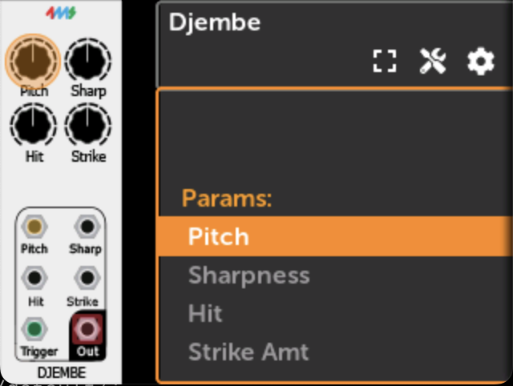
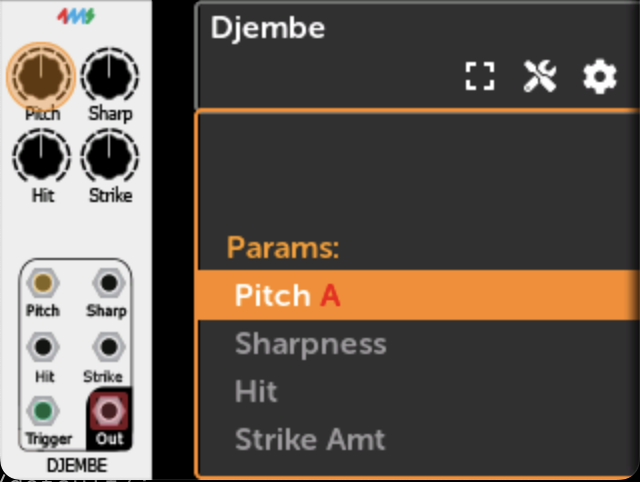
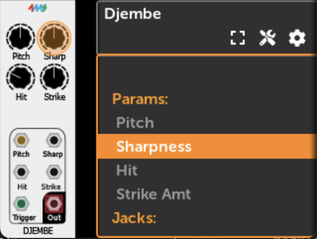

# Using the MetaModule: Knobs

## How to View Knob and Jack Mappings

-  __1. Click the Knob icon in the button bar__

   [{ .half }](./img/patch-view-knobset-icon.png)

-  __2. Knob mappings are shown__

      This is a "Knob Set" (see below).

      Turn some physical knobs and watch the knobs on the screen turn (the patch must be playing).

      Click `Jacks` to view jack mappings

   [{ .half }](./img/knobset-karplus-jackicon.png)

-  __3. Jack mappings are shown__

   [{ .half }](./img/jackmap-karplus.png)

---

## Knob Sets

-  A Knob Set is a group of knob mappings. Each Knob Set maps the 12 physical
   knobs to virtual module controls.
   For example, a patch might have a Knob Set for each module. Or there might
   be a Knob Set for controlling various timbre parameters, another Knob Set
   for controlling rhythmic elements, and another for overall mix. 

-  A patch can have up to eight Knob Sets, but only one Knob Set can be active at a time.

-  A single physical knob can be mapped to up to 8 virtual knobs in a Knob Set. See [Multi-maps](#mapping-to-more-than-one-knob-multi-maps)

### How to Use a Different Knob Set

From the Knob Set page:

-  __1. Click `>>` to view the next Knob Set__

      If there is only one Knob Set in the patch, the >> button will not appear.

   [{ .half }](./img/knobset-karplus.png)

-  __2. Click `Use` to activate a Knob Set__
        
     Now the physical knobs will control the parameters mapped in the new Knob
     Set.

   [{ .half }](./img/knobset-use.png)

### **Knob Set Shortcut**

A fast way to change Knobs Sets is to __hold down the Back button and turn the encoder__.

A pop-up will tell you the name of the Knob Set that was just made active.

The Back button's color will always indicate the Knob Set number:

1

2

3

4

5

6

7

8

See more shortcuts on the [Shortcuts](shortcuts.md) page.

### Creating a new Knob Set

You can create a new knob set in several ways:

 -  With VCV Rack, when you make the patch. See [Creating Knob Sets in VCV Rack](using_rack.md#creating-knob-sets-in-vcv-rack)

 -  By clicking `(new knobset)` when you creating a new knob mapping (see next section)

 -  By selecting `Auto-map knobs (new Knob Set)` from the module [Action
    menu](action_menu.md#auto-map-knobs-new-knob-set).

### Changing a Knob Set name

From the Knob Set page:

-  __1. Click on the knob set name__

   [{ .half }](./img/knobset-name.png)

-  __2. Type a new name__
     
     Click the check mark to save your changes, or press the Back button to cancel.

   [{ .half }](./img/edit-knobset-name.png)

---

## Creating a new Knob Mapping or MIDI Mapping

From the Patch View page:

-  __1. Open a module and click a control__

   [{ .half }](./img/plaits-freq-knob.png)

-  __2. Click on a Knob Set that doesn't already have a mapping__

    If you want to create a new Knob Set, click `(new knobset)`

    If you want to map a MIDI CC or Note to this knob, click `MIDI`

   [{ .half }](./img/plaits-mapping-pane.png)

-  __3. Wiggle the knob you want to map to__

    If you're mapping MIDI, then send a MIDI Note or CC message.
    You may select a MIDI Channel if you wish.

    If you're mapping to a button on the MetaButtons expander, then press the button.

   Knob:
   [{ .half }](./img/plaits-mapping-add.png)
   MIDI:
   [{ .half }](./img/midi-mapping-add.png)

-  __4. Click OK. It's mapped!__

     If you want to adjust the minimum and maximum values of the mapping, or
     give the mapping a name, see [Edit a Knob
     Mapping](#editting-a-knob-mapping).

   [{ .half }](./img/plaits-mapping-done.png)

### **Quick Map Shortcut**

You can quickly map params by pressing and holding the rotary encoder while wiggling a knob (or pressing a button
on the MetaButtons expander). This is a fast way to map a lot of parameters.

-  __1. Scroll to the parameter you want to map__

   [{ .half }](./img/djembe-pitch-knob.png)

-  __2. Press and hold the rotary while wiggling a knob__

     Release the rotary when you see the knob name appear.

     The knob will be instantly mapped.

     You can remove the mapping by holding down the rotary and tapping the Back button.

   [{ .half }](./img/djembe-pitch-knob-mapped.png)

Note that the mapping will be created in the currently active knobset, and will replace any existing non-MIDI mapping. 
Use the [Knob Set Shortcut] in conjunction with this shortcut if you want to create mappings in multiple knob sets.

### **Remove a mapping shortcut**

You can quickly remove all mappings to a parameter in the current knobset. 

-  __1. Scroll to the parameter with the mapping you want to remove__

     Press and hold the rotary, and then tap the Back button. Release the rotary.

   [{ .half }](./img/djembe-sharp-knob.png)

See more shortcuts on the [Shortcuts](shortcuts.md) page.

---

---

## Editting a Knob Mapping

From the Knob Set page:

-  __1. Click on a mapping...__

   [{ .half }](./img/knobset-karplus-knobA.png)

-  __2. ... to go to the Knob View page__

   [{ .half }](./img/knobview.png)

-  __3. Click on MIN or MAX to change the range__

     When the physical knob is all the way down, the virtual knob will be set
     to the MIN value. Likewise, when the physical knob is all the way up, the
     virtual knob will be at the MAX value.

     If you set MAX to be less than the MIN, the virtual knob will turn the
     opposite direction as the physical knob.

   [{ .half }](./img/knobview-min.png)

-  __4. Click on the knob name to type an alias__

     An alias is a name you pick for a knob mapping. If this is a multi-map,
     then the alias will apply to all mappings within the multi-map.

   [{ .half }](./img/knobview-name.png)

---

## Mapping to more than one knob (Multi-maps)

A single physical knob can be mapped to up to eight virtual knobs. This is
known as a "multi-map". As you turn the physical knob, all the mapped virtual
knobs will turn. Each virtual knob can have different minimum and maximum
values. In this way, mulit-maps allow the MetaModule to act like a macro
controller.

For example, if a reverb module has separate wet and dry level knobs, you could
map a physical knob to both of these. Then you could set the MIN and MAX values
such that as you turn the physical knob up, the dry level will go down, and the
wet level will go up, creating a crossfade between the dry and wet signals.

Another example is using multi-maps in a polyphonic patch. One physical knob
can control the pitch knobs of all the voices; another physical knob can
control the waveshape knobs; another can control the envelope shapes, etc...

Multi-maps exist within a Knob Set. So each Knob Set can have its own set of maps
and multi-maps. Since there are a maximum of eight Knob Sets, and each Knob Set
has twelve knob multi-maps, and each multi-map can have up to eight virtual
knobs, a maximum of 768 virtual knobs can be mapped in a single MetaModule
patch. 

### How to create a multi-map

Multi-maps are created automatically if you create new knob map with a physical knob that's already mapped (in the current knob set).
See [Creating a New Knob Mapping](using_metamodule.md#creating-a-new-knob-mapping-or-midi-mapping).

### How to view a multi-map

Viewing any module that has a mapping that's a part of a multi-map will display that mapping normally.

If you want to see all the virtual knobs that map to a specific physical knob:

-  __1. Click the knob icon to go to the Knob Set page__

   [{ .half }](./img/patch-enosc4-knobset-icon.png)

-  __2. Multi-maps are shown with a scroll bar under the knob__

      Scroll left and right to view all the mapped knobs.

   [{ .half }](./img/knobset-multimap.png)

