# Using the MetaModule: Jacks and Cables

## How to Patch Cables

There are two types of cables in the MetaModule: cables between virtual modules
(also called internal cables), and cables that go to the physical panel jacks
(also called Jack Mappings)

*Note: While VCV Rack supports polyphonic cables, only monophonic cables are
supported on the current version of the MetaModule*

### Patching cables between modules

-  __1. Click on a jack, and click New Cable__

      You can start a cable from the input or output. If the jack is already
      patched, then the new cable will "stack" on top of the existing cable
      (thus acting like a passive mult)

      If this is the first cable you're creating this session, a pop-up will
      remind you of how to patch a cable. Read it and click OK.

   [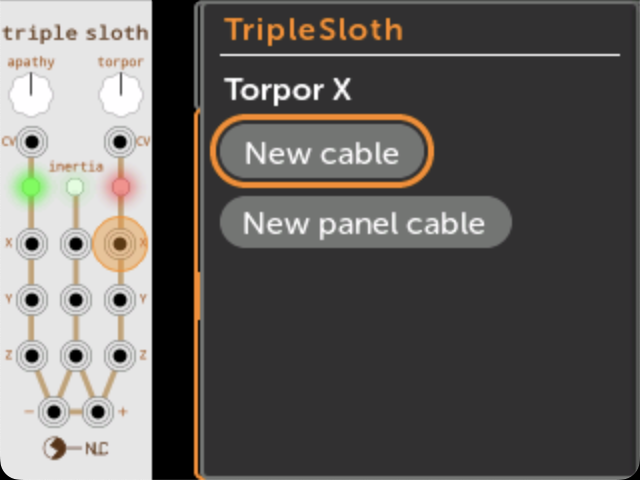{ .half }](./img/new-cable-start.png)

-  __2. Navigate to the jack you want to connect to__

     - Find the module you want to patch to, and click on it. 

     - Then scroll to the jack you want to patch to, and click on it.

     Only valid jacks will be shown. You cannot connect multiple outputs to
     an input. 

     If you want to cancel making a cable, click "Cancel Cable" or press the
     Back button from the Patch View page.

   [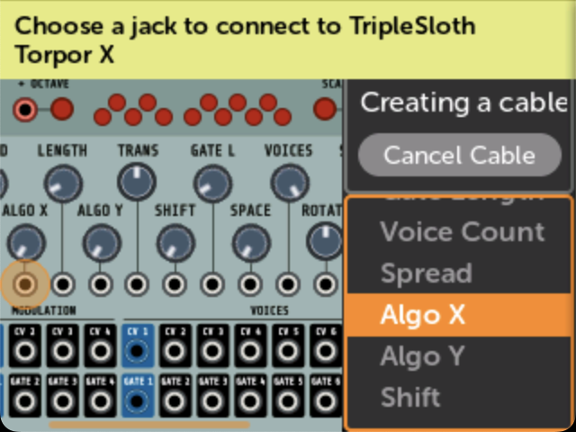{ .half }](./img/new-cable-dest.png)

-  __3. Done!__

     *Note: Keep in mind that the physical panel Input jacks are treated like
     outputs. This makes sense if you consider that they send signals to
     virtual modules. Therefore, if a panel Input (i.e. In 1-6 or GateIn 1-2)
     is patched to a virtual input jack, then you cannot patch another output to the
     same virtual input jack (because only one output can drive an input).*

   [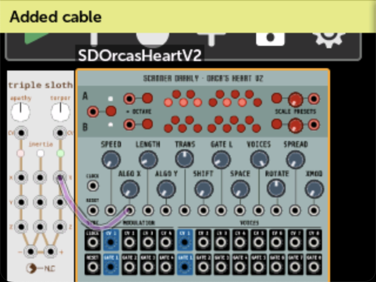{ .half }](./img/new-cable-done.png)

### Patching to a panel jack

Patching a virtual module jack to a panel jack is how you map the physical jacks on the
MetaModule to virtual module jacks.

-  __1. Click on a jack, and click New Panel Cable__

    If the jack is already connected to a panel jack, then this button will not
    be displayed.

   [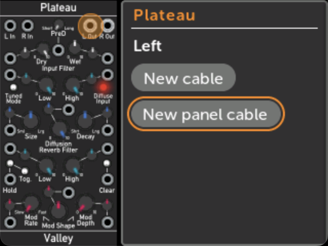{ .half }](./img/new-panel-cable.png)

-  __2. Select a panel jack and click Connect__

     The drop-down menu will indicate if any panel jacks are already connected:

       - Connecting to a panel Out jack that's already connected to something else will disconnect the existing cable.

       - Connecting to a panel In jack that's already connected to something else will stack on top of the existing cable.

   [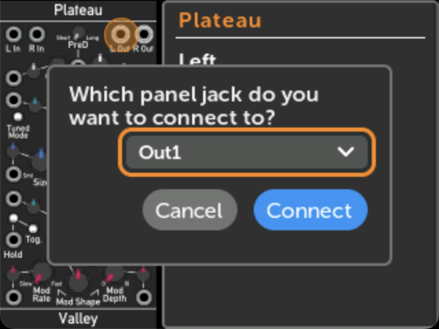{ .half }](./img/new-panel-cable-popup.png)

### Quick Assign Jacks

You can quickly patch a virtual jack to a panel jack by pressing and turning the rotary encoder.
This is a fast way to assign a lot of jacks to the panel.

-  __1. Scroll to the jack you want to map__

   [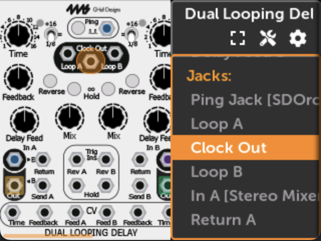{ .half }](./img/dld-jack.png)

-  __2. Press and turn the rotary__ 

     Each click of the rotary will select a different available panel jack.

     Release the rotary when you see the jack you want.

     You can remove the jack assignment by holding down the rotary and tapping the Back button.

   [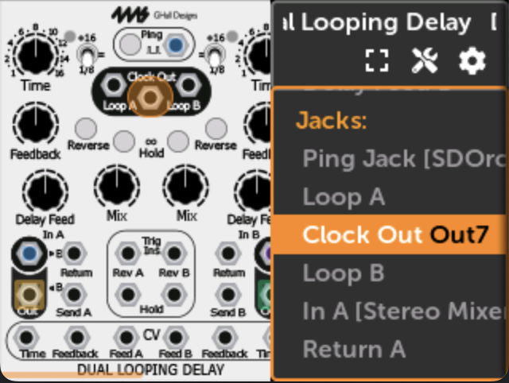{ .half }](./img/dld-jack-assigned.png)

See more shortcuts on the [Shortcuts](shortcuts.md) page.

### Creating or editing a Jack Alias

You can provide a custom name for a panel jack mapping.

-  __Create or edit an alias__

    Click on the jack, then click on the panel jack mapping in the "Connected To:" box.

    Jack aliases are saved with the patch, and are shown on the Jacks page.

   [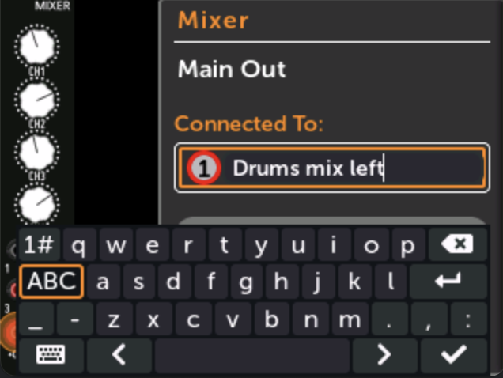{ .half }](./img/jack-alias-edit.png)

You can also create and edit jack aliases in VCV Rack in the context menu for the MetaModule.

### Viewing all panel jack mappings

-  __1. Click the Jacks button on the Knob Sets page__

    The Knob Sets page is opened by clicking the Knob icon at the top of the patch.

   [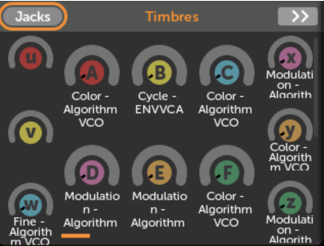{ .half }](./img/jacks-button.png)

-  __2. All jack mappings are shown__ 

     
   [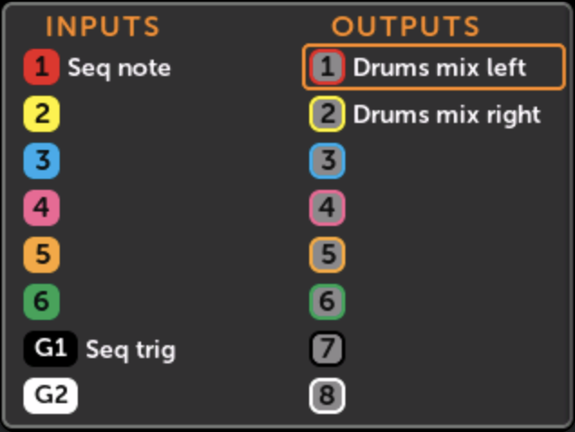{ .half }](./img/jack-alias-list.png)

### Disconnecting a cable (Unpatching or removing a cable)

-  __1. Click on a jack, and then click Disconnect__

     This will disconnect all cables to this jack.

     For stacked cables (one output going to multiple inputs):

     - If the selected jack is an output, then all stacked cables will be removed.

     - If the selected jack is an input, then only the stacked cables that connect to this jack will be removed.

   [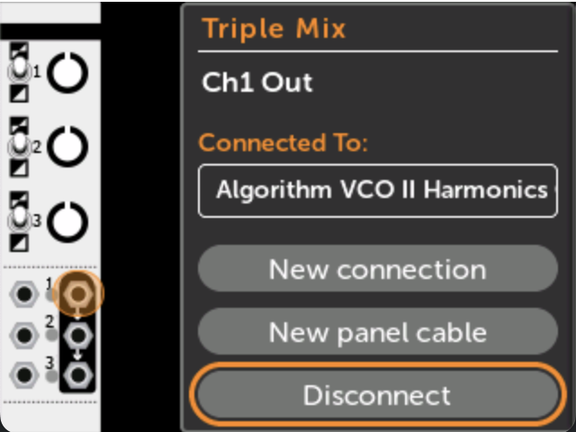{ .half }](./img/disconnect-cable.png)

### Following a Cable

You can "follow" a cable to trace the connections between modules.

-  __1. Click on a jack, and then click on an item in "Connected To:"__

     You will be taken to the jack on the other module.

     Clicking on a Panel connection does nothing.

   [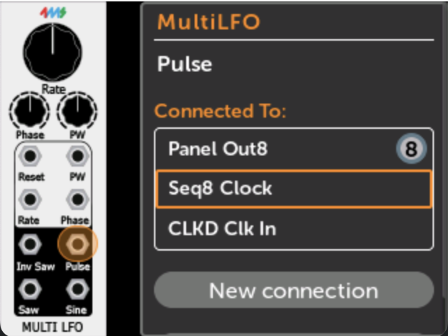{ .half }](./img/connecting-jack.png)

-  __2. Module and jack on the other end of the cable will be shown__

     You can repeat the process to trace all connections on a jack.

     Pressing the Back button will re-trace your steps, first going to the
     module's list of controls and jacks, and then going back to the previously
     viewed module.

   [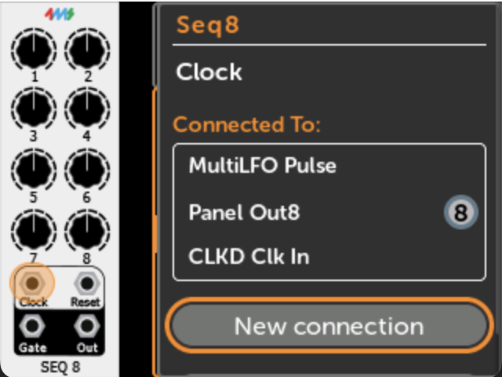{ .half }](./img/connecting-jack-end.png)

---

## Monitoring Signals: Scope Module

The built-in **Scope** module lets you visualize CV and audio signals on the MetaModule's display.
It is found in the **RackCore** brand in the module browser.

   [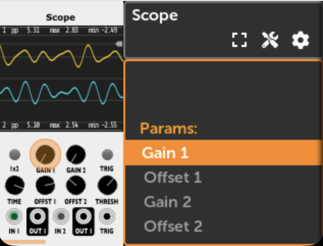{ .half }](./img/scope-module.png)

The display shows live peak-to-peak, max, and min values for each channel alongside the waveform.
Clicking the display in the parameter/jack list will show it full-screen:

   [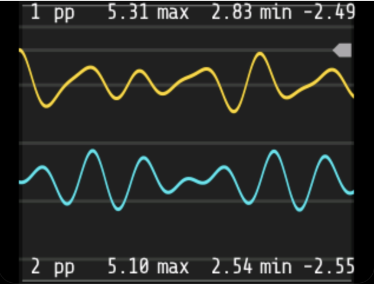{ .half }](./img/scope-fullscreen.png)

   [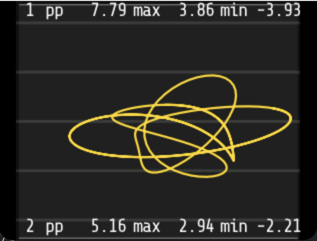{ .half }](./img/scope-1x2.png)

**Inputs:**

| Jack | Description |
|---|---|
| **Ch 1 (X)** | Primary input signal |
| **Ch 2 (Y)** | Secondary input signal |
| **Trig** | Optional external trigger for stable display sync |

**Outputs:** Ch 1 and Ch 2 are passed through unchanged, so patching through the Scope
does not interrupt signal flow.

**Controls:**

| Control | Description |
|---|---|
| **Gain 1 / Gain 2** | Vertical scale for each channel |
| **Offset 1 / Offset 2** | Vertical position shift for each channel |
| **Time** | Horizontal time scale (sweep speed) |
| **Mode** | `1 & 2`: dual stacked view; `1 x 2`: Lissajous (XY) mode |
| **Trig** | Enable/disable external trigger sync |
| **Thresh** | Trigger detection threshold |

