# Using the MetaModule: Jacks and Cables

## How to Patch Cables

There are two types of cables in the MetaModule: cables between virtual modules
(also called internal cables), and cables that go to the physical panel jacks
(also called Jack Mappings)

Cables can carry a single (mono) signal or multiple (polyphonic) signals. See
[Polyphonic Cables](#polyphonic-cables) below.

### Patching cables between modules

-  __1. Click on a jack, and click New Cable__

      You can start a cable from the input or output. If the jack is already
      patched, then the new cable will "stack" on top of the existing cable
      (thus acting like a passive mult)

      If this is the first cable you're creating this session, a pop-up will
      remind you of how to patch a cable. Read it and click OK.

   [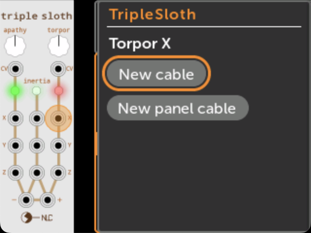{ .half }](./img/new-cable-start.png)

-  __2. Navigate to the jack you want to connect to__

     - Find the module you want to patch to, and click on it. 

     - Then scroll to the jack you want to patch to, and click on it.

     Only valid jacks will be shown. If the destination input jack is already
     connected to another output, the new cable will be summed with the
     existing one (see [Summed input jacks](#summed-input-jacks)).

     If you want to cancel making a cable, click "Cancel Cable" or press the
     Back button from the Patch View page.

   [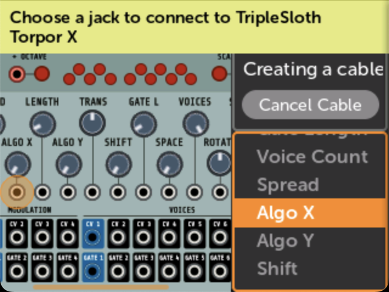{ .half }](./img/new-cable-dest.png)

-  __3. Done!__

     *Note: Keep in mind that the physical panel Input jacks are treated like
     outputs. This makes sense if you consider that they send signals to
     virtual modules. If a panel Input (i.e. In 1-6 or GateIn 1-2) is already
     patched to a virtual input jack, you can still patch another output to
     the same virtual input jack — the signals will be summed together (see
     [Summed input jacks](#summed-input-jacks)).*

   [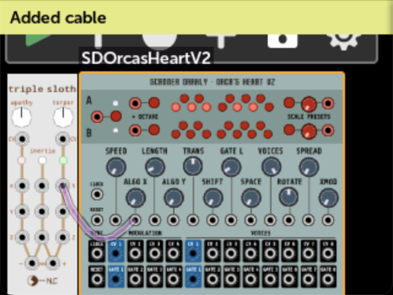{ .half }](./img/new-cable-done.png)

### Patching to a panel jack

Patching a virtual module jack to a panel jack is how you map the physical jacks on the
MetaModule to virtual module jacks.

-  __1. Click on a jack, and click New Panel Cable__

   [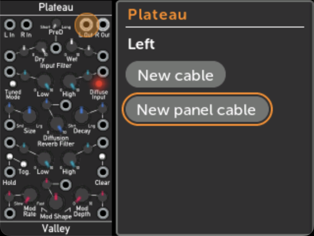{ .half }](./img/new-panel-cable.png)

-  __2. Select a panel jack and click Connect__

     The drop-down menu will indicate if any panel jacks are already connected:

       - Connecting to a panel Out jack that's already connected to something else will sum the existing signal with the signal from the jack you're patching.

       - Connecting to a panel In jack that's already connected to something else will stack on top of the existing cable.

   [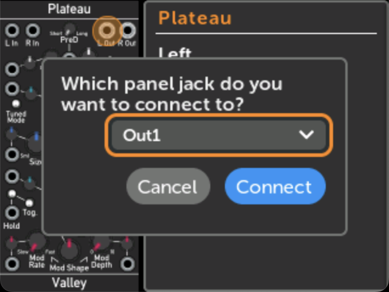{ .half }](./img/new-panel-cable-popup.png)

### Quick Assign Jacks

You can quickly patch a virtual jack to a panel jack by pressing and turning the rotary encoder.
This is a fast way to assign a lot of jacks to the panel.

-  __1. Scroll to the jack you want to map__

   [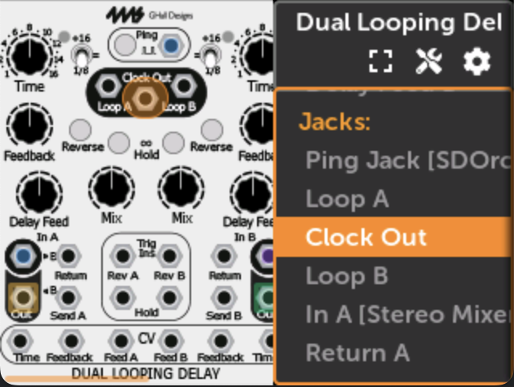{ .half }](./img/dld-jack.png)

-  __2. Press and turn the rotary__ 

     Each click of the rotary will select a different available panel jack.

     Release the rotary when you see the jack you want.

     You can remove the jack assignment by holding down the rotary and tapping the Back button.

   [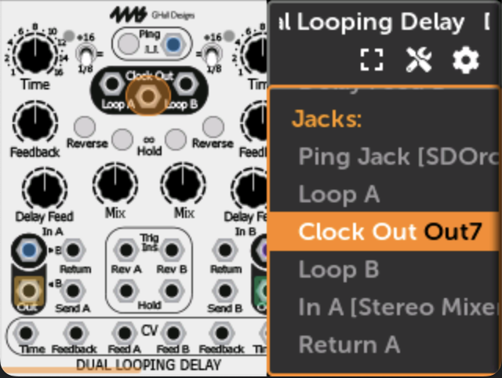{ .half }](./img/dld-jack-assigned.png)

See more shortcuts on the [Shortcuts](shortcuts.md) page.

### Summed input jacks

The MetaModule supports patching multiple outputs to a single input jack. When
this happens, the output signals are summed together at unity gain before
reaching the input — exactly as if they were passed through a simple unity
mixer. This works for any combination of internal (virtual module) cables and
panel jack mappings going to the same input.

Summing multiple outputs into one input is more efficient than inserting a
mixer module when you just need a basic unity mix.

This feature also matches how VCV Rack handles stacked input cables, so
patches you create in VCV Rack that sum signals into a single input will play
seamlessly when loaded onto the MetaModule.

To create a summed input on the MetaModule, simply patch a new cable to an
input jack that is already connected. The `Connected To:` list for that input
will show every output that is feeding it.

### Polyphonic Cables

The MetaModule supports **polyphonic cables**, which carry up to **4 voices**
on a single cable. This matches how VCV Rack handles polyphony, so patches that
use poly cables play correctly when loaded onto the MetaModule (as long as each
cable uses no more than 4 voices).

Polyphony is **fully automatic** — there is nothing extra to do when patching.
When you connect a polyphonic output to an input, the cable automatically
carries as many voices as the source module produces (up to the 4-voice
maximum). Most modules are polyphonic.

Poly cables are easy to spot in the Patch View and Module View:

- Poly cables are drawn thicker than mono cables, with an outline.
- Poly jacks that are mapped to a panel jacks have a larger square drawn on them.

   [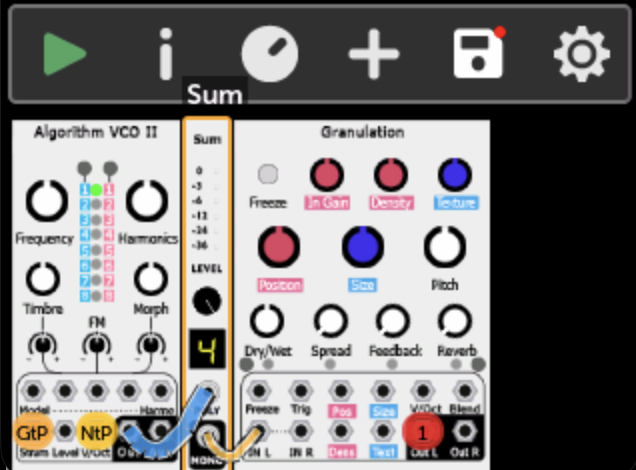{ .half }](./img/poly-cable.png)

!!! note
    A single cable carries a maximum of 4 voices. If a module outputs more than
    4 voices, only the first 4 are sent down the cable. For MIDI, you can use a
    second poly cable to reach 8 voices — see
    [MIDI Polyphony](using_metamodule_midi.md#midi-polyphony).

#### Poly utility modules

The **RackCore** brand includes three utilities for working with poly signals. These behave almost exactly like the VCV Rack "Fundamental" equivalents, except these have only 4 jacks.

| Module | Description |
|---|---|
| **Merge** | Combines up to 4 mono inputs into one polyphonic output. The voice count is auto-detected from the connected inputs. |
| **Split** | Splits a polyphonic input into 4 separate mono outputs. |
| **Sum** | Sums all voices of a polyphonic input down to a single mono output, with a level knob and clipping meter. |

### Creating or editing a Jack Alias

You can provide a custom name for a panel jack mapping.

-  __Create or edit an alias__

    Click on the jack, then click on the panel jack mapping in the "Connected To:" box.

    Jack aliases are saved with the patch, and are shown on the Jacks page.

   [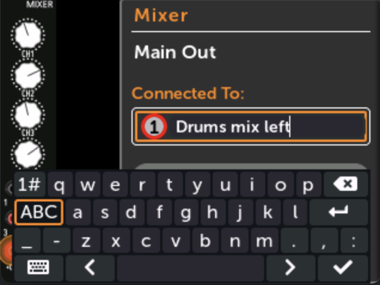{ .half }](./img/jack-alias-edit.png)

You can also create and edit jack aliases in VCV Rack in the context menu for the MetaModule.

### Viewing all panel jack mappings

-  __1. Click the Jacks button on the Knob Sets page__

    The Knob Sets page is opened by clicking the Knob icon at the top of the patch.

   [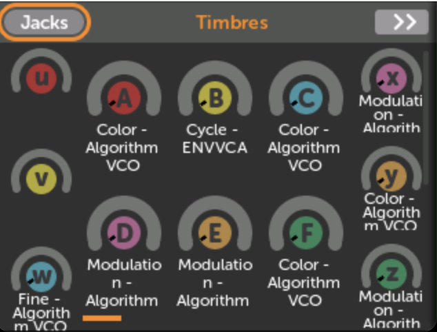{ .half }](./img/jacks-button.png)

-  __2. All jack mappings are shown__ 

     
   [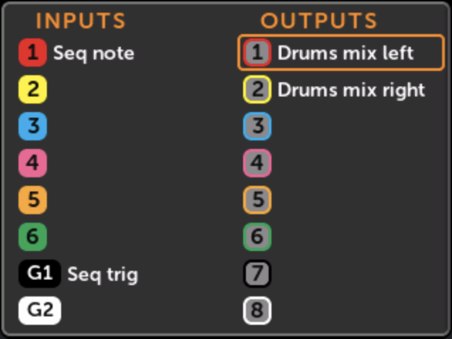{ .half }](./img/jack-alias-list.png)

### Disconnecting a cable (Unpatching or removing a cable)

-  __1. Click on a jack, and then click Disconnect__

     This will disconnect all cables to this jack.

     For stacked cables (one output going to multiple inputs):

     - If the selected jack is an output, then all stacked cables will be removed.

     - If the selected jack is an input, then only the stacked cables that connect to this jack will be removed.

   [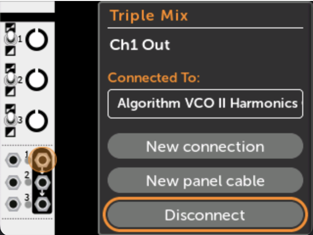{ .half }](./img/disconnect-cable.png)

### Following a Cable

You can "follow" a cable to trace the connections between modules.

-  __1. Click on a jack, and then click on an item in "Connected To:"__

     You will be taken to the jack on the other module.

     Clicking on a Panel connection does nothing.

   [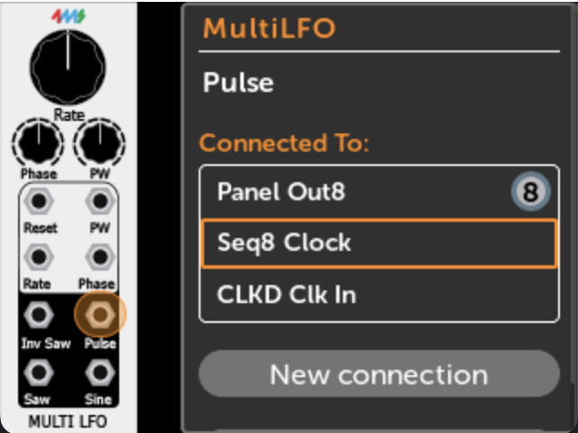{ .half }](./img/connecting-jack.png)

-  __2. Module and jack on the other end of the cable will be shown__

     You can repeat the process to trace all connections on a jack.

     Pressing the Back button will re-trace your steps, first going to the
     module's list of controls and jacks, and then going back to the previously
     viewed module.

   [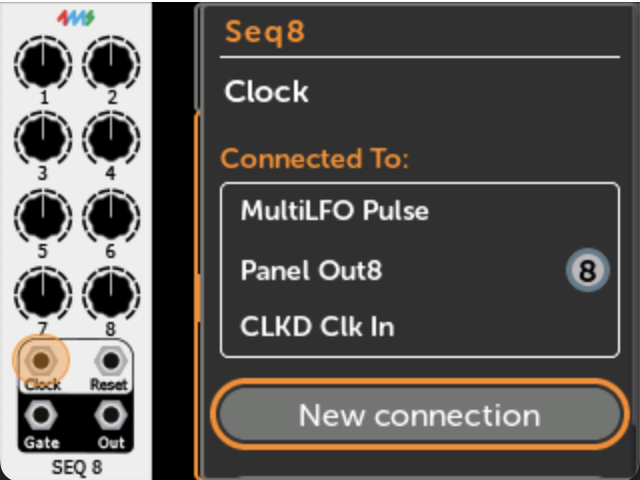{ .half }](./img/connecting-jack-end.png)

---

## Monitoring Signals: Scope Module

The built-in **Scope** module lets you visualize CV and audio signals on the MetaModule's display.
It is found in the **RackCore** brand in the module browser.

   [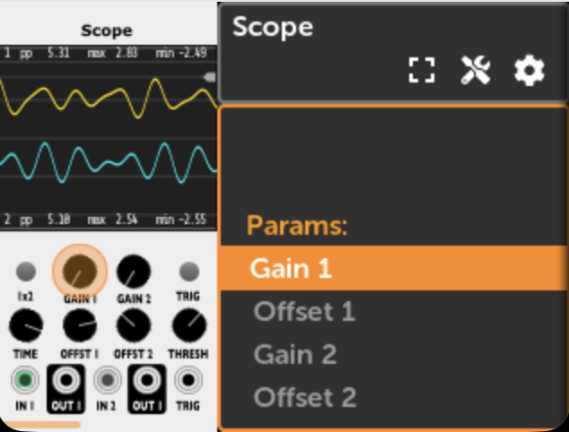{ .half }](./img/scope-module.png)

The display shows live peak-to-peak, max, and min values for each channel alongside the waveform.
Clicking the display in the parameter/jack list will show it full-screen:

   [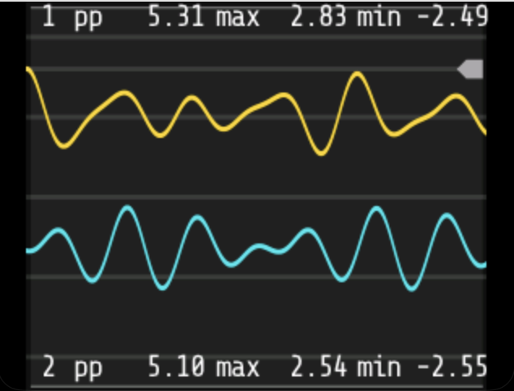{ .half }](./img/scope-fullscreen.png)

   [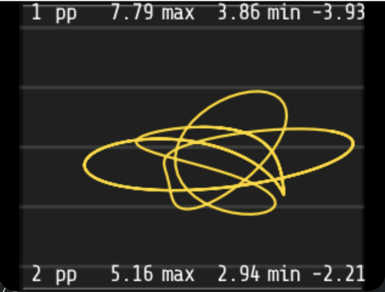{ .half }](./img/scope-1x2.png)

**Inputs:**

| Jack | Description |
|---|---|
| **Ch 1 (X)** | Primary input signal |
| **Ch 2 (Y)** | Secondary input signal |
| **Trig** | Optional external trigger for stable display sync |

**Outputs:** Ch 1 and Ch 2 are passed through unchanged, so patching through the Scope
does not interrupt signal flow.

**Controls:**

| Control | Description |
|---|---|
| **Gain 1 / Gain 2** | Vertical scale for each channel |
| **Offset 1 / Offset 2** | Vertical position shift for each channel |
| **Time** | Horizontal time scale (sweep speed) |
| **Mode** | `1 & 2`: dual stacked view; `1 x 2`: Lissajous (XY) mode |
| **Trig** | Enable/disable external trigger sync |
| **Thresh** | Trigger detection threshold |

