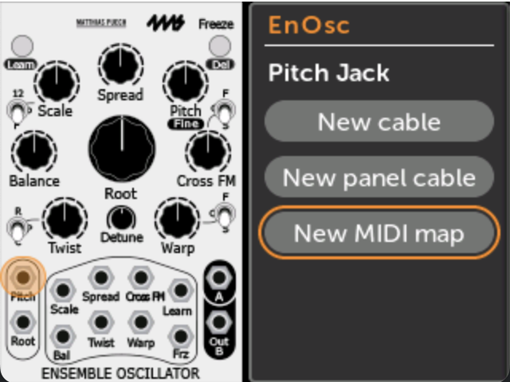
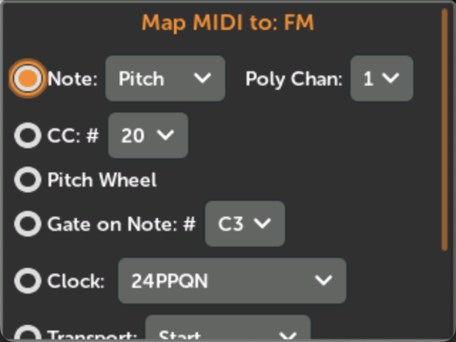
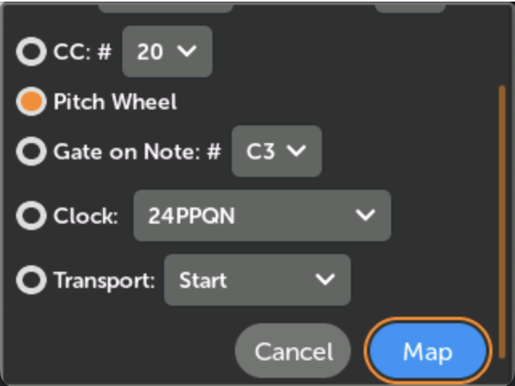
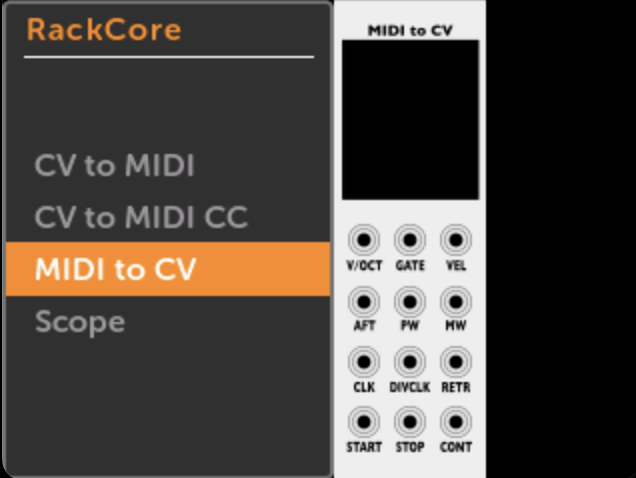
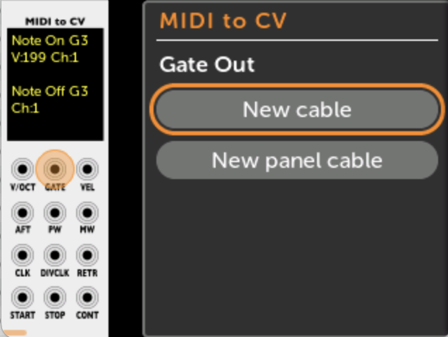
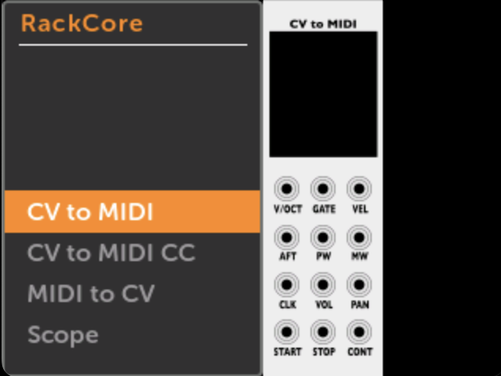
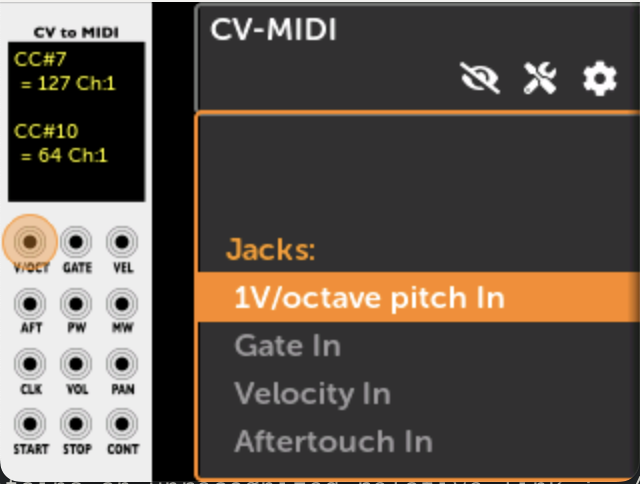
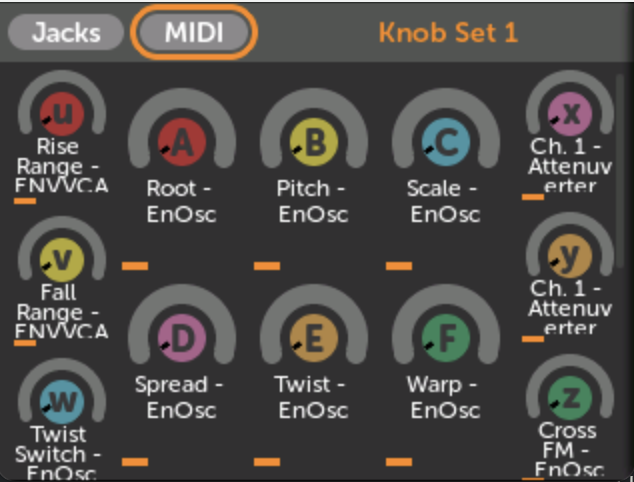
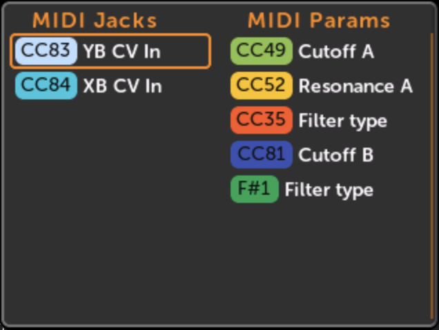
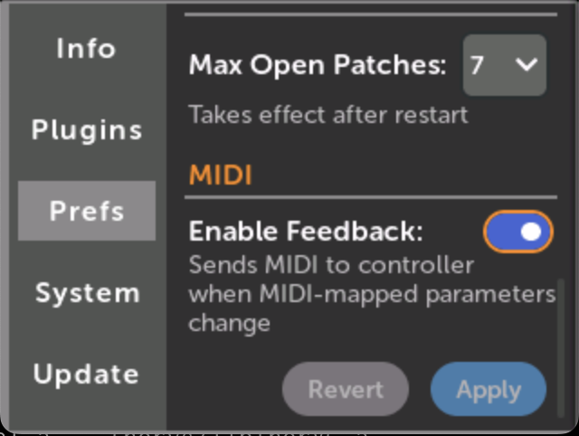

# Using the MetaModule: MIDI jack mappings 

## MIDI Maps to parameters

You can map MIDI CC or Note Gate on/off to parameters such as knobs, switches, and buttons. 

See [Using MetaModule](using_metamodule.md#creating-a-new-knob-mapping-or-midi-mapping) for a detailed description
of one method for adding MIDI maps.

### **Quick MIDI Map Shortcut**

You can quickly create MIDI CC or Note on/off mappings with MIDI Assign mode.

-  __1. Enable MIDI Assign mode in the module action menu__

   [{ .half }](./img/enable-midi-assign.png)

-  __2. Scroll to the parameter you want to map__

   [{ .half }](./img/djembe-sharp-knob.png)

-  __3. Press and hold the rotary while sending a MIDI CC or Note__

     Release the rotary when you see the MIDI event appear.

     The parameter will be instantly mapped.

     You can remove the mapping by holding down the rotary and tapping the Back button.

   [{ .half }](./img/djembe-sharp-knob-mapped-cc17.png)

Turn off MIDI Assign mode when you're done, or it will automatically turn off when you open a different patch.

See more shortcuts on the [Shortcuts](shortcuts.md) page.

### How MIDI parameter mappings work

You can map MIDI CC or MIDI Note Gates to parameters such as knobs, buttons, switches, etc. 

The parameter value is always updated immediately when a MIDI message is received, regardless
of the current [Knob Catchup](preferences.md) mode in the preferences page.

On the [Edit Mapping](#editing-the-midi-channel-of-a-midi-mapping)
page, each MIDI mapping can be set to respond to all MIDI channels, or just a
particular MIDI channel.

The MIN and MAX sliders determine the range of the mapping in the same way that
they do for panel knob mappings. For MIDI CC mappings, this means a CC value of
0 will set the parameter to the value set by the MIN slider, and a CC value of
127 sets it to the MAX slider's value. For MIDI Note Gate mappings, the note can
only be on or off, so the parameter will be set to the MIN or MAX slider value.
Additionally, for MIDI Note Gate mappings you can enable Toggle mode to make the
parameter change value each time a note is played. See [MIDI Note toggle
mode](#midi-note-gate-toggle-mode)

Note that while you can only map MIDI CC and Note Gates to parameters, you can
map any MIDI message to input jacks: see [MIDI Input Jacks](#midi-input-jacks).

### Editing the MIDI Channel of a MIDI Mapping

From the Module View page:

-  __1. Click on the mapped control__

   [{ .half }](./img/module-view-mapping-pane-midi.png)

-  __2. Click on the MIDI mapping__

   [{ .half }](./img/module-view-midi-map.png)

-  __3. Adjust the MIDI Channel__

     You may adjust the MIN/MAX sliders and the mapping name in the same way
     that you do for normal knob mappings.

     For MIDI Note Gate mappings, you may also change the Toggle mode (see below).

   [{ .half }](./img/midi-map-channel.png)

### MIDI Note Gate Toggle mode

When you map a MIDI Note Gate to a parameter, you have two options:

-  __MIDI Note Gate: Toggle Enabled__

     Each time a matching Note On message is received, the parameter will
     toggle between the values set by the MIN and MAX sliders. Note Off
     messages are ignored. This makes the parameter value toggle each time you
     play the MIDI Note. 

     _Technical note:_ In case the param has changed value since the last MIDI
     Note message, the MetaModule will set the value to MIN or MAX based on
     which one the current value is __farther__ from.

   [{ .half }](./img/midi-map-toggle-on.png)

-  __MIDI Note Gate: Toggle Disabled__

     When a Note On message for that note is received, the param's
     value will be set to the value of the MAX slider. When a Note Off message
     is received, the param will be set to the MIN slider's value.

   [{ .half }](./img/midi-map-toggle-off.png)

---

## MIDI Input Jacks

You can patch MIDI signals to input jacks in two ways: using MIDI mappings, or using a MIDI-CV module.

### Patching MIDI Input to jacks

-  __1. Click on an input jack, and click New MIDI Map__

    If the jack is already connected to a panel jack, then this button will not
    be displayed.

   [{ .half }](./img/enosc-midi-map.png)

-  __2. Select a MIDI signal__

    Choose from:

    - Note events (keyboard): select Pitch (key number), Gate (note on/off), Velocity,
      Aftertouch, or Retrigger (multiple note-on). Also select
      the polyphony channel. The maximum polyphony channel of all the MIDI
      mappings in the entire patch determines how MIDI note events are parsed.

    - CC: Continuous CV scaled to 0V to 10V. Select a CC number, or send a CC
      event to "learn" it.

    - Pitch Wheel

    - Gate on Note: fires a gate whenever a particular note is pressed. Select
      a note or play a note live to "learn" it.

    - Clock: Select the raw MIDI clock (24PPQN) or a divided version of that.

    - Transport: Sends a gate for Start, Stop, and Continue events.

    - Channel: Select "All Channels" or a choose a particular MIDI channel to respond to.

   [{ .half }](./img/midi-map-top.png)

-  __3. Click Map to create the mapping__

   [{ .half }](./img/midi-map-pw.png)

### Using a MIDI input module

-  __1. Add the RackCore MIDIToCVInterface module__

   [{ .half }](./img/rackcore-midi-cv-module.png)

-  __2. Patch the jack(s) corresponding to the MIDI signal(s) you want to use__

   [{ .half }](./img/rackcore-midi-cv-jack.png)

---

## Patching Outputs to MIDI

To support MIDI Output as a MIDI Host, the MetaModule has the CV-MIDI module
in the RackCore brand.

Third-party plugin modules that produce MIDI Output should work, as well.

Note that the MetaModule always acts as a MIDI Host, and never as a MIDI Device.

-  __1. Add the RackCore CV-MIDI module__

   [{ .half }](./img/rackcore-cv-midi-module.png)

-  __2. Patch the CV and gate signals you wish to output as MIDI__

     A log of MIDI events will appear on the module's screen.

   [{ .half }](./img/rackcore-cv-midi-jacks.png)

---

## Viewing all MIDI mappings

-  __1. Click the MIDI button on the Knob Sets page__

    The Knob Sets page is opened by clicking the Knob icon at the top of the patch.

    If there are no MIDI mappings, this button will not be visible.

   [{ .half }](./img/midi-button.png)

-  __2. All MIDI mappings are shown__ 

     The left side shows all MIDI jack mappings (maps to input jacks).

     The right side shows all MIDI parameter mappings (maps to knobs, switches, buttons, etc).

     Manually created mappings using the RackCore modules are not displayed here, but can be
     seen as normal cables in the patch view.
     
   [{ .half }](./img/midi-maps-list.png)

---

## MIDI Feedback

MIDI Feedback, also known as "bi-directional MIDI", is a feature that allows a
MIDI controller to stay in sync with the MetaModule. When this is enabled, the
MetaModule will send MIDI CC, pitch wheel, and Note on/off messages back to the
controller whenever a parameter changes value. When a patch is loaded, the MetaModule
will send the value of all MIDI-mapped parameters.
If the MIDI controller supports MIDI Feedback, then it will update its display
or internal state with the new value.

For example, if you map a CC to the Pitch knob of your VCO, then
when you load that patch, a feedback-aware MIDI controller will jump to the
current value of the pitch, perhaps by displaying this value on a screen or
even by turning a motorized knob like the Roto-Control does.

As you play the patch, if you adjust the VCO's pitch knob manually (using the
Adjust button) or by mapping a panel knob to the Pitch knob, then the MIDI
controller will stay in sync with these new parameter values.
Also, say the module happens to have advanced features such as scale quantization,
such that when you select a scale the Pitch knob jumps to the closest note.
The MetaModule will still keep the MIDI controller in sync even if the Pitch knob
changed indirectly (e.g. because you selected a new quantization scale or a new
preset).

If you need to re-send all MIDI-mapped values to the controller, for example if you 
reset the controller after loading the patch, simply pause and unpause the patch 
playback. This will send the current value of all MIDI-mapped parameters.

-  __To enable or disable MIDI Feedback, check the box in Settings > Prefs > MIDI:__

     By default, MIDI Feedback is enabled starting in firmware v2.0.9.

   [{ .half }](./img/midi-feedback.png)

