# Using the MetaModule: MIDI jack mappings 

## MIDI Maps to parameters

You can map MIDI CC or Note Gate on/off to parameters such as knobs, switches, and buttons. 

See [Using MetaModule](using_metamodule.md#creating-a-new-knob-mapping-or-midi-mapping) for a detailed description
of one method for adding MIDI maps.

### **Quick MIDI Map Shortcut**

You can quickly create MIDI CC or Note on/off mappings with MIDI Assign mode.

-  __1. Enable MIDI Assign mode in the module action menu__

   [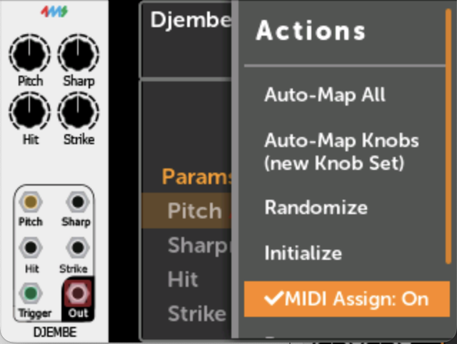{ .half }](./img/enable-midi-assign.png)

-  __2. Scroll to the parameter you want to map__

   [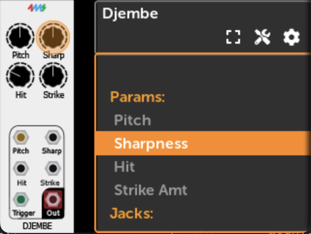{ .half }](./img/djembe-sharp-knob.png)

-  __3. Press and hold the rotary while sending a MIDI CC or Note__

     Release the rotary when you see the MIDI event appear.

     The parameter will be instantly mapped.

     You can remove the mapping by holding down the rotary and tapping the Back button.

   [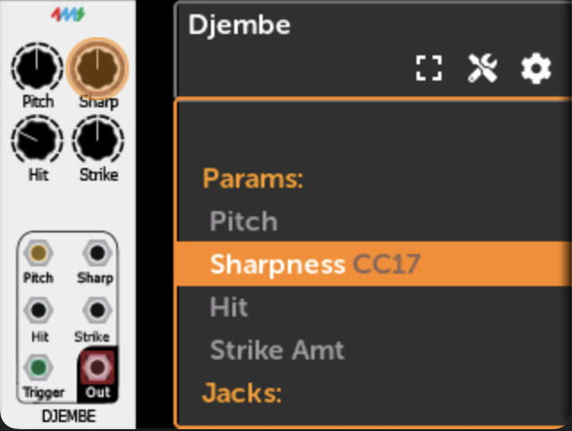{ .half }](./img/djembe-sharp-knob-mapped-cc17.png)

Turn off MIDI Assign mode when you're done, or it will automatically turn off when you open a different patch.

See more shortcuts on the [Shortcuts](shortcuts.md) page.

### How MIDI parameter mappings work

You can map MIDI CC or MIDI Note Gates to parameters such as knobs, buttons, switches, etc. 

The parameter value is always updated immediately when a MIDI message is received, regardless
of the current [Knob Catchup](preferences.md) mode in the preferences page.

On the [Edit Mapping](#editing-the-midi-channel-of-a-midi-mapping)
page, each MIDI mapping can be set to respond to all MIDI channels, or just a
particular MIDI channel.

The MIN and MAX sliders determine the range of the mapping in the same way that
they do for panel knob mappings. For MIDI CC mappings, this means a CC value of
0 will set the parameter to the value set by the MIN slider, and a CC value of
127 sets it to the MAX slider's value. For MIDI Note Gate mappings, the note can
only be on or off, so the parameter will be set to the MIN or MAX slider value.
Additionally, for MIDI Note Gate mappings you can enable Toggle mode to make the
parameter change value each time a note is played. See [MIDI Note toggle
mode](#midi-note-gate-toggle-mode)

Note that while you can only map MIDI CC and Note Gates to parameters, you can
map any MIDI message to input jacks: see [MIDI Input Jacks](#midi-input-jacks).

### Editing the MIDI Channel of a MIDI Mapping

From the Module View page:

-  __1. Click on the mapped control__

   [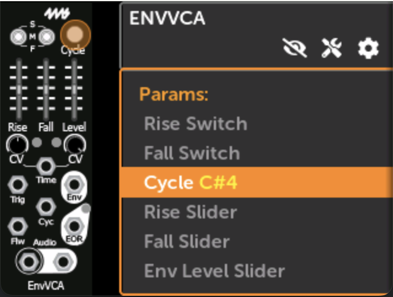{ .half }](./img/module-view-mapping-pane-midi.png)

-  __2. Click on the MIDI mapping__

   [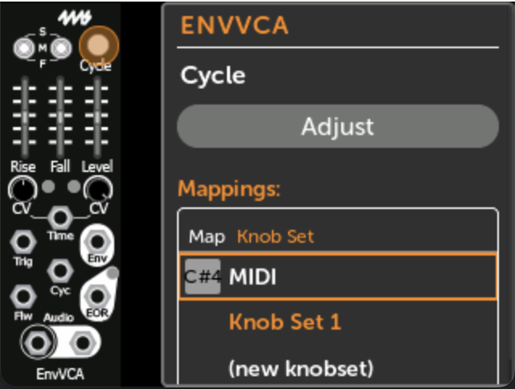{ .half }](./img/module-view-midi-map.png)

-  __3. Adjust the MIDI Channel__

     You may adjust the MIN/MAX sliders and the mapping name in the same way
     that you do for normal knob mappings.

     For MIDI Note Gate mappings, you may also change the Toggle mode (see below).

   [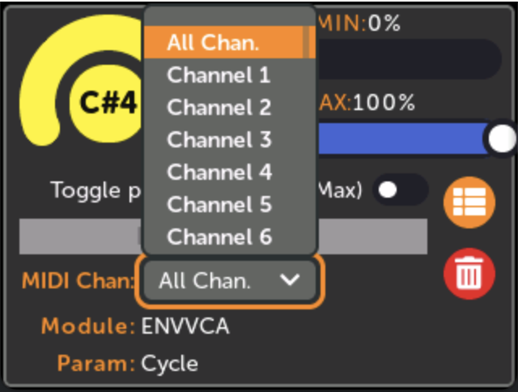{ .half }](./img/midi-map-channel.png)

### MIDI Note Gate Toggle mode

When you map a MIDI Note Gate to a parameter, you have two options:

-  __MIDI Note Gate: Toggle Enabled__

     Each time a matching Note On message is received, the parameter will
     toggle between the values set by the MIN and MAX sliders. Note Off
     messages are ignored. This makes the parameter value toggle each time you
     play the MIDI Note. 

     _Technical note:_ In case the param has changed value since the last MIDI
     Note message, the MetaModule will set the value to MIN or MAX based on
     which one the current value is __farther__ from.

   [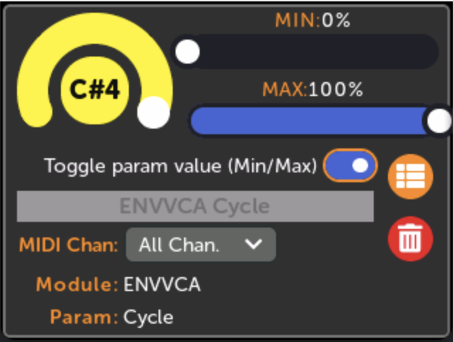{ .half }](./img/midi-map-toggle-on.png)

-  __MIDI Note Gate: Toggle Disabled__

     When a Note On message for that note is received, the param's
     value will be set to the value of the MAX slider. When a Note Off message
     is received, the param will be set to the MIN slider's value.

   [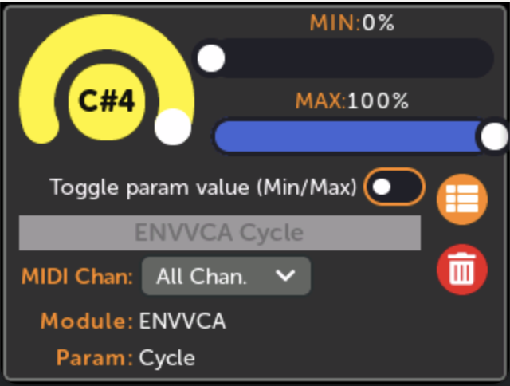{ .half }](./img/midi-map-toggle-off.png)

---

## MIDI Input Jacks

You can patch MIDI signals to input jacks in two ways: using MIDI mappings (aka "Built-in MIDI"), or by using RackCore modules such as MIDI-CV, MIDI-Gate, MIDICC-CV.

### Patching MIDI Input to jacks

-  __1. Click on an input jack, and click New MIDI Map__

    If the jack is already connected to a panel jack, then this button will not
    be displayed.

   [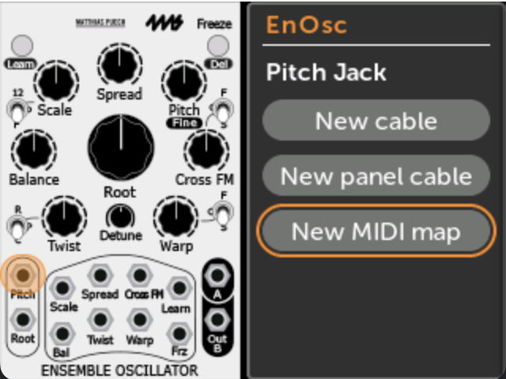{ .half }](./img/enosc-midi-map.png)

-  __2. Select a MIDI signal__

    Choose from:

    - Note events (keyboard): select Pitch (key number), Gate (note on/off), Velocity,
      Aftertouch, or Retrigger (multiple note-on). Also select the polyphony
      channel (see [MIDI Polyphony](#midi-polyphony)):

         - __#1-4__: a single **polyphonic cable** carrying voices 1–4.
         - __#5-8__: a second polyphonic cable carrying voices 5–8 (use this in
           addition to a #1-4 cable to reach 8 voices).
         - __#1__ … __#8__: a single **mono cable** for one specific voice.

    - CC: Continuous CV scaled to 0V to 10V. Select a CC number, or send a CC
      event to "learn" it.

    - Pitch Wheel

    - Gate on Note: fires a gate whenever a particular note is pressed. Select
      a note or play a note live to "learn" it.

    - Clock: Select the raw MIDI clock (24PPQN) or a divided version of that.

    - Transport: Sends a gate for Start, Stop, and Continue events.

    - Channel: Select "All Channels" or a choose a particular MIDI channel to respond to.

   [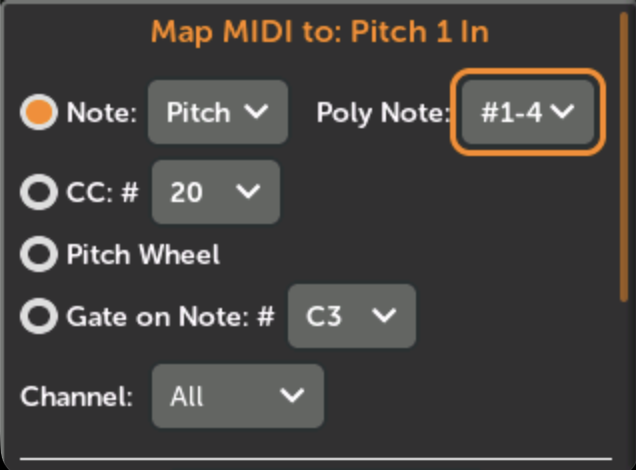{ .half }](./img/midi-map-top.png)

-  __3. Click Map to create the mapping__

   [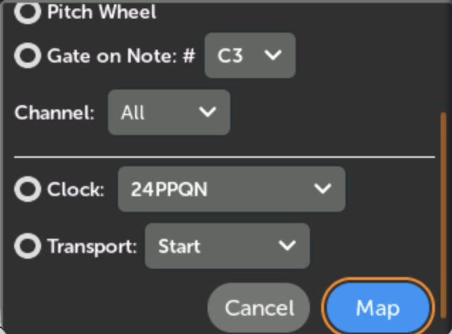{ .half }](./img/midi-map-pw.png)

### Using the MIDI to CV module

-  __1. Add the MIDI to CV module from the RackCore brand__

   [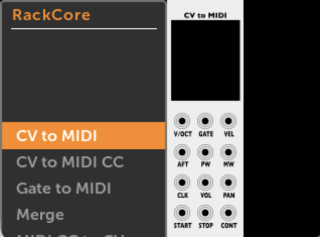{ .half }](./img/rackcore-midi-cv-module.png)

-  __2. Patch the jack(s) corresponding to the MIDI signal(s) you want to use__

   [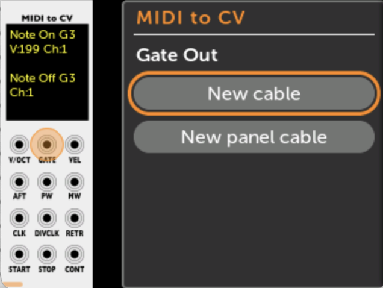{ .half }](./img/rackcore-midi-cv-jack.png)

### Using the MIDI to Gate module

The **MIDI to Gate** module converts incoming MIDI notes into gate/trigger
outputs (16 jacks). Each cell can be assigned to a note, and can output a held
gate or a trigger.

-  __1. Add the MIDI to Gate module from the RackCore brand__

       Patch to any of the 16 outputs jacks.

   [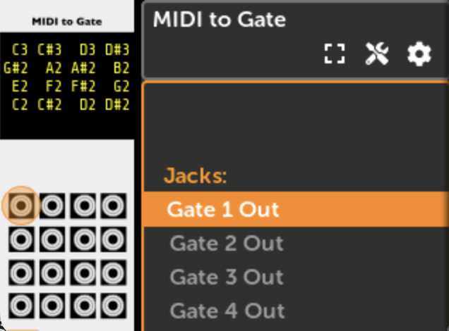{ .half }](./img/rackcore-midi-gate-module.png)

-  __2. Optionally choose custom notes for each jack__

      Select `Options>>` at the bottom and then choose custom notes for each "cell" (jack).

   [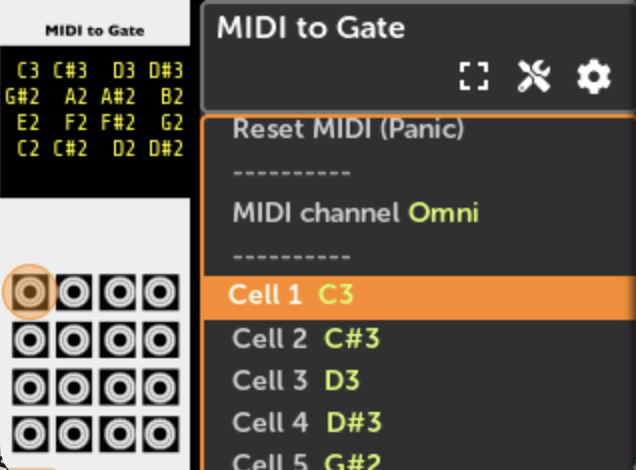{ .half }](./img/rackcore-midi-gate-jack.png)

### Using the MIDI CC to CV module

The **MIDI CC to CV** module converts incoming MIDI CC messages into CV 
(16 outputs), each assignable to a CC number.

-  __1. Add the MIDI CC to CV module from the RackCore brand__

       Patch to any of the 16 outputs jacks.

   [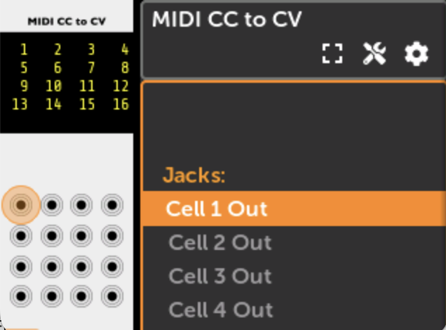{ .half }](./img/rackcore-midicc-cv-module.png)

-  __2. Optionally choose custom notes for each jack__

      Select `Options>>` at the bottom and then choose custom notes for each "cell" (jack).

   [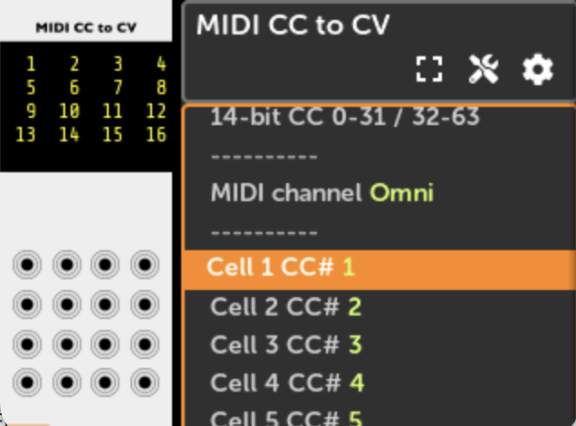{ .half }](./img/rackcore-midicc-cv-jack.png)

---

## Patching Outputs to MIDI

To support MIDI Output, the MetaModule has the `CV to MIDI` and
`CV to MIDI CC` modules in the RackCore brand.

Third-party plugin modules that produce MIDI Output should work, as well.

Note that the MetaModule always acts as a MIDI Host, and never as a MIDI Device.

### CV to MIDI (Notes)

-  __1. Add the RackCore CV-MIDI module__

   [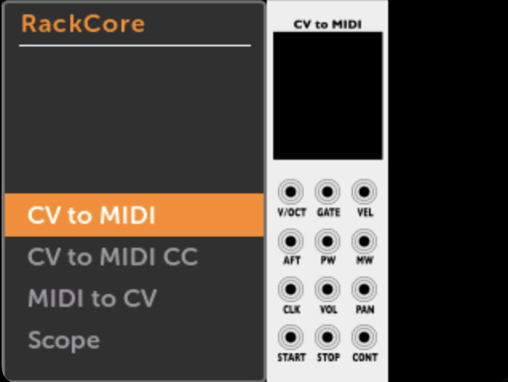{ .half }](./img/rackcore-cv-midi-module.png)

-  __2. Patch the CV and gate signals you wish to output as MIDI__

     A log of MIDI events will appear on the module's screen.

   [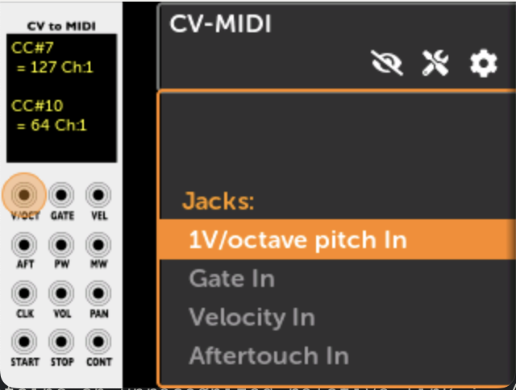{ .half }](./img/rackcore-cv-midi-jacks.png)

### CV to MIDI CC

The **CV to MIDI CC** module converts CV inputs to MIDI CC messages. It has 16 CV input jacks arranged
in a 4×4 grid, each independently assignable to any MIDI CC number. Use CV to MIDI CC when you want to
drive external MIDI hardware or software synthesizers with CV signals from your patch.

-  To use, patch CV signals into any of the 16 jacks.
   By default, Jack 1 → CC 1, Jack 2 → CC 2, and so on.

   [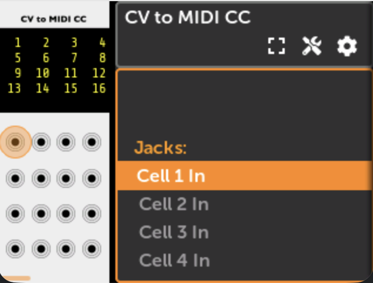{ .half }](./img/cv-cc-module.png)

-  To assign a CC number to a cell:

    Click `Options>>>` at the bottom of the list, select the cell, and choose a CC number from the list. 

    Two cells cannot have the same CC number assigned to them.

   [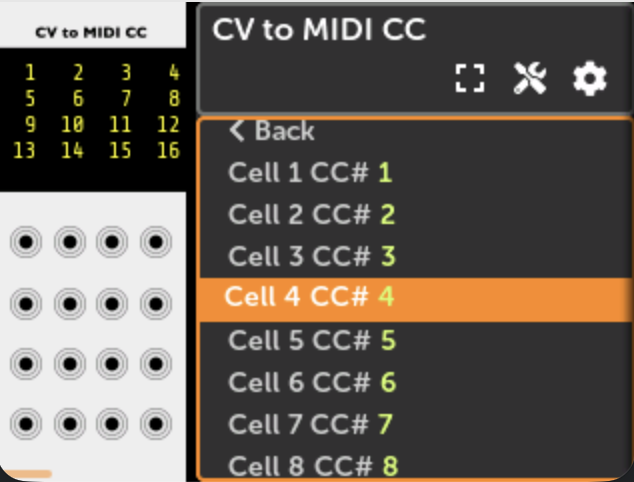{ .half }](./img/cv-cc-module-set-cc.png)

### Gate to MIDI

The **Gate to MIDI** module converts gate/trigger inputs into MIDI note on/off
messages, with optional velocity from the input level.

-  To use, patch gate signals into any of the 16 jacks.
   By default, Jack 1 → C3, Jack 2 → C#3, and so on.

   [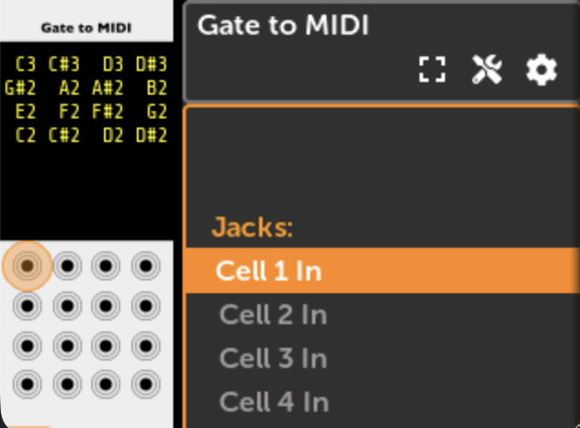{ .half }](./img/gate-midi-module.png)

-  To assign a note to a cell:

    Click `Options>>>` at the bottom of the list, select the cell, and choose a note from the list. 

    Two cells cannot have the same note assigned to them.

   [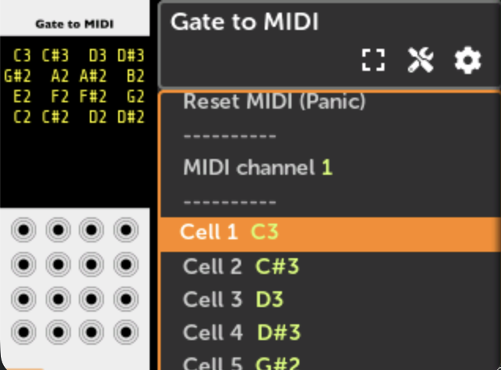{ .half }](./img/gate-midi-module-setup.png)

---

## Viewing all MIDI mappings

You can see all built-in MIDI mappings on one page.

-  __1. Click the MIDI button on the Knob Sets page__

    The Knob Sets page is opened by clicking the Knob icon at the top of the patch.

    If there are no MIDI mappings, this button will not be visible.

   [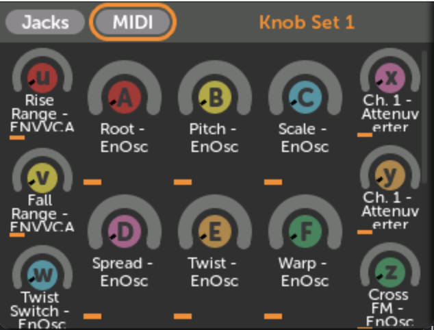{ .half }](./img/midi-button.png)

-  __2. All MIDI mappings are shown__ 

     The left side shows all MIDI jack mappings (maps to input jacks).

     The right side shows all MIDI parameter mappings (maps to knobs, switches, buttons, etc).

     Manually created mappings using the RackCore modules are not displayed here, but can be
     seen as normal cables in the patch view.
     
   [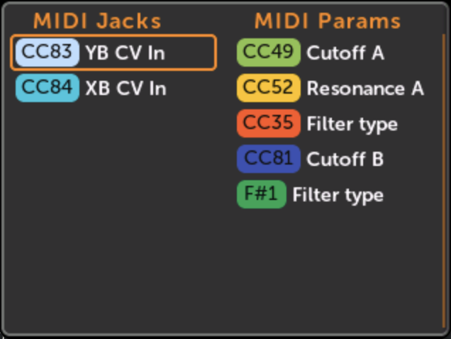{ .half }](./img/midi-maps-list.png)

---

## MIDI Polyphony

The MetaModule has **built-in MIDI polyphony**. MIDI note information (pitch,
gate, velocity, aftertouch, retrigger) can be carried on
[polyphonic cables](using_metamodule_jacks.md#polyphonic-cables), with up to
**4 voices per cable**. By using two poly cables — one for voices **#1-4** and a
second for voices **#5-8** — you can play up to **8 voices** of polyphony.

When you create a MIDI note mapping from within the MetaModule, the polyphony
dropdown lets you choose a `#1-4` poly cable, a `#5-8` poly cable, or a single
mono voice (`#1`–`#8`). See [Patching MIDI Input to
jacks](#patching-midi-input-to-jacks).

### Setting the polyphony number

The number of active MIDI voices is shown and set in the
[Patch Info](module_patch_settings.md#patch-info) dialog, under **MIDI Poly
Chans**:

- **Auto** (the default): the MetaModule automatically detects how many voices
  the patch needs by scanning its MIDI mappings. If any `#5-8` poly cable is
  used, 8 voices are allocated; if only a `#1-4` poly cable is used, 4 voices;
  otherwise it uses the highest mono voice number that's mapped.

- **1 – 8**: force a fixed number of voices, regardless of what's mapped.

The dialog also shows **Active poly chans**, the number of voices currently in
use.

!!! note
    When more notes are played than there are available voices, the MetaModule
    reassigns voices to the new notes (voice "stealing").

---

## MIDI Feedback

MIDI Feedback, also known as "bi-directional MIDI", is a feature that allows a
MIDI controller to stay in sync with the MetaModule. When this is enabled, the
MetaModule will send MIDI CC, pitch wheel, and Note on/off messages back to the
controller whenever a parameter changes value. When a patch is loaded, the MetaModule
will send the value of all MIDI-mapped parameters.
If the MIDI controller supports MIDI Feedback, then it will update its display
or internal state with the new value.

For example, if you map a CC to the Pitch knob of your VCO, then
when you load that patch, a feedback-aware MIDI controller will jump to the
current value of the pitch, perhaps by displaying this value on a screen or
even by turning a motorized knob like the Roto-Control does.

As you play the patch, if you adjust the VCO's pitch knob manually (using the
Adjust button) or by mapping a panel knob to the Pitch knob, then the MIDI
controller will stay in sync with these new parameter values.
Also, say the module happens to have advanced features such as scale quantization,
such that when you select a scale the Pitch knob jumps to the closest note.
The MetaModule will still keep the MIDI controller in sync even if the Pitch knob
changed indirectly (e.g. because you selected a new quantization scale or a new
preset).

If you need to re-send all MIDI-mapped values to the controller, for example if you 
reset the controller after loading the patch, simply pause and unpause the patch 
playback. This will send the current value of all MIDI-mapped parameters.

-  __To enable or disable MIDI Feedback, check the box in Settings > Prefs > MIDI:__

     By default, MIDI Feedback is enabled starting in firmware v2.0.9.

   [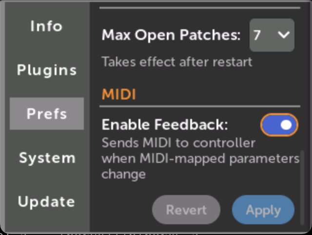{ .half }](./img/midi-feedback.png)

---

## MIDI CC Knob Set switching

You can use a single MIDI CC message to instantly switch between the eight
Knob Sets in the current patch. This is useful for changing performance
"scenes" using any MIDI device that can send CC values.

When enabled, sending a CC value of 0–7 on the chosen MIDI Channel and CC#
will immediately make the corresponding Knob Set active:

| CC value | Knob Set |
|---|---|
| 0 | Knob Set 1 |
| 1 | Knob Set 2 |
| 2 | Knob Set 3 |
| ... | ... |
| 7 | Knob Set 8 |

CC values outside the 0–7 range are ignored. The CC# you choose for Knob Set
switching can still be used as a normal MIDI parameter mapping.

To enable this feature, go to **Settings > Prefs > MIDI** and set the
MIDI Channel and CC# for Knob Set switching. See [Preferences](preferences.md).

For more information about Knob Sets, see [Knob Sets](using_metamodule.md#knob-sets).

---

## Loading patches with MIDI Program Change

You can load patches by sending MIDI Program Change (PC) messages. This lets you
recall patches hands-free from a MIDI controller, sequencer, or DAW — useful for
switching patches during a live performance.

Each patch is assigned to a Program Change number (0–127) on a MIDI channel of
your choosing. When the MetaModule receives a matching PC message, it loads that
patch.

-  __1. Assign a patch to a PC number__

    Open the patch you want to assign, click the file/disk icon to open the
    [Patch File Menu](module_patch_settings.md#patch-file-menu), and select
    **Load on MIDI PC**.

    In the dialog that appears, choose a __PC #__ (0–127) and a __MIDI Channel__.
    Set the channel to a specific channel (1–16), or to __Any__ to respond on all
    channels. The dropdown shows which patch (if any) is already assigned to each
    PC number, so you can avoid collisions.

   [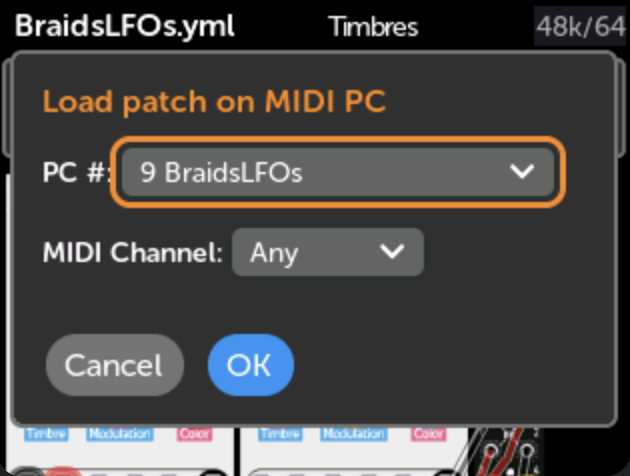{ .half }](./img/midi-pc-assign-dialog.png)

-  __2. Enable MIDI PC Patch Load in the preferences__

    Go to **Settings > Prefs ** and check "Enable" under
    **MIDI PC PATCH LOAD**. This globally enables or disables the MIDI PC Patch
    Load feature. See [Preferences](preferences.md).

   [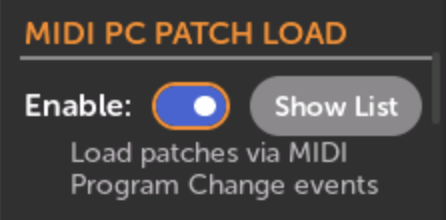{ .wide-240 }](./img/prefs-midi-pc-load.png)

Each patch can be assigned to one PC number. Assigning a patch to a PC number that
is already in use will move the assignment to the new patch. To change a patch's
assignment, open it and select **Load on MIDI PC** again.

### Viewing PC assignments

- In **Settings > Prefs **, click **Show List** under MIDI PC PATCH LOAD to see
  all current assignments, sorted by PC number. 

    Clicking an entry views that patch.

   [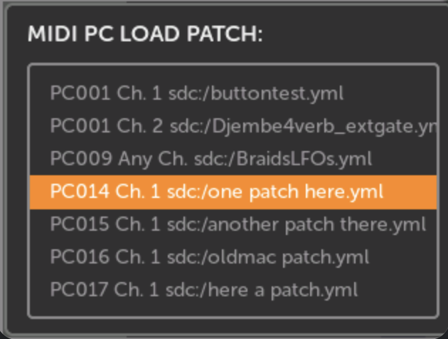{ .half }](./img/midi-pc-load-list.png)

