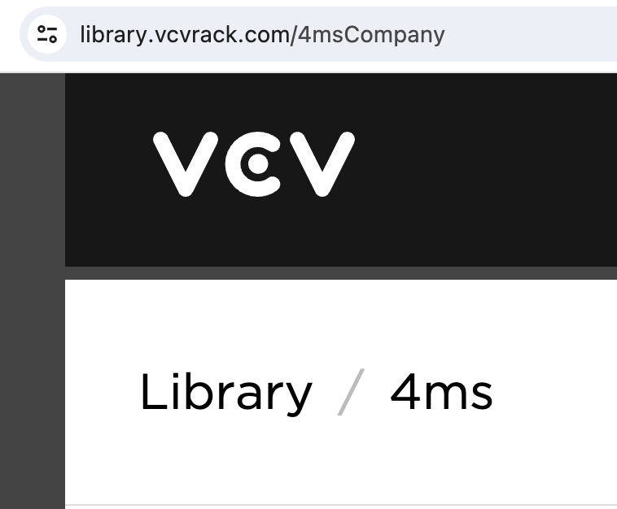
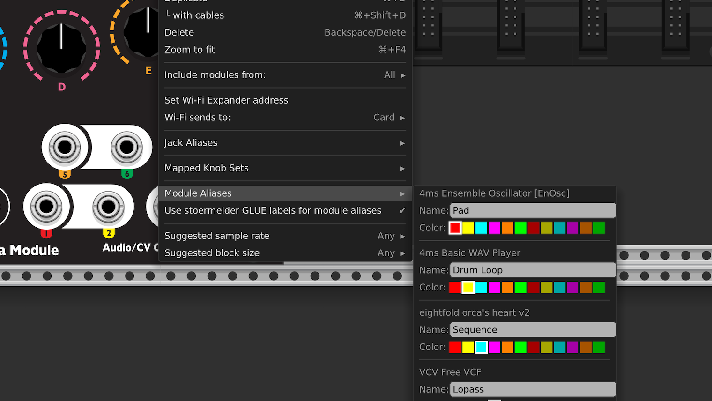
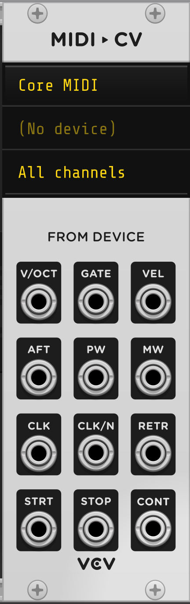
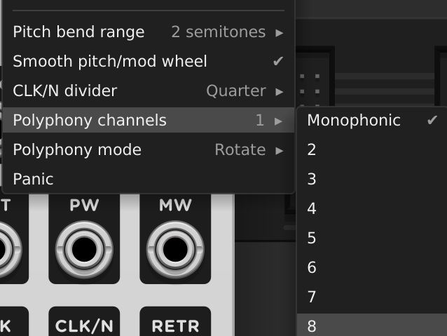
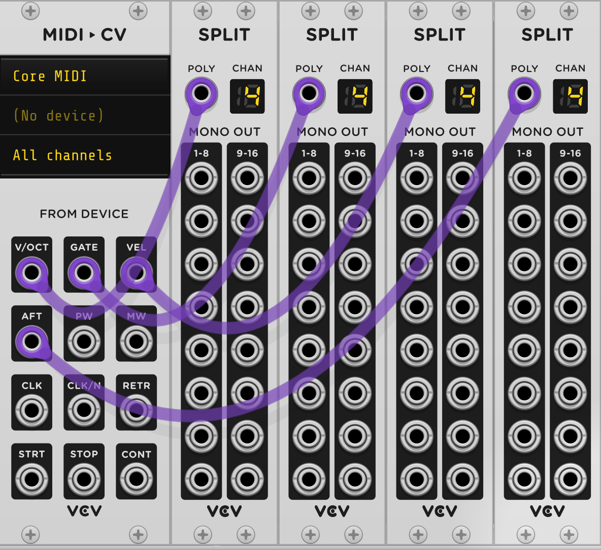
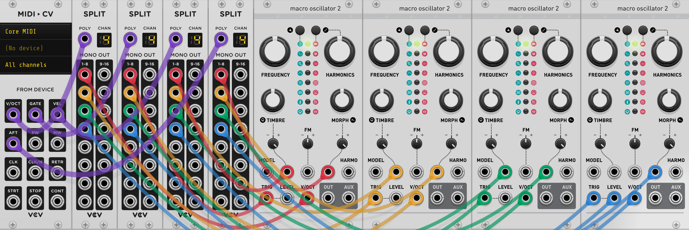
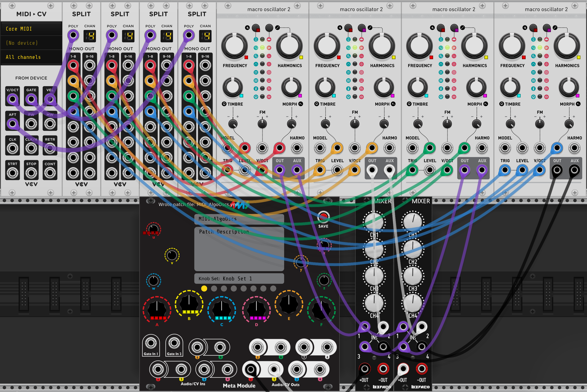
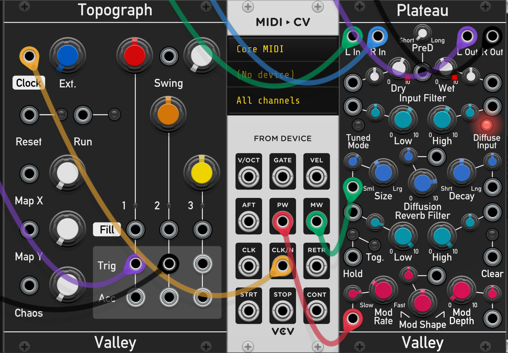
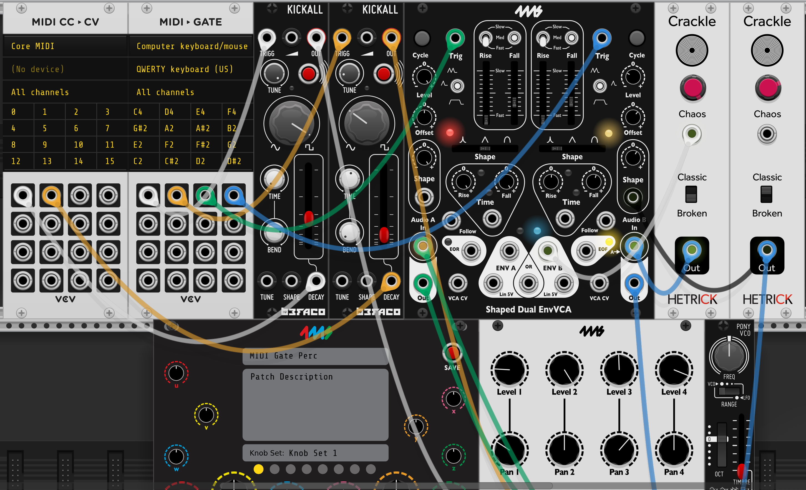
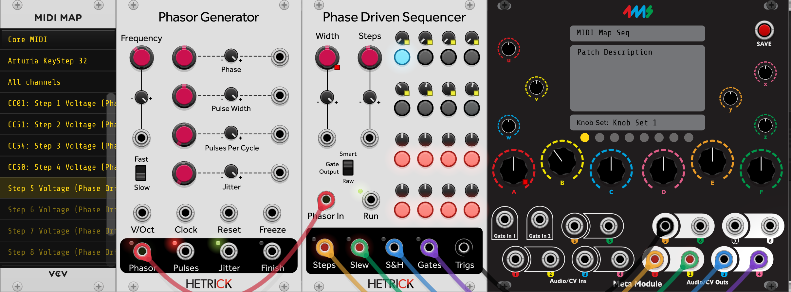

# Using MetaModule with Rack

__What is VCV Rack?__

[VCV Rack](https://vcvrack.com/) is a "Virtual Eurorack Studio" that runs
on a Mac, Windows, or Linux computer. There are thousands of free modules
available, making it one of the most popular virtual modular platforms.
There is a free open-source version, and a paid Pro version.

&nbsp;
*VCV Rack is owned and maintained by VCV and is not affiliated with 4ms Company.*

&nbsp;

You can create patches on your computer in VCV Rack and play them on the MetaModule. This is the preferred workflow for complex patches involving lots of modules, patch cables and/or mappings.

## Installing the 4ms modules into VCV Rack

Before you can use VCV Rack to create patches for your MetaModule, you need to
install the 4ms modules into VCV Rack on your computer.

-  __1. Install from VCV Rack Library__

      Go to the 4ms Company page of the [VCV Rack Library](https://library.vcvrack.com/4msCompany)

   [{ .half }](./img/vcv-library-webpage.png)

-  __2. Click Subscribe__

      Click "Subscribe" to add all 4ms modules to your account. Subscribing
      will also tell the VCV Rack program to check for updates as we release
      bug fixes and new modules. 

      Alternatively, you could click "Add All", which will add all modules that
      exist at the current time, but you will not be notified when future
      modules are added.

      The VCV Rack Library requires you to create a free account.

   [{ .half }](./img/vcv-library-subscribe.png)

-  __3. Quit and re-launch VCV Rack__ 

    Make sure you are logged into your account from the VCV Rack Program (Library menu).

    If there is an item called `4ms Company` in the Library menu, click it to install the updated 4ms plugin.

    Restart VCV Rack (quit and re-open).

    Right-click (or control-click) on any empty rack space to open the Add
    Module page and see the 4ms modules.

   [{ .half }](./img/vcv-rack-modules.png)

### How to install manually

There is normally not any reason to install plugins manually. However, if you were asked by Support to 
try a special version, or are beta-testing, then [here is the procedure to do a manual installation](rack_manual_install.md).

## Creating patches

-  __1. Create a patch in VCV Rack__

      Add modules, patch them together, and set knobs and switches like you would do on
      a hardware Eurorack system. If you need help using VCV Rack, there are
      many video tutorials on YouTube. Use the VCV Audio module to listen to
      your work as you patch.

      All modules from 4ms are compatible with the MetaModule, plus about 800 more!

      See the [FAQ](faq.md#what-modules-from-vcv-rack-can-i-use-on-the-metamodule) for more information, or browse the complete up-to-date list on the [Plugins page](../plugins)

      For an example patch, try [SpringsintoCaves](https://metamodule.info/dl/patches/SpringsintoCaves.vcv). Or [browse the example patches](https://metamodule.info/dl/patches/)

   [{ .half }](./img/vcv-patch-start.png)

-  __2. Add the MetaModule__

     Right-click (or control-click) on an empty rack space to display the list
     of modules. Find the MetaModule Hub (search for MetaModule or browse the
     4ms brand).

   [{ .half }](./img/vcv-metamodule-hub.png)

-  __3. Create Knob Mappings__

    First, click the colored ring around any knob on the MetaModule Hub. 

    Then click on the knob, button, switch, or slider you want to map to.

    *Tip: if you're zoomed out, it might be hard to click the colored ring.
    Shift+click anywhere on the knob itself also works.*

    You can map up to 8 virtual knobs to a single MetaModule knob! This is known as a [multi-map](using_metamodule.md#mapping-to-more-than-one-knob-multi-maps)

   [{ .half }](./img/vcv-make-mapping.png)

-  __4. Create Jack mappings__

      - Jacks can be mapped by patching cables to the MetaModule.

          For example, if you want signal on the output jack of a VCA module to
          come out of the physical MetaModule's Out 1 jack, then drag a cable
          between those two jacks. 

      - If you want to also listen to that output, use two cables (Tip:
        Cmd+drag on Mac or Ctl+drag on Windows/Linux to create a new cable on top)
      

      - Give the jack a unique name by right-clicking and entering a name in the Alias box.

      *The MetaModule Hub does not send any signals out, or do anything to the
      signals that you send in. The cables connected to it are just
      there to tell the MetaModule what you want to have mapped to each jack
      when you run the patch on the MetaModule.*

   [{ .half }](./img/vcv-map-outjack.png)

-  __Completed Patch:__   [{ .half }](./img/vcv-patch-done.png)

-  __5. Save the Patch__ 
    
    Give the patch a name by typing it in the top box.

    You can also give it a description or patch notes in the box below.

    Click the red SAVE button.

    This will create a file with the `.yml` extension.

    _Note: VCV Rack patch files end in `.vcv` and cannot be read by the
    MetaModule._

    Save the file on a USB drive or microSD Card.
    You can save patches in folders to keep them organized. However, the
    MetaModule will not find patches in sub-folders of folders.

   [{ .half }](./img/vcv-naming-patch.png)

-  __6. Load the patch into the MetaModule__ 
    
    - Insert the disk into the MetaModule.

    - Go to the Patch Selector page and open your patch. 

    - Plug Outs 1 and 2 into your output mixer/speakers/headphone amp.

    - Press the Play icon to start/stop the audio.

    - Enjoy!

   [{ .half }](./img/vcv-load-bouncingscales.png)
    
   [{ .half }](./img/vcv-play-bouncingscales.png)

### How to set the name or min/max range of a knob mapping

-  __Right-click the MetaModule Hub knob__

    - Type in a brief name for the knob mapping if it's helpful for you to
      remember.

    - Change the Min and Max values if you want to limit the range of the
      virtual knob. *Tip: If you make Max less than Min, the knob will turn
      "backwards"*

    - If you have multiple virtual knobs mapped to this knob, then a separate
      Min and Max slider will be shown for each one.

   [{ .half }](./img/vcv-mapping-range.png)

### How to remove a knob mapping

-  __Right-click the MetaModule Hub knob or the virtual module knob__

    Select `Unmap` from the menu.

   [{ .half }](./img/vcv-unmap.png)

## Creating Knob Sets in VCV Rack

A Knob Set is a group of mappings. You can create up to eight Knob Sets in a
MetaModule patch and switch between them on the fly when running the patch on the MetaModule.

Knob Sets are a great way to control the entire patch using just the 12 on-board knobs.

See [Knob Sets](using_metamodule.md#knob-sets) for more information.

### Selecting a Knob Set

-  __Click one of the yellow circles on the MetaModule Hub__

    Each circle chooses a Knob Set (1-8).

    The knob mappings for the selected Knob Set will be shown in the patch.
    Creating, editing, and removing knob mappings will change only the current Knob Set.

    Mapped knobs won't change their values until you wiggle the MetaModule knobs.

   [{ .half }](./img/vcv-knobset-2.png)

### Naming Knob Set

Select a Knob Set and type a name in the box above the yellow circles.

This name will be displayed on the MetaModule.

### Assigning Module Aliases

-  __Right-click the MetaModule Hub and select `Module Aliases`__

    Each module in the patch is listed. Type a name in the text field next to a module
    to set its alias. To remove an alias, clear the text field.

    In VCV Rack, aliased modules display a colored label at the top of their panels.

   [{ .half }](./img/vcv-module-aliases.png)

You can also add aliases using the [GLUE module from stoermelder](https://library.vcvrack.com/Stoermelder-P1/Glue).
If a module has both an alias set in the Meta Hub and a label set in GLUE, the Hub alias takes precedence. To use
GLUE _without_ your GLUE labels setting aliases in your MetaModule patch, right-click the Hub and uncheck
`Use stoermelder GLUE for aliases`.

## MIDI Mapping

When making patches in VCV Rack, it's usually most convenient to use the VCV MIDI modules to 
create MIDI mappings. You also can make MIDI mappings using the MetaModule itself; see
[MIDI Input Jacks](using_metamodule_jacks.md#midi-input-jacks) for details.

### How to map MIDI notes, gates, velocity, and aftertouch

VCV Rack and MetaModule support polyphonic MIDI notes, gates, velocity, and
aftertouch. The maximum polyphony number is 16, but often you will 
limit this to 4 - 8 when creating patches for the MetaModule.

 

In addition to polyphonic note information, you can map pitch wheel, mod
wheel, clock, divided clock, re-trigger, start, stop, and continue.

 

Any of these MIDI signals can be mapped to virtual module jacks simply by
connecting cables, however for MIDI signals you don't connect to the MetaModule
directly. Instead, you connect to the built-in MIDI and SPLIT modules. The
MetaModule recognizes these modules and scans their connections, generating
MIDI mappings for your patch. These modules won't display when you load the
patch onto the MetaModule, they just are used to tell the MetaModule how you
want MIDI to be mapped. Also, these modules are fully functional within VCV
Rack, so you can test how your patch works with MIDI on VCV Rack before
transferring it to the MetaModule.

-  __Add the MIDI CV Module to your VCV Rack patch__

   [{ .half }](./img/vcv-midicv-module.png)

-  __Select the number of polyphony channels__

    *Polyphony is the maximum number of notes that can be played at once.*

    - Right-click the MIDI-CV module to see the menu.

    - Select the desired number under "Polyphony channels".

   [{ .half }](./img/vcv-midi-polynum.png)

-  __Add a SPLIT module for each polyphonic MIDI parameter you want to map__

     MetaModule does not support VCV Rack's polyphonic cables, so you must use
     the SPLIT module to split the signal into monophonic cables.

     You can verify the polyphony number you chose earlier: it will display on
     the SPLIT screen.

   [{ .half }](./img/vcv-midi-split-4.png)

-  __Create cables from the SPLIT modules to your modules__

     Connect to whatever jacks you want to be MIDI mapped.

     Finish your patch normally (e.g., mix the outputs and connect the mixer output to the MetaModule)

   [{ .half }](./img/vcv-midi-mapped-4.png)

-  __Finish the patch__

     Finish your patch normally (e.g., mix the outputs and connect the mixer output to the MetaModule)

     Create knob mappings from the MetaModule. Multi-maps are often useful with
     polyphonic patches (shown in the image).

   [{ .half }](./img/vcv-midi-4-done.png)

### How to map other MIDI signals

The procedure is identical to the above procedure, but since these are not
polyphonic signals, you don't need to use a SPLIT module. Just patch directly
from the MIDI module to the jacks you want mapped.

 -  You can map Pitch Wheel, Mod Wheel, Clock, Divided Clock, Retrigger,
    Start, Stop, and Continue using the MIDI-CV module.

     &nbsp;

   [{ .half }](./img/vcv-midi-other-map.png)

 -  You can map MIDI notes to gates by using the MIDI-Gate module.

     Map MIDI CC signals to jacks using the MIDI-CC-CV module.

   [{ .half }](./img/vcv-midi-gate-map.png)

 -  You can map MIDI CCs to knobs using the MIDI-CC module.

    Click on an empty line on the MIDI-CC module, and send a MIDI CC event.
    Then click on a knob to create the mapping.

    Notice that VCV Rack indicates a MIDI mapping with a yellow square. This
    should not be confused with the yellow square used by Knob B of the
    MetaModule. If in doubt, hover the mouse over the Knob B ring, and if the
    other knob's square flashes rapidly then it's mapped to the MetaModule.

   [{ .half }](./img/vcv-midi-knob-map.png)

## Tip: Favorite the MetaModule-compatible modules:

If you have trouble remembering which modules can be run on the MetaModule, one way to keep track of this is
to mark all compatible modules as "Favorite" in VCV Rack.

User `tenofswords` created a python script to do this automatically for you:
[4ms-MetaModule-Scripts](https://github.com/gregornoriskin/4MS-MetaModule-Scripts)

Running this requires some basic knowledge of using python scripts. Some discussion is here:
[MetaModule Forum: MetaModule Tag in Rack to Identify Supported Modules](https://forum.4ms.info/t/metamodule-tag-in-rack-to-identify-supported-modules/69/32)
