# Using Metamodule with Rack

!!! tip "What is VCV Rack?"
    [VCV Rack](https://vcvrack.com/) is a "Virtual Eurorack Studio" that runs
    on a Mac, Windows, or Linux computer. There are thousands of free modules
    available, making it one of the most popular virtual modular platforms.
    There is a free open-source version, and a paid Pro version.

    &nbsp;
    *VCV Rack is owned and maintained by VCV and is not affiliated with 4ms Company.*

You can create patches on your computer in VCV Rack and play them on the MetaModule. This is the preferred workflow for complex patches involving lots of modules, patch cables and/oor mappings.

## Installing the 4ms modules into VCV Rack

Before you can use VCV Rack to create patches for your MetaModule, you need to
install the 4ms modules into VCV Rack on your computer.

### How to install from the VCV Rack Library (preferred method)

-  __Coming soon!__

### How to install manually

If you need the latest version before it's available in the VCV Rack Library,
you can download the plugin and install it manually.

-  __1. Download the latest version__

      Click the [Download](../downloads) link above.

      Scroll down to the *VCV Rack Modules* section.

      Click to download the version for the type of computer you have. 
      If you have a Mac, download the x64 version for an Intel processor, or
      the arm64 version if you have a newer Apple silicon processor.

   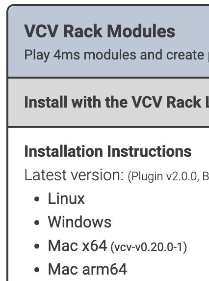{ .half }

-  __2. Find your VCV Rack User Folder__

      From the VCV Rack program, select "Open user folder" 
      from the _Help_ menu.

      A folder called "Rack2" will open on your screen.

      
      Alternatively, you can open the folder manually:

      - MacOS: ~/Library/Application Support/Rack2/
      - Windows: C:\Users\<username>\AppData\Local\Rack2\
      - Linux: ~/.local/share/Rack2/

   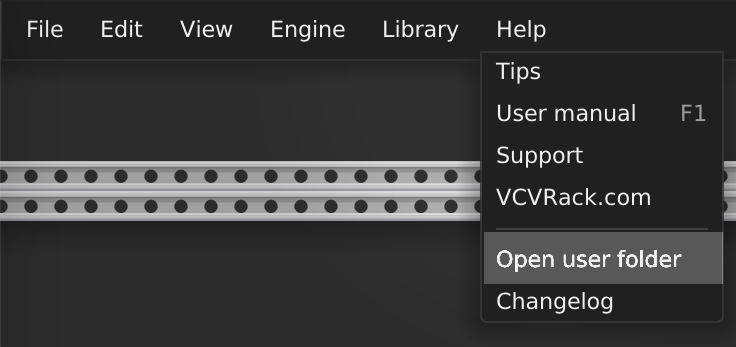{ .half }

-  __3. Put the downloaded file into the plugin directory__ 

    The folder is named after they type of computer and OS you have, but always starts with `plugins-`

    For example, on a Mac with Apple silicon, it's called `plugins-mac-arm64`, and on an Intel Mac it's `plugins-mac-x64`.

   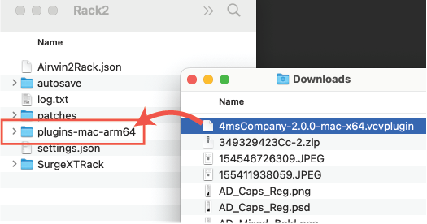{ .half }

-  __4. Quit and re-launch VCV Rack__ 

    Right-click (or control-click) on any empty rack space to open the Add
    Module page and see the 4ms modules.

   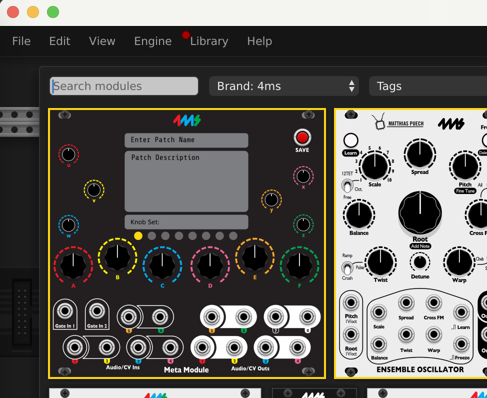{ .half }

## Creating patches

-  __1. Create a patch in VCV Rack__

      Add modules, patch them together, and set knobs and switches like you would do on
      a hardware Eurorack system. If you need help using VCV Rack, there are
      many video tutorials on Youtube. Use the VCV Audio module to listen to
      your work as you patch.

      All modules from 4ms are compatible with the MetaModule, plus about 800 more!

      See the [FAQ](faq.md#what-modules-from-vcv-rack-can-i-use-on-the-metamodule) for more information, or browse the complete up-to-date list on the [Plugins page](../plugins)

      For an example patch, try [SpringsintoCaves](https://metamodule.info/dl/patches/SpringsintoCaves.vcv). Or [browse the example patches](https://metamodule.info/dl/patches/)

   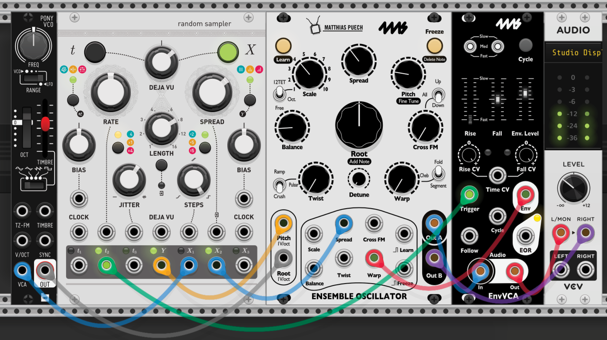{ .half }

-  __2. Add the MetaModule__

     Right-click (or control-click) on an empty rack space to display the list
     of modules. Find the MetaModule Hub (search for MetaModule or browse the
     4ms brand).

   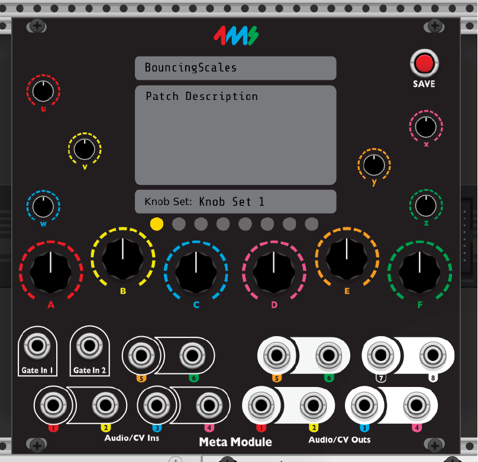{ .half }

-  __3. Map Knobs__

    - First, click the colored ring around any knob on the MetaModule Hub. 
    - Then, click on the knob, button, switch, or slider you want to map to.

    *Tip: if you're zoomed out, it might be hard to click the colored ring.
    Shift+click anywhere on the knob itself also works.*

    You can map up to 8 virtual knobs to a single MetaModule knob! This is known as a [multi-map](using_metamodule.md#mapping-to-more-than-one-knob-multi-maps)

   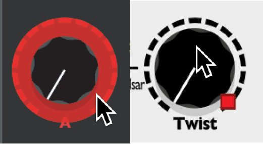{ .half }

-  __4. Map Jacks__

      - Map jacks of a virtual module to the MetaModule by patching cables.

        - For example, if you want signal on the output jack of a VCA module to
          come out of the physical MetaModule's Out 1 jack, then drag a cable
          between those two jacks. 

      - If you want to also listen to that output, use two cables (Tip:
        Cmd+drag on Mac or Ctl+drag on Windows/Linux to create a new cable on top)
      
      *The MetaModule Hub does not send any signals out, or do anything to the
      signals that you send in. The cables connected to it are just
      there to tell the MetaModule what you want to have mapped to each jack
      when you run the patch on the MetaModule.*

   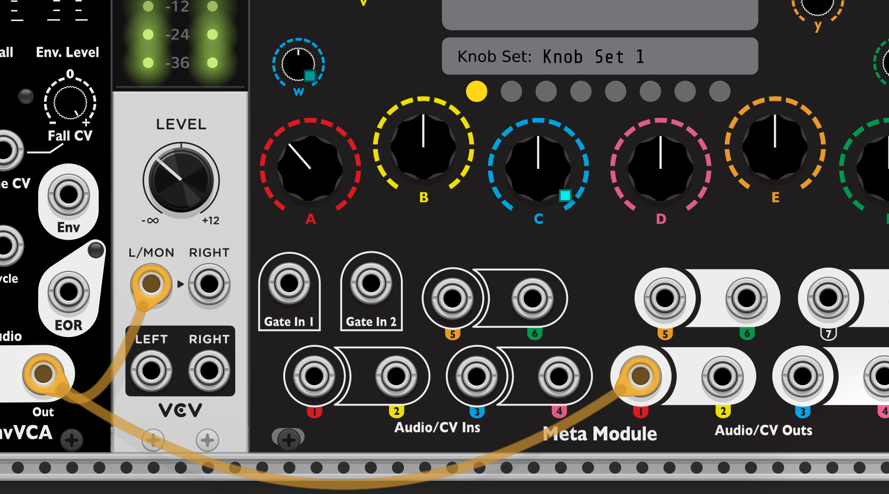{ .half }

-  __Completed Patch:__   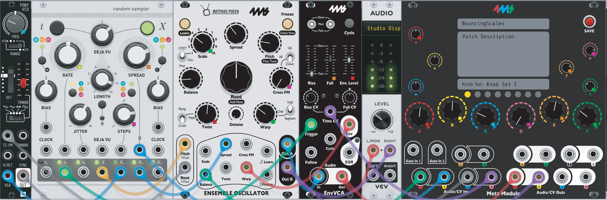{ .half }

-  __5. Save the Patch__ 
    
    Give the patch a name by typing it in the top box.

    You can also give it a description or patch notes in the box below.

    Click the red Save button.

    Save the file on a USB drive or microSD Card.
    You can save patches in folders to keep them organized. However, the
    MetaModule will not find patches in sub-folders of folders.

   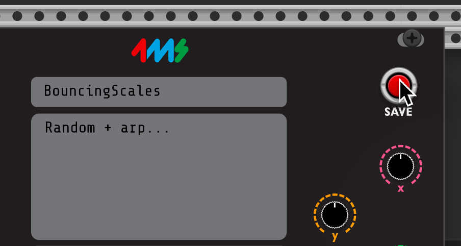{ .half }

-  __6. Load the patch into the MetaModule__ 
    
    - Insert the disk into the MetaModule.

    - Go to the Patch Selector page and open your patch. 

    - Plug Outs 1 and 2 into your output mixer/speakers/headphone amp.

    - Press the Play icon to start/stop the audio.

    - Enjoy!

   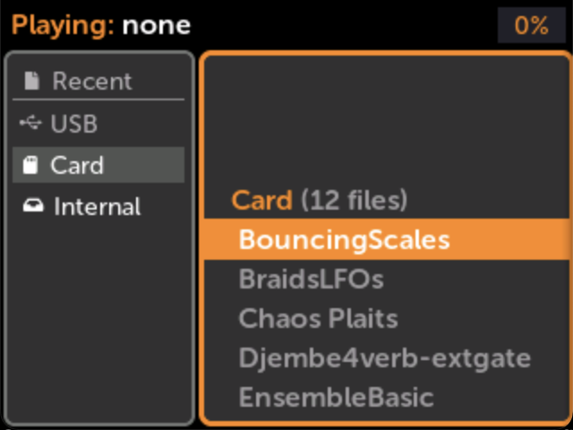{ .half } 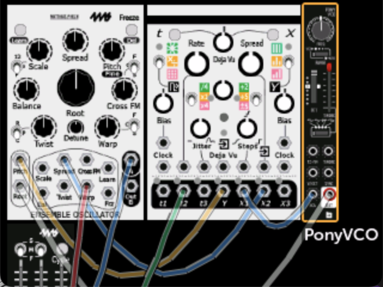{ .half }

### How to set the name or min/max range of a knob mapping

-  __Right-click the MetaModule Hub knob__

    - Type in a brief name for the knob mapping if it's helpful for you to
      remember.

    - Change the Min and Max values if you want to limit the range of the
      virtual knob. *Tip: If you make Max less than Min, the knob will turn
      "backwards"*

    - If you have multiple virtual knobs mapped to this knob, then a separate
      Min and Max slider will be shown for each one.

   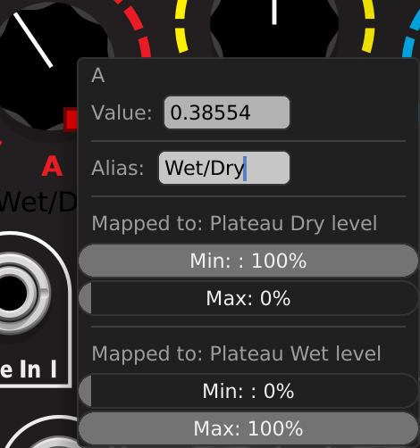{ .half }

### How to remove a knob mapping

-  __Right-click the virtual knob__

    Select "Unmap" from the menu.

   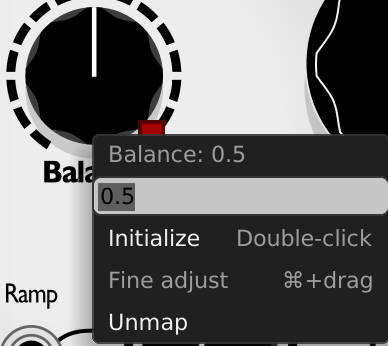{ .half }

## Creating Knobsets in VCV Rack

A Knob Set is a group of mappings. You can create up to eight Knob Sets in a
MetaModule patch and switch between them on the fly. 

See [Knob Sets](using_metamodule.md#knob-sets) for more information.

### Selecting a Knobset

-  __Click one of the yellow circles on the MetaModule Hub__

    Each circle chooses a Knob Set (1-8).

    The knob mappings for the selected Knob Set will be shown in the patch.

    Mapped knobs won't change their values until you wiggle the MetaModule knobs.

   { .half }

### Naming Knobsets

## MIDI Mapping

You can map MIDI signals to virtual knobs and jacks using VCV Rack.

-  __Right-click the virtual knob__

    Select "Unmap" from the menu.

   { .half }

