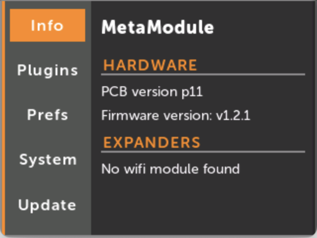
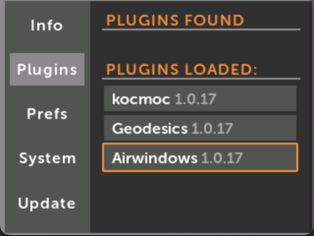
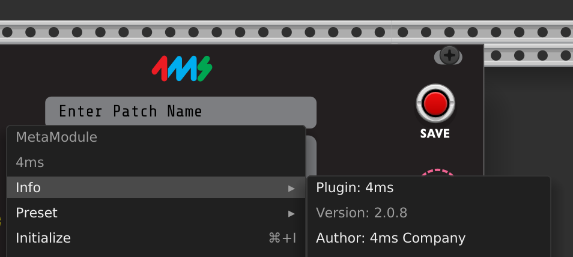

# Versions

There are many different versions associated with the MetaModule, VCV Rack, and third-party plugins. This guide
attempts to explain the different version you may encounter.

## Firmware Version

-  The Firmware is the code that runs on the MetaModule hardware.

      You can see the firwmare version by clicking the Settings button in the Main Menu.
    
      The firmware version is displayed next to the words "Firmware version: ".
       
      For example, the firmware version in the picture is v1.2.1.
       
      You can check the latest firmware version available from the [Downloads page](../downloads)

  [{ .half }](./img/system-info.png)

## Plugin Version

-  Each plugin that runs on the MetaModule can have its own version.

      You can see the plugin version by looking at the file you downloaded,
      the version will be at the end of the file name.

      You can also see the version of what's loaded on the MetaModule by
      going to the Settings > Plugins page and looking at the version next to each
      plugin name.

      Note that the VCV Rack plugins have their own versioning system.
      The version you see here is the MetaModule plugin version. You 
      can check which VCV Rack plugin version the MetaModule version
      is based off of, by looking at the [Plugins webpage.](../plugins)

  [{ .half }](./img/plugins-versions.png)

## Compatibility between Firmware version and Plugin version

In general, if you use the latest version of all plugins and firmware, then everything will run.

The plugin version is not related to the firmware version that it runs on. For example, a plugin
developer might give their plugin a version of 1.2, but that does not mean it requires any
particular firmware version to run.

Instead, when you load a plugin on the MetaModule, it's scanned by the MetaModule to determine if 
it's compatible with the firmware you're running.

Note that this is a new policy starting with firmware v2.0 (April 2025) -- prior to this the plugin
version was linked to the firmware version it required.

## 4ms VCV Rack Plugin version

-  The VCV Rack plugin of 4ms modules also has a version. This is separate from
   the version of the firmware of either the firmware or plugins.

     You can see the version of the 4ms plugin for VCV Rack by right-clicking
     any 4ms module and looking in the `Info` sub-menu.

     This version number does not correspond to the firmware version or plugin
     versions or API version. The major version indicates the major version of
     VCV Rack that it will run on (Rack v2) and the minor and patch versions
     indicate revisions and bug fixes to the plugin.
     
     Always use the latest version of the 4ms plugin for VCV Rack. In terms of
     compatibility, it will always generate patches that run on all firmware versions
     (though, of course not all features may be available for earlier versions).

  [{ .half }](./img/vcv-rack-version.png)

## Technical details on Plugin versions (for developers)

This section is meant for plugin developers or anyone curious how versioning
works with plugins. Nothing in this section is necessary to know or understand
in order to use the MetaModule and plugins.

Plugins have the SDK version used to compile the plugin in two places:

 1. Inside the `.mmplugin` tar bundle, there is a file called `SDK-X.X` which
    is automatically generated by the `plugin.cmake` build script.
 2. In the metamodule-core-interface library that the plugin compiles against,
    there is a function `get_version()`

The `SDK-X.X` file is present so that the plugin loader can abort early if it
untars a file with an incompatible version. This file provides a small amount
of assurance that executing the code in the plugin will not crash. 

The `get_version()` symbol is called only after the the first two checks have passed.
This returns a major, minor, and revision.

#### Extracting contents of a plugin file

If you have an unknown plugin and wish to open a plugin up to see what version it needs, you
can extract the contents. 
   - On MacOS, right-click the .mmplugin file and open it with "Archive Utility"
   - On Linux, type the command: `tar -xf PluginFileName.mmplugin`
   - On Windows, you can use a mingw shell and type the linux command. Or you
     may be able to use 7zip or TarTool if you rename the .mmplugin file to end
     in .tar. 

 Once you have it extracted, you will see a file starting with `SDK-`. This
 indicates the version. For instance `SDK-2.0` means the plugin requires
 firmware v2.0 or later (but earlier than the next major release which is 3.0).

