# Wi-Fi Expander

## Getting Set Up

Read the PDF version here: [Wi‑Fi Quick Start](https://4mscompany.com/media/MetaModule/Wifi-QSG.pdf)

### Connect to MetaModule

1. Power off your system.
2. Connect one end of the included 8-pin cable to the header labeled 
    "WiFi" on the MetaModule, and the other end to the 8-pin header on 
    the Wi-Fi Expander. 
3. Make sure the red stripe is up on both ends of the cable. 
4. Connect the included 10-pin power cable to Eurorack power with the red stripe down.
5. Power on your case. The Wi-Fi Expander button will turn light blue.

### Connecting to a Wi-Fi network (Provisioning)

-   __1. Download the ESP BLE Provisioning app on a phone or tablet__

    - iOS: [App Store](https://apps.apple.com/us/app/esp-ble-provisioning/id1473590141)
    - Android: [Google Play Store](https://play.google.com/store/apps/details?id=com.espressif.provble&hl=en_US)

   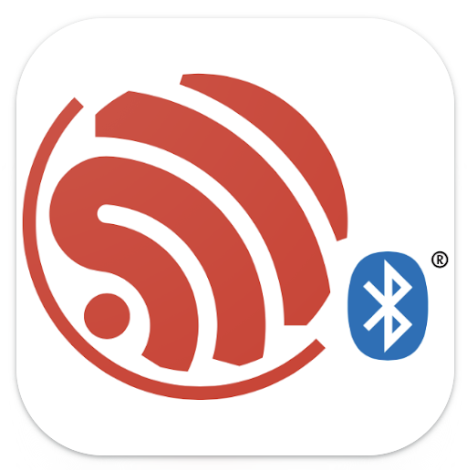{ .half }

-   __2. Open the ESP BLE Provisioning app__

    At some point the app will ask for permission to use the 
    camera and/or Bluetooth. Click "OK" or "Allow".

    If you do not allow access to the camera and Bluetooth, then you 
    MUST go to your iOS or Android Settings and allow access.

-   __3. Tap the gear icon (upper-left) on iOS or the three dots (upper-right) on Android__

    This will open the settings page.

   { .half }

-   __4. Turn off Encrypted Communication__

   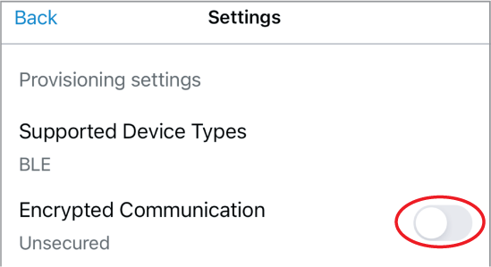{ .half }

-   __5. Tap "Provision Device"__

   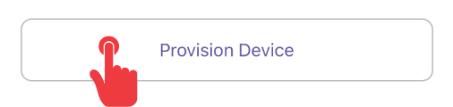{ .half }

-   __6. Tap "I don't have a QR code"__

   { .half }

-   __7. In the PREFIX box, remove the text “PROV_” (if present), and type “4MS”__

     On Android, tap “Change” first.

   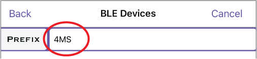{ .half }

-   __8. Tap the Refresh icon or “Scan Again”__

    Then tap the 4MS device that appears

   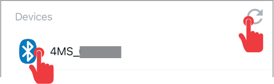{ .half }

-   __9. Select your Wi-Fi network from the list__

    Enter your Wi-Fi password when asked.

    After a moment, the light on the Wi-Fi Expander will turn green.

-   __10. On the MetaModule, go to `Settings > Info`__

    Look for the Wi-Fi IP address

   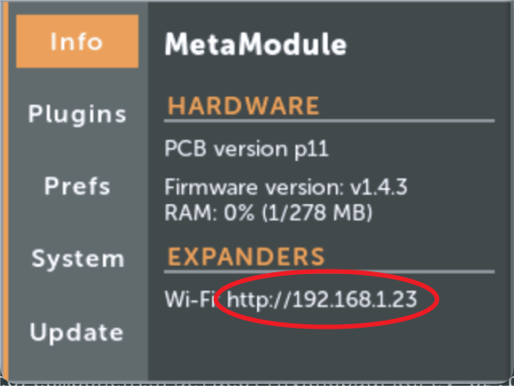{ .half }

-   __11. On your computer, open a browser window and type in the IP address__

    Hint: the IP address starts with `http://`, not with `https://`

   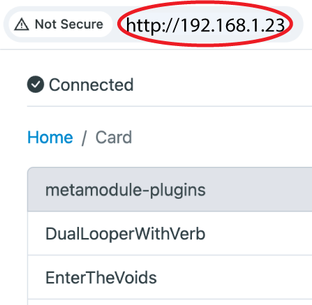{ .half }

-   __You're connected!__

    In the browser, navigate to the drive (and optionally, a subfolder) where you want to put a patch.

    Click the Upload button and select a `.yml` patch file to transfer, or drag and drop it. 

    When the progress bar is complete, the patch file can be played on your MetaModule!

   [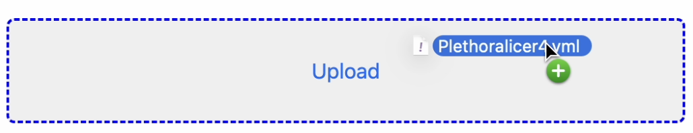{ .half }](./img/browser-drag-drop.png)

After connecting to a Wi-Fi network, you can choose to delete the ESP BLE Provisioning app. However, if you
anticipate needing to change Wi-Fi networks, you may want to leave it installed. 

## Using the Wi-Fi Expander with VCV Rack

-   __1. Install the 4ms plugin for VCV Rack, version 2.0.9 or later__

    Update or install from the [VCV Rack Library](https://library.vcvrack.com/4msCompany)
    

-   __2. Enter the Wi-Fi Expander's address into the VCV Rack MetaModule hub__
    
    Right-click on the MetaModule panel.

    From the menu, select "Set Wi-Fi Expander address".

    Enter the address you found by going to Settings > Info on the MetaModule
    (see above).

   [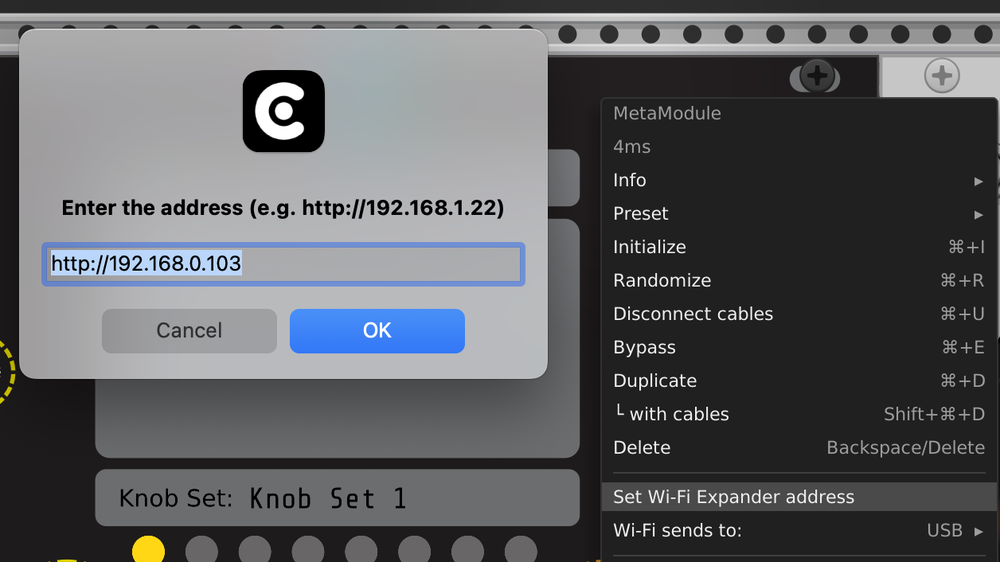{ .half }](./img/vcv-wifi-url.png)

-   __3. Select the volume you want to transfer to__
     
     Right-click on the MetaModule in VCV Rack and choose a volume
     from the "Wi-Fi sends to:" submenu.

Note that the Internal drive has very limited space (2 MB max),
     so it's recommended to store patches on USB or Card if possible. 

    Note: sending to sub-folders is not yet supported. Use a web browser if you
    need to do that.

   [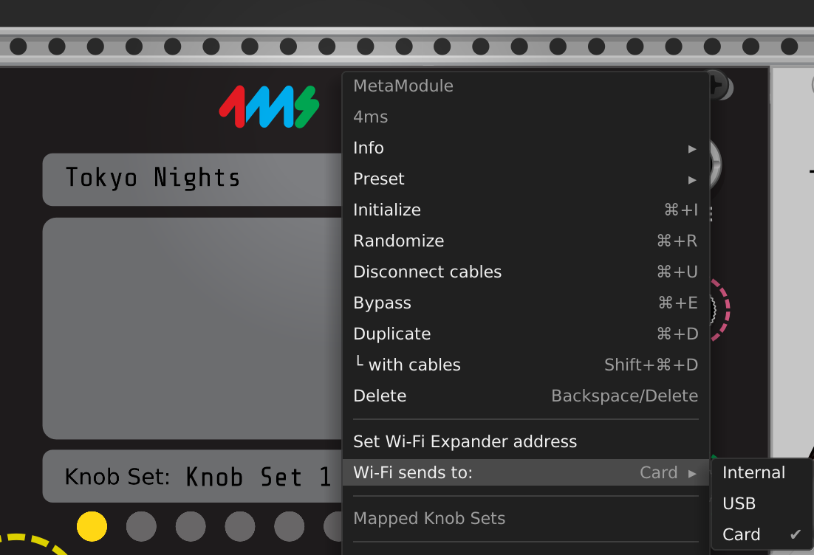{ .half }](./img/vcv-wifi-vol.png)

-   __4. Click the Wi-Fi button to transfer a patch__
      
      If you hover the cursor over the button, the Wi-Fi settings
      will display in the main text box.

      After clicking, the top text box will display "Sent patch file"
      or "Failed to send patch".

   [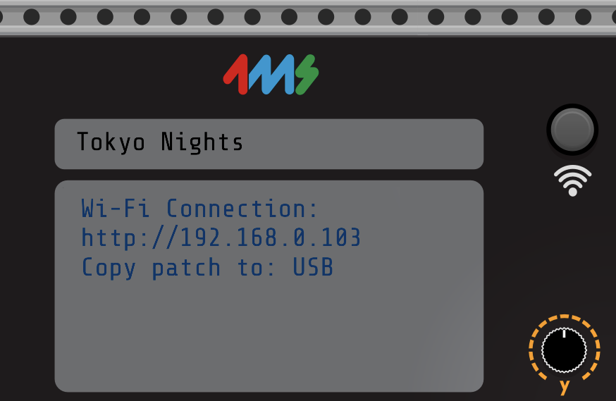{ .half }](./img/vcv-wifi-button.png)

----

## Changing Wi-Fi networks or Resetting the Wi-Fi Expander

Power on with the button held down. Release it when it turns red. The light will turn off and then turn light blue.
You can then perform the [steps at the top of this page](#connecting-to-a-wi-fi-network-provisioning).

----

## Light Colors

The Wi-Fi Expander shows its status with a colored button light:

- Red: The Expander has not been told what Wi-Fi network to connect to, or
  there is an internal error. Reset the Wi-Fi Expander (see above section).

- Light Blue: The Expander cannot find the Wi-Fi network. Check if other
  devices can see the network, and that the signal strength is high where the
  Wi-Fi Expander is mounted. Make sure there is a clear line-of-sight from the
  Wi-Fi Expander to the Wi-Fi router.

- Green: The Expander is connected to a Wi-Fi network.

----

## Updating Wi-Fi Expander Firmware

The Wi-Fi Expander firmware will be updated whenever you update the MetaModule
firmware and a Wi-Fi Expander is connected via the 8-pin cable.

All MetaModule firmware releases starting with v1.4 contain the Wi-Fi Expander
firmware. If you do not have the Wi-Fi Expander connected when you update the
MetaModule firmware, then the updater will skip the Wi-Fi Expander updates and
just update the MetaModule.

----

## Wi-Fi Expander Troubleshooting

- __Cannot get the ESP BLE Provisioning app to see the Wi-Fi Expander module__

    - Did you disable Secure Communication in the app settings?

    - Did you erase the prefix text "PROV" and replace it with "4MS"?
    - Did you give the app permission to use the camera?
      Even though the Wi-Fi Expander doesn't have a QR code, the app will
      still not function unless you give it permission to use the camera.

    - Did you give the app permission to use Bluetooth? Go to your phone's
      settings and verify it has Bluetooth and camera permissions

    - Try resetting the Wi-Fi Expander by holding down the button while
      powering on. Release the button when it turns red. Re-provision the Wi-Fi
      Expander by following the [steps at the top of this
      page](#connecting-to-a-wi-fi-network-provisioning).

- __Cannot see my hotspot in the list of Wi-Fi networks__

    - If you are creating a personal Wi-Fi network (aka "hotspot"),
      then it's possible you will need to run the ESP BLE Provisioning app on a
      different device. The app may not be able to see the hotspot network
      created on the same device that it's running on.

    - Make sure you are trying to connect to a 2.4GHz network. Networks that
      are 5GHz will not work with the Wi-Fi Expander.

- __Cannot send a patch over Wi-Fi using VCV Rack__
    - Verify the IP address is correct: compare it carefully with what's
      displayed on the MetaModule Settings > Info page. Don't forget to type
      the "http://" at the start.

    - Try typing the IP address into a browser to make sure you have the right address

    - Your computer has to be on the same Wi-Fi network as the MetaModule Wi-Fi Expander.

    - Are you trying to transfer to a volume (Card or USB) that's not inserted
      into the MetaModule? Go to `Load Patch` on the MetaModule and make sure the
      volume you're trying to transfer to is actually detected.

    - If you are transferring to the Internal drive, it's possible you ran out
      of space. Delete some patches.

    - There is a limit of 1MB for patch files transferred to USB or Card, and
      256kB for the Internal drive. Most modules store very little (only a few
      bytes, if anything) but some modules store 64kB or more. Try saving the
      .yml patch file to your computer and then looking at how large it is.

    - Check your system permissions and see if VCV Rack has permission to access
      the local network. For MacOS 15, it's in the System Preferences >
      Privacy&Security > Local Network > VCV Rack (and your preferred web
      browser): [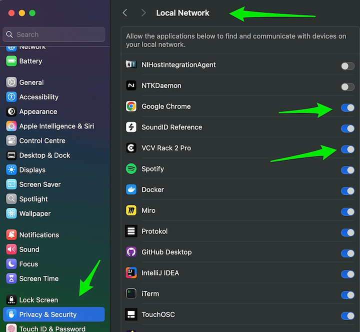{ .img-412 }](./img/wifi-macos-permissions.png)

- __My browser won't load the Wi-Fi Expander's page__
    - Your computer must be on the same network as the Wi-Fi expander. 
      Make sure whatever Wi-Fi network you entered into the ESP BLE app is the 
      same as the network your computer is connected to.

    - Check the Wi-Fi Expander's light is green. If it's blue or red, then the Wi-Fi
       Expander is not connected to the network.

    - Check your system permissions and see if your web browser has permission to access
      the local network. See image above for an example in MacOS 15.

    - Eject the USB drive and/or microSD card and refresh the browser. If it connects
      now, then the issue may be that one of your disks contains too many files
      and the directory transfer is stalling out on the network. This is a known 
      issue and the workaround is to reduce the number of files on all mounted disks.

- __I don't have a Wi-Fi button on my VCV Rack MetaModule hub__

    - You need to install the 4ms plugin for VCV Rack v2.0.9 or later

    - Make sure to quit and re-open VCV Rack after upgrading.

- __Other problems__

    - Make sure you are using the latest MetaModule firmware and Wi-Fi Expander
      firmware. Updating the MetaModule firmware while the Wi-Fi Expander is
      connected via the 8-pin cable will update both the MetaModule and the Wi-Fi Expander.

    - Use the latest version of the 4ms VCV Rack plugin.
